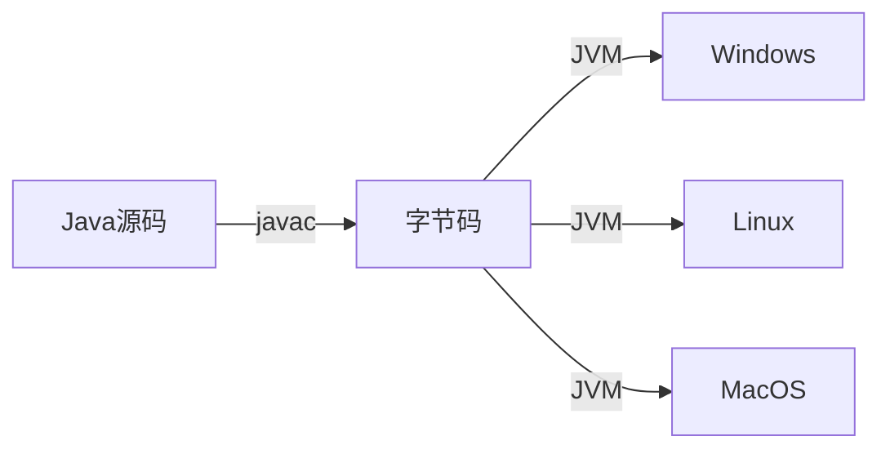
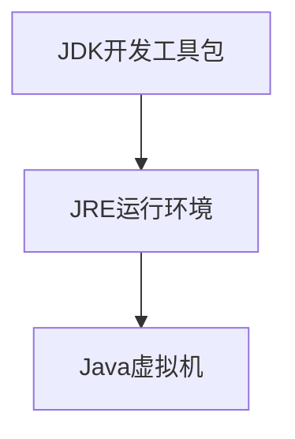

# Ch01-Java语言概述

## 1.1 Java语言的诞生
（待补充内容）

## 1.2 学习Java的必要性
- 面向对象编程语言
- 涵盖网络/数据库/多线程等核心编程概念

## 1.3 Java核心特性
### 简单易学
- 类C/C++语法但更安全
- 移除指针和手动内存管理
- 提供丰富的标准类库(API)

### 平台无关性

### 多线程支持
| 特性        | Java | C++ |
|-------------|------|-----|
| 内置支持    | ✓    | ✗   |
| 线程安全API | ✓    | ✗   |

### 其他特性
- **健壮性**：编译时类型检查 + 运行时内存管理
- **安全性**：防病毒/防篡改设计
- **动态性**：运行时类加载

## 1.4 Java vs C/C++
| 特性          | Java            | C/C++          |
|---------------|-----------------|----------------|
| 内存管理      | 自动GC          | 手动管理       |
| 全局变量      | 公用静态变量    | 全局变量       |
| 异常处理      | try-catch-finally| goto语句       |
| 数据类型长度  | 固定            | 平台相关       |

## 1.5 Java技术体系
### 平台版本
- ☕ Java SE：标准桌面应用
- 🏢 Java EE：企业级服务
- 🔌 Java ME：嵌入式设备

### 开发环境

## 1.6 开发流程
1. 编写`.java`源文件
2. 编译：`javac Main.java` → 生成`.class`字节码
3. 运行：`java MainClass`

## 1.7 JDK兼容性
（待补充内容）
