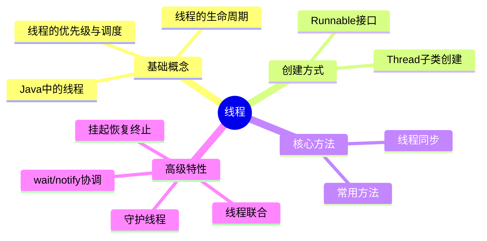
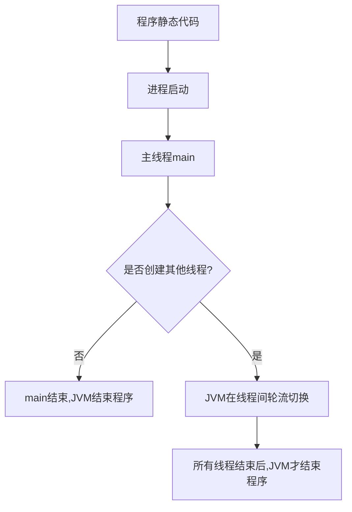
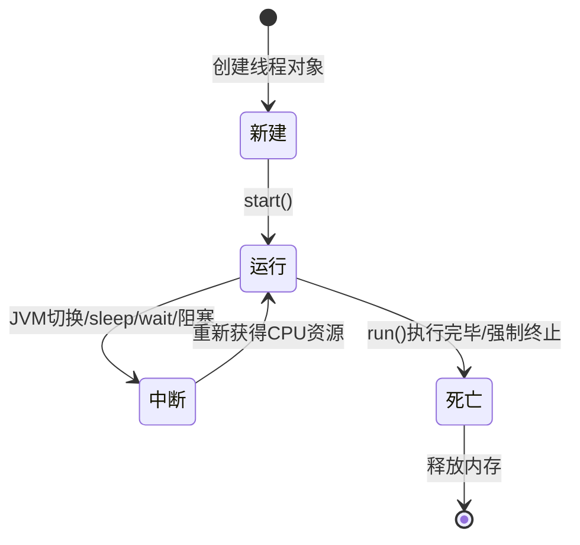
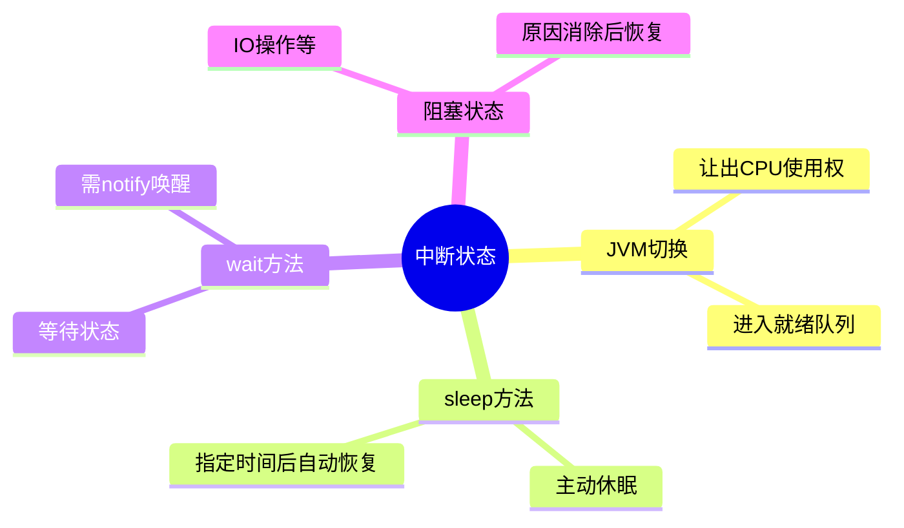
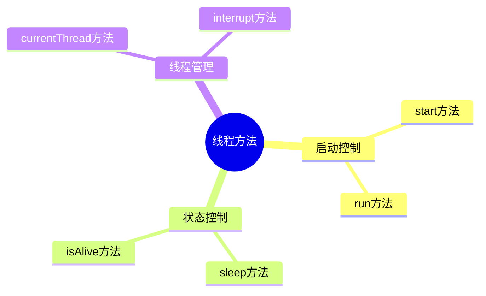
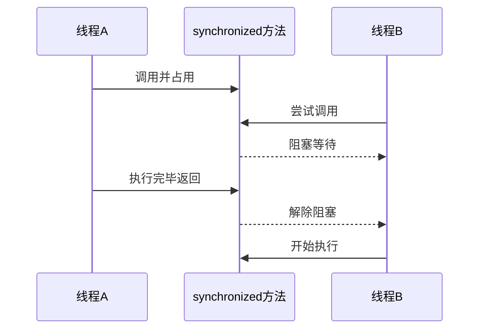
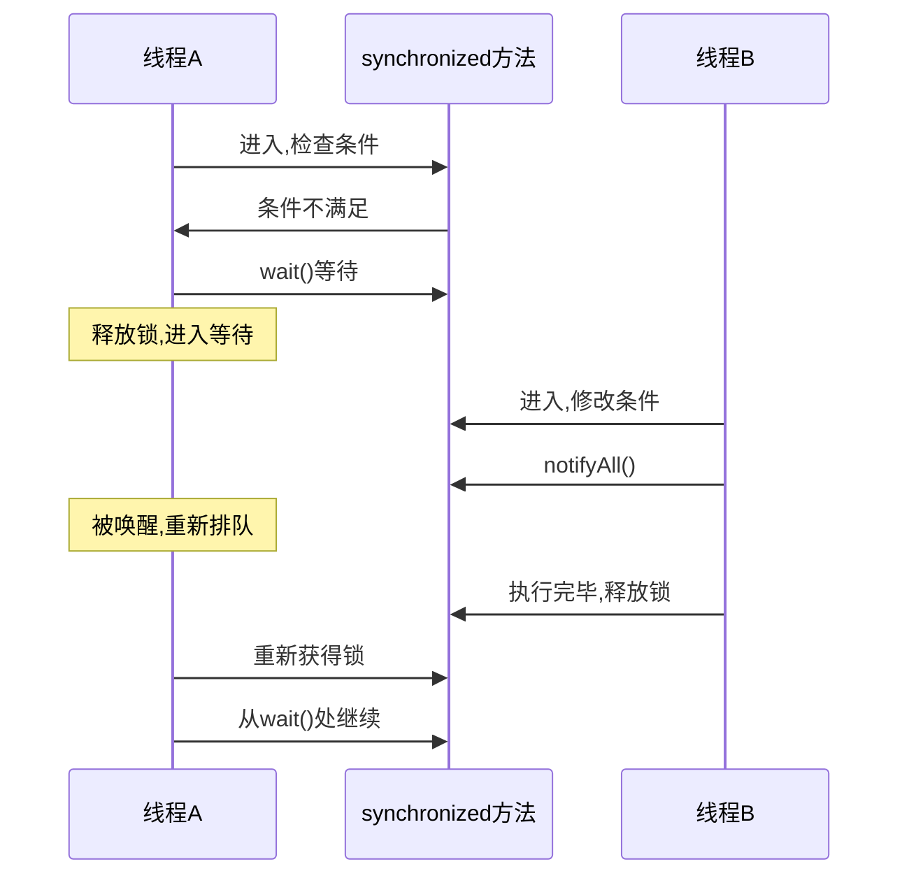
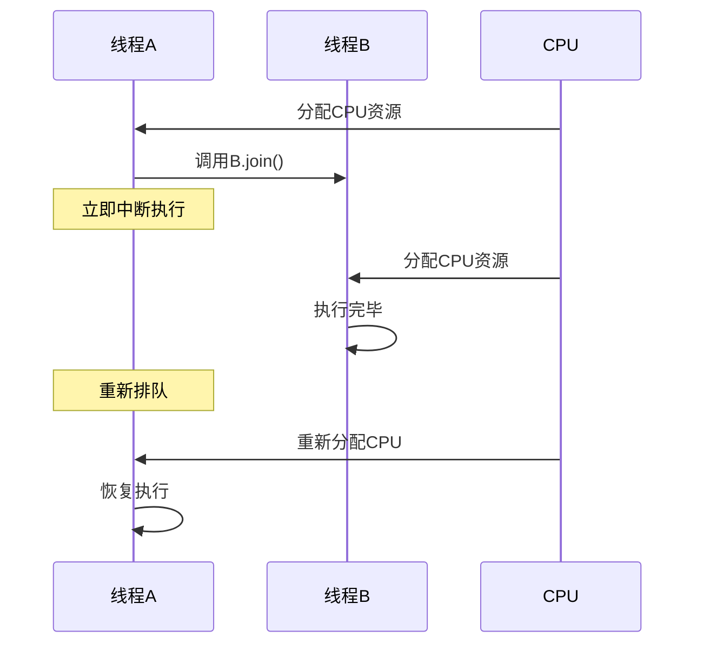
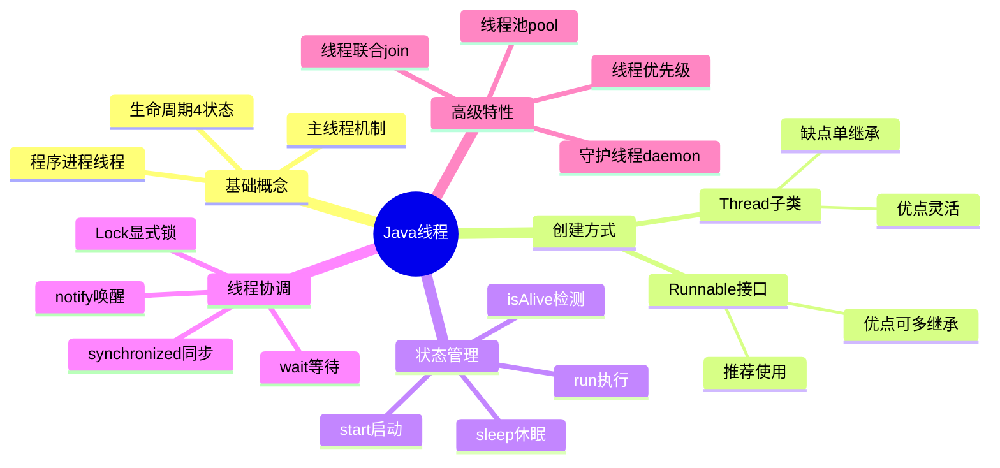

# 线程

> 📝 **课程**: Java语言程序设计 第八章
> 
> 🎯 **学习目标**: 掌握Java多线程编程的核心概念与实践应用

---

## 📋 目录结构



**章节列表**:

1. Java中的线程
2. 线程的生命周期
3. 线程的优先级与调度管理
4. Thread的子类创建线程
5. Runnable接口
6. 线程的常用方法
7. 线程同步
8. 使用wait()、notify()、notifyAll()协调同步线程
9. 挂起、恢复和终止线程
10. 线程联合
11. 守护线程

---

## 🔍 8.1 Java中的线程

### 💡 引言

Java是最早内置支持并发编程的主流编程语言之一。

**发展历程**:

| 时期 | 关注重点 | 应用场景 |
|------|---------|---------|
| 早期 | 轻松使用后台线程 | 加载图像、Web服务器并发请求处理 |
| 现代 | 多处理器/内核协同工作 | 充分利用多核CPU资源 |

> 💡 **核心理念**: 多线程的并发运行可以通过使用不同的处理器或在同一处理器上使用不同的时间片来实现

### 🏷️ 核心概念对比

| 概念     | 定义          | 特点               |
| ------ | ----------- | ---------------- |
| **程序** | 一段静态的代码     | 应用软件执行的蓝本        |
| **进程** | 程序的一次动态执行过程 | 从代码加载、执行至完成的完整过程 |
| **线程** | 比进程更小的执行单位  | 进程中的多条执行线索       |

### 🔄 执行流程



### 📌 主线程机制

**主线程的启动**:

- Java应用程序总是从主类的`main()`方法开始执行
- 当JVM加载代码并发现`main()`方法后，会启动一个**主线程**
- 主线程负责执行`main()`方法
- 在`main()`方法中创建的线程称为**主线程中的线程**

**程序结束条件**:

| 场景 | 行为 |
|------|------|
| `main()`中未创建其他线程 | `main()`执行完最后一条语句时,JVM结束程序 |
| `main()`中创建了其他线程 | JVM在主线程和其他线程间轮流切换,直到所有线程都结束 |

> ⚠️ **注意**: 即使`main()`方法执行完毕，只要还有其他线程在运行，JVM就不会结束Java应用程序

---

## 🔍 8.2 线程的生命周期

### 🏷️ 线程的4种状态



### 📊 状态详解

#### 1️⃣ 新建状态 (New)

**特征**:
- Thread类或其子类的对象被声明并创建
- 已分配内存空间和其他资源
- 尚未在JVM线程管理中注册

#### 2️⃣ 运行状态 (Runnable/Running)

**进入条件**:
- 线程调用`start()`方法通知JVM
- JVM将线程加入就绪队列
- 线程获得CPU资源后执行`run()`方法

**重要规则**:

| 要求 | 说明 |
|------|------|
| 必须重写`run()` | Thread类的`run()`方法为空,需要在子类中重写 |
| 不可重复调用`start()` | 在线程未结束前再次调用会抛出`IllegalThreadStateException` |

> 💡 **关键**: `run()`方法规定了线程的具体使命

#### 3️⃣ 中断状态 (Blocked/Waiting)

**4种中断原因**:



**详细说明**:

**(a) JVM调度切换**
- JVM将CPU资源切换给其他线程
- 当前线程让出CPU使用权
- 进入中断状态

**(b) sleep()方法**

| 特性 | 说明 |
|------|------|
| 方法类型 | Thread类的静态方法 |
| 执行效果 | 立刻让出CPU使用权 |
| 恢复机制 | 休眠指定毫秒后重新排队等待CPU |
| 继续位置 | 从中断处继续运行 |

**(c) wait()方法**

| 特性 | 说明 |
|------|------|
| 进入等待 | 线程进入中断(等待)状态 |
| 主动性 | 不会主动进入就绪队列 |
| 唤醒方式 | 必须由其他线程调用`notify()`或`notifyAll()` |
| 继续位置 | 从中断处继续运行 |

> 📌 **提示**: 关于`wait()`、`notify()`和`notifyAll()`详见8.8节

**(d) 阻塞状态**
- 执行某些操作(如读操作)引起阻塞
- 线程不能进入排队队列
- 阻塞原因消除后才能重新排队
- 从原中断处继续运行

#### 4️⃣ 死亡状态 (Terminated)

**死亡原因**:

| 原因 | 说明 |
|------|------|
| 正常结束 | 执行完`run()`方法中的全部语句 |
| 强制终止 | 强制结束`run()`方法 |

> ⚠️ **警告**: `stop()`方法已被弃用(deprecated)，因为本质上它是不安全的。如果线程在临界区被强制终止，数据处于部分更新状态，而此时保护临界区的锁被解锁，其他线程则会使用被损坏的数据

**死亡含义**:
- 释放线程实体
- 释放分配给线程对象的内存

---

## 🔍 8.3 线程的优先级与调度管理

### 🏷️ 优先级级别

**JVM线程调度器优先级范围**:

| 常量 | 值 | 说明 |
|------|----|----|
| `Thread.MIN_PRIORITY` | 1 | 最低优先级 |
| `Thread.NORM_PRIORITY` | 5 | 默认优先级 |
| `Thread.MAX_PRIORITY` | 10 | 最高优先级 |

### 🛠️ 优先级设置

```java
// 设置优先级
thread.setPriority(int grade);  // grade: 1-10

// 获取优先级
int priority = thread.getPriority();
```

> ⚠️ **异常**: 如果参数不在1-10范围内,会产生`IllegalArgumentException`异常

### 📊 操作系统兼容性

| 系统类型 | 识别级别 | 说明 |
|---------|---------|------|
| 部分操作系统 | 仅3个级别 | 1、5、10 |
| 完整支持系统 | 10个级别 | 1-10全部识别 |

### ⚠️ 优先级使用建议

**使用注意**:
- 可以为线程设置优先级，高优先级线程被安排在低优先级线程之前运行
- 通常我们希望JVM和主机平台能够遵守优先级，但具体细节高度取决于平台
- **不建议**: 使用优先级来确定线程的执行先后是脆弱的，通常不建议使用

---

## 🔍 8.4 Thread的子类创建线程

### 🏷️ 基本原理

**创建步骤**:
1. 继承Thread类
2. 重写父类的`run()`方法
3. 在`run()`方法中规定线程的具体操作

> ⚠️ **注意**: 相较于"继承Thread类"，更推荐"实现Runnable接口"(8.5节)的方式来创建线程

### 💻 代码示例

#### 基本语法

```java
class MyThread extends Thread {
    @Override
    public void run() {
        // 线程执行的代码
        for (int i = 0; i < 5; i++) {
            System.out.println(getName() + ": " + i);
        }
    }
}

// 使用
MyThread thread = new MyThread();
thread.start();  // 启动线程
```

#### 带参数的线程

```java
class CounterThread extends Thread {
    private int count;
    
    public CounterThread(String name, int count) {
        super(name);  // 设置线程名
        this.count = count;
    }
    
    @Override
    public void run() {
        for (int i = 0; i < count; i++) {
            System.out.println(getName() + ": " + i);
            try {
                Thread.sleep(100);  // 休眠100ms
            } catch (InterruptedException e) {
                Thread.currentThread().interrupt();
            }
        }
    }
}
```

### 📋 使用场景

| 场景 | 适用性 |
|------|--------|
| 需要为线程添加新的成员变量 | ✅ 适用 |
| 需要为线程添加新的方法 | ✅ 适用 |
| 线程类需要继承其他类 | ❌ 不适用(Java单继承) |
| 多个线程需要共享同一任务 | ❌ 不适用(推荐Runnable) |

---

## 🔍 8.5 Runnable接口

### 🏷️ 对比分析

#### ⚖️ Thread子类 vs Runnable接口

| 方式         | 优点                            | 缺点                         |
| ---------- | ----------------------------- | -------------------------- |
| Thread子类   | ✅ 可增加新成员变量<br>✅ 可增加新方法        | ❌ Java不支持多继承<br>❌ 不能再继承其他类 |
| Runnable接口 | ✅ 可继承其他类<br>✅ 更灵活<br>✅ 支持任务共享 | 需要传入Thread构造方法             |

### 🛠️ Runnable接口创建线程

**关键概念**:

| 概念   | 说明                    |
| ---- | --------------------- |
| 任务对象 | 实现Runnable接口的类的实例     |
| 目标对象 | 线程的任务(task)           |
| 接口回调 | 线程获得CPU后自动调用`run()`方法 |

**执行流程**:
1. 创建实现Runnable接口的类
2. 创建该类的实例(任务对象)
3. 将任务对象传入Thread构造方法
4. 调用线程的`start()`方法
5. 线程获得CPU后自动执行任务的`run()`方法

### 💻 代码示例

#### 基本用法

```java
// 1. 实现Runnable接口
class MyTask implements Runnable {
    @Override
    public void run() {
        // 任务代码
        String name = Thread.currentThread().getName();
        System.out.println(name + " is running");
    }
}

// 2. 创建线程并传入任务
MyTask task = new MyTask();
Thread thread = new Thread(task, "Thread-1");
thread.start();
```

#### 共享数据示例

```java
class BankTask implements Runnable {
    private int balance = 100;  // 共享变量
    
    @Override
    public void run() {
        String name = Thread.currentThread().getName();
        
        while (balance > 0) {
            balance -= 10;
            System.out.println(name + " 取款后余额: " + balance);
            
            try {
                Thread.sleep(100);
            } catch (InterruptedException e) {
                Thread.currentThread().interrupt();
            }
        }
    }
}

// 两个线程共享同一任务
BankTask task = new BankTask();
Thread t1 = new Thread(task, "ATM-1");
Thread t2 = new Thread(task, "ATM-2");
t1.start();
t2.start();
```

### 🏷️ run()方法中的局部变量

#### 重要特性

- 对于具有相同任务的线程，当其中一个线程享用CPU资源时，任务自动调用接口中的`run()`方法
- 当轮到另一个线程享用CPU资源时，任务会再次调用接口中的`run()`方法
- **不同线程的`run()`方法中的局部变量互不干扰**
- 一个线程改变自己的`run()`方法中的局部变量不会影响其他线程的局部变量

#### 局部变量 vs 成员变量

| 变量类型 | 作用域 | 特性 |
|---------|--------|------|
| 成员变量 | 任务对象 | 多个线程共享，需要同步 |
| 局部变量 | `run()`方法内 | 每个线程独立，互不干扰 |

```java
class TaskDemo implements Runnable {
    private int shared = 0;  // 共享变量(成员变量)
    
    @Override
    public void run() {
        int local = 0;  // 局部变量(线程独立)
        
        for (int i = 0; i < 3; i++) {
            shared++;  // 多线程共享
            local++;   // 线程独立
            System.out.println(Thread.currentThread().getName() + 
                             " - shared: " + shared + ", local: " + local);
        }
    }
}
```

---

## 🔍 8.6 线程的常用方法

### 📋 方法列表



### 🛠️ 方法详解

#### 1️⃣ start()

| 特性 | 说明 |
|------|------|
| 功能 | 启动线程 |
| 效果 | 使线程从新建状态进入就绪队列 |
| 执行时机 | 轮到享用CPU资源时脱离主线程独立运行 |

#### 2️⃣ run()

| 特性 | 说明 |
|------|------|
| 功能 | 定义线程被调度后的操作 |
| 调用方式 | 系统自动调用,用户程序不可调用 |
| Thread类 | Thread类的`run()`方法 |
| Runnable接口 | Runnable接口中的`run()`方法 |

#### 3️⃣ sleep(int millisecond)

| 特性 | 说明 |
|------|------|
| 功能 | 线程休眠 |
| 参数 | 休眠的毫秒数 |
| 效果 | 立即放弃CPU资源 |
| 恢复 | 休眠时间到后重新排队等待CPU |

```java
try {
    Thread.sleep(1000);  // 休眠1秒
} catch (InterruptedException e) {
    Thread.currentThread().interrupt();  // 恢复中断状态
}
```

#### 4️⃣ isAlive()

**返回值规则**:

| 线程状态 | 返回值 |
|---------|--------|
| 未调用`start()`前 | `false` |
| `run()`结束前 | `true` |
| 进入死亡状态后 | `false` |

```java
Thread thread = new Thread(task);
System.out.println(thread.isAlive());  // false (未启动)

thread.start();
System.out.println(thread.isAlive());  // true (运行中)

// 等待线程结束
while (thread.isAlive()) {
    Thread.sleep(100);
}
System.out.println(thread.isAlive());  // false (已结束)
```

> ⚠️ **重要提醒**: 一个已经运行的线程在没有进入死亡状态前，不要再给线程分配实体。由于线程只能引用最后分配的实体，先前的实体会成为"垃圾"，并且不会被垃圾收集机制收集

#### 5️⃣ currentThread()

| 特性 | 说明 |
|------|------|
| 方法类型 | Thread类的静态方法 |
| 调用方式 | `Thread.currentThread()` |
| 返回值 | 当前正在使用CPU资源的线程 |

```java
Thread current = Thread.currentThread();
String name = current.getName();        // 线程名
long id = current.getId();              // 线程ID
int priority = current.getPriority();   // 优先级
```

#### 6️⃣ interrupt()

| 特性 | 说明 |
|------|------|
| 功能 | "唤醒"休眠的线程 |
| 效果 | 导致休眠线程发生`InterruptedException`异常 |
| 结果 | 结束休眠,重新排队等待CPU资源 |

```java
// 线程A: 休眠10秒
Thread threadA = new Thread(() -> {
    try {
        System.out.println("开始休眠...");
        Thread.sleep(10000);
        System.out.println("自然醒来");
    } catch (InterruptedException e) {
        System.out.println("被中断唤醒");
    }
});
threadA.start();

// 线程B: 1秒后唤醒线程A
Thread.sleep(1000);
threadA.interrupt();  // 中断线程A的休眠
```

---

## 🔍 8.7 线程同步

### 🏷️ 同步概念

**线程同步的定义**:
- 多个线程要执行一个`synchronized`修饰的方法
- 当一个线程正在执行该方法时，其他线程必须等待
- 直到该方法返回，其他线程才能执行

**同步机制**:



### 🔒 synchronized关键字

**使用方式**:
```java
public synchronized void methodName() {
    // 同步代码块
}
```

### 💻 代码示例

#### 同步方法

```java
class BankAccount {
    private int balance = 100;
    
    // synchronized修饰方法
    public synchronized void withdraw(int amount) {
        if (balance >= amount) {
            balance -= amount;
            System.out.println(Thread.currentThread().getName() + 
                             " 取款 " + amount + "，余额: " + balance);
        }
    }
}
```

#### 同步代码块

```java
class Counter {
    private int count = 0;
    private Object lock = new Object();
    
    public void increment() {
        synchronized(lock) {  // 同步代码块
            count++;
        }
    }
}
```

### 📊 同步使用场景

| 场景 | 使用方式 |
|------|---------|
| 整个方法都是临界区 | 使用`synchronized`方法 |
| 部分代码是临界区 | 使用`synchronized`代码块 |
| 需要自定义锁对象 | 使用`synchronized(lock)` |
| 静态方法同步 | 使用`static synchronized` |

---

## 🔍 8.8 使用wait()、notify()、notifyAll()协调同步线程

### 🏷️ 基本概念

**方法来源**:
- `wait()`、`notify()`和`notifyAll()`都是Object类中的final方法
- 被所有的类继承
- 不允许重写

### 🤝 协调机制

**使用场景**:
- 当一个线程使用同步方法中的某个变量
- 此变量需要其他线程修改后才能符合本线程需要
- 典型场景: 生产者-消费者(producer-consumer)问题

**工作流程**:



### 🔐 与synchronized配合使用

**必须配合使用的原因**:

| 要求 | 原因 |
|------|------|
| 必须在synchronized块中 | 确保已获取对象的监视器锁 |
| 保证操作原子性 | 检查条件和进入等待必须是原子操作 |
| 避免通知丢失 | 防止notify在wait之前执行导致永久等待 |

> ⚠️ **关键**: `synchronized`确保了检查条件和进入等待的原子性

### 📊 监控器模式

**Java的等待/通知机制**:

| 阶段 | 操作 | 说明 |
|------|------|------|
| 进入监控器 | `synchronized`获取锁 | 线程A |
| 等待条件 | `wait()`释放锁并等待 | 只有持有锁的线程才能调用 |
| 通知条件变化 | `notify()`/`notifyAll()` | 只有持有锁的线程才能调用(线程B) |
| 退出监控器 | 退出同步块释放锁 | 线程B |

### 💻 代码示例

#### 基本模板

```java
class SharedResource {
    private boolean ready = false;
    
    // 等待者
    public synchronized void waitForCondition() {
        while (!ready) {  // 使用while而非if
            try {
                wait();  // 等待
            } catch (InterruptedException e) {
                Thread.currentThread().interrupt();
            }
        }
        // 条件满足，执行业务
        System.out.println("条件满足，开始工作");
    }
    
    // 通知者
    public synchronized void setReady() {
        ready = true;
        notifyAll();  // 唤醒所有等待的线程
    }
}
```

#### 生产者-消费者示例

```java
class Buffer {
    private int[] items = new int[10];
    private int count = 0;
    
    // 生产者
    public synchronized void produce(int item) throws InterruptedException {
        while (count == items.length) {
            wait();  // 缓冲区满，等待
        }
        items[count++] = item;
        System.out.println("生产: " + item);
        notifyAll();  // 通知消费者
    }
    
    // 消费者
    public synchronized int consume() throws InterruptedException {
        while (count == 0) {
            wait();  // 缓冲区空，等待
        }
        int item = items[--count];
        System.out.println("消费: " + item);
        notifyAll();  // 通知生产者
        return item;
    }
}
```

### 📌 重要注意事项

| 注意点 | 说明 |
|--------|------|
| 使用while而非if | 防止虚假唤醒,被唤醒后重新检查条件 |
| 必须在synchronized中 | 否则抛出`IllegalMonitorStateException` |
| 优先使用notifyAll | 避免信号丢失,确保所有等待线程被唤醒 |
| 处理InterruptedException | 正确响应线程中断 |

---

## 🔍 8.9 挂起、恢复和终止线程

### 🏷️ 线程挂起与恢复

**实现机制**:
- 使用`wait()`实现挂起
- 使用`notify()`/`notifyAll()`实现恢复
- 需要配合`volatile`关键字保证可见性

### 💻 代码示例

```java
class ControlTask implements Runnable {
    private volatile boolean suspended = false;  // volatile保证可见性
    
    public boolean isSuspended() {
        return suspended;
    }
    
    @Override
    public void run() {
        while (true) {
            // 执行工作
            doWork();
            
            // 检查是否需要挂起
            if (shouldSuspend()) {
                try {
                    suspended = true;
                    suspend();
                    suspended = false;
                } catch (InterruptedException e) {
                    Thread.currentThread().interrupt();
                    break;
                }
            }
        }
    }
    
    public synchronized void suspend() throws InterruptedException {
        wait();
    }
    
    public synchronized void resume() {
        notifyAll();
    }
    
    private void doWork() { /* 工作逻辑 */ }
    private boolean shouldSuspend() { return false; }
}
```

### 📌 关键要点

| 要点 | 说明 |
|------|------|
| volatile关键字 | 保证变量修改对其他线程可见 |
| synchronized方法 | suspend()和resume()必须同步 |
| 状态标志 | 使用布尔标志记录挂起状态 |
| 主线程监控 | 主线程检测状态并控制恢复 |

> 💡 **关键**: 将变量声明为`volatile`，可以保证变量的值修改后对其他线程(例如主线程)是可见的

---

## 🔍 8.10 线程联合

### 🏷️ 联合概念

**基本原理**:
- 线程A在占有CPU期间可以让线程B调用`join()`方法与自己联合
- 语法: `B.join();`
- 效果: A线程立刻中断执行，等待B线程执行完毕
- A线程等B执行完后重新排队等待CPU资源

**执行流程**:



> 💡 **提示**: 如果B线程已经结束，`B.join()`不会产生任何效果

### 💻 代码示例

```java
Thread thread1 = new Thread(() -> {
    System.out.println("任务1开始");
    try { Thread.sleep(2000); } catch (InterruptedException e) {}
    System.out.println("任务1完成");
});

Thread thread2 = new Thread(() -> {
    System.out.println("等待任务1完成...");
    try {
        thread1.join();  // 等待thread1完成
    } catch (InterruptedException e) {
        Thread.currentThread().interrupt();
    }
    System.out.println("任务1已完成，开始任务2");
});

thread1.start();
thread2.start();
```

### 📊 join()方法变体

| 方法 | 说明 |
|------|------|
| `join()` | 无限等待线程终止 |
| `join(long millis)` | 最多等待millis毫秒 |
| `join(long millis, int nanos)` | 更精确的等待时间 |

### 📌 使用场景

| 场景 | 说明 |
|------|------|
| 任务依赖 | 任务B依赖任务A的结果 |
| 顺序执行 | 确保任务按特定顺序执行 |
| 数据同步 | 等待数据准备完成 |
| 资源初始化 | 等待资源初始化完成 |

---

## 🔍 8.11 守护线程

### 🏷️ 守护线程概念

**基本定义**:

| 线程类型 | 说明 |
|---------|------|
| 用户线程 | 默认类型,需要执行完所有语句 |
| 守护线程 | 当所有用户线程结束时立即结束 |

**设置方法**:
```java
thread.setDaemon(true); // 设置为守护线程
```

> ⚠️ **注意**: 线程必须在运行之前设置是否为守护线程

### 🌙 守护线程特性

**结束条件**:
- 当程序中所有用户线程都已结束运行时
- 即使守护线程的`run()`方法中还有需要执行的语句
- 守护线程也立刻结束运行

**使用场景**:
- 做一些不是很严格的工作
- 线程的随时结束不会产生不良后果
- 例如: 后台监控、日志记录等

### 💻 代码示例

```java
Thread daemon = new Thread(() -> {
    while (true) {
        System.out.println("守护线程运行中...");
        try {
            Thread.sleep(1000);
        } catch (InterruptedException e) {
            break;
        }
    }
});

daemon.setDaemon(true);  // 设置为守护线程(必须在start()之前)
daemon.start();
```

### 📊 守护线程应用场景

| 场景 | 示例 |
|------|------|
| 后台监控 | 监控系统资源使用情况 |
| 日志记录 | 异步写入日志 |
| 垃圾回收 | JVM的垃圾回收线程 |
| 心跳检测 | 定期发送心跳包 |
| 缓存清理 | 定期清理过期缓存 |

### 📌 重要注意事项

| 注意点 | 说明 |
|--------|------|
| 设置时机 | 必须在`start()`之前调用`setDaemon(true)` |
| 突然终止 | 守护线程可能在任何时刻突然终止 |
| 资源清理 | 不要在守护线程中执行重要的资源清理工作 |
| finally块 | 守护线程的finally块不保证执行 |

> 💡 **说明**: 当用户线程执行完毕后,守护线程立即结束,即使while循环还在运行

---

## 🏆 补充知识

### 🏊 线程池 (Thread Pools)

#### 📊 传统方式的问题

**传统创建线程的步骤**:


**存在的问题**:
- 为每个任务创建一个新线程
- 大量任务时会限制吞吐量
- 导致性能下降

#### 🏗️ 线程池解决方案

**ExecutorService接口**:

| 组件 | 说明 |
|------|------|
| `Executor` | 执行任务的基础接口 |
| `ExecutorService` | 管理和控制任务的接口(Executor的子接口) |

**基本使用**:

```java
import java.util.concurrent.*;

// 创建线程池
ExecutorService executor = Executors.newFixedThreadPool(3);

// 提交任务
executor.execute(() -> {
    System.out.println(Thread.currentThread().getName() + " 执行任务");
});

// 关闭线程池
executor.shutdown();
```

**线程池类型**:

| 方法 | 说明 |
|------|------|
| `newFixedThreadPool(n)` | 固定大小为n的线程池 |
| `newCachedThreadPool()` | 可缓存线程池,根据需要创建新线程 |
| `newSingleThreadExecutor()` | 单线程的线程池 |
| `newScheduledThreadPool(n)` | 支持定时和周期性任务 |

> 💡 **建议**: 如果只需为一个任务创建线程，使用Thread类。如果需要为多个任务创建线程，使用线程池更好

---

### 🔒 使用Lock进行同步

#### 📋 锁的概念

**为什么需要锁**:
- 避免共享变量被破坏
- 确保一次只有一个线程可以计算和设置新值
- 必须在不中断的情况下完整执行的代码称为**临界区**(critical region/section)

#### 🛠️ Lock接口

```java
import java.util.concurrent.locks.*;

Lock lock = new ReentrantLock();

lock.lock();  // 获取锁
try {
    // 临界区代码
} finally {
    lock.unlock();  // 释放锁(必须在finally中)
}
```

**工作机制**:
- 执行`lock()`的第一个线程锁定对象
- 其他线程调用`lock()`时被阻塞
- 直到第一个线程调用`unlock()`

> ⚠️ **重要**: 通过将`unlock()`放入finally子句，如果临界区发生异常，锁将被释放；否则锁将被永久锁定

#### ⚖️ synchronized vs Lock

**对比分析**:

| 特性 | synchronized | Lock |
|------|-------------|------|
| 使用难度 | 简单 | 需要显式加锁/解锁 |
| 灵活性 | 较低 | 高,更直观 |
| 适用场景 | 简单互斥 | 复杂条件同步 |
| 锁的获取 | 隐式获取内部锁 | 显式获取Lock对象 |
| 可中断 | 不支持 | 支持`lockInterruptibly()` |
| 尝试获取 | 不支持 | 支持`tryLock()` |
| 公平锁 | 非公平 | 可选公平/非公平 |

> 💡 **建议**: 一般情况下使用synchronized更简单。但使用显式锁对于带条件的线程同步更直观和灵活

---

### 🤝 线程协作 (Cooperation among Threads)

#### 📋 Condition条件对象

**为什么需要条件对象**:
- 线程同步可以避免竞态条件
- 但有时还需要线程之间进行协作
- Condition可以用于线程间通信

**Condition方法**:

| 方法 | 对应Object方法 | 说明 |
|------|---------------|------|
| `await()` | `wait()` | 当前线程等待 |
| `signal()` | `notify()` | 唤醒一个等待线程 |
| `signalAll()` | `notifyAll()` | 唤醒所有等待线程 |

#### 💻 Condition使用示例

```java
import java.util.concurrent.locks.*;

Lock lock = new ReentrantLock();
Condition condition = lock.newCondition();
boolean ready = false;

// 等待
lock.lock();
try {
    while (!ready) {
        condition.await();
    }
    // 执行业务
} finally {
    lock.unlock();
}

// 通知
lock.lock();
try {
    ready = true;
    condition.signalAll();
} finally {
    lock.unlock();
}
```

---

## 🗂️ 知识体系总结


