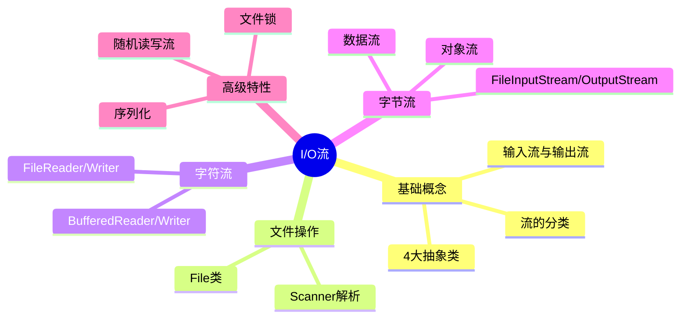
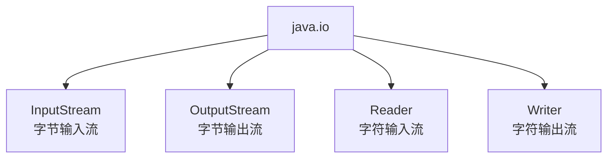
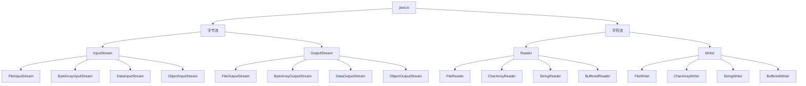
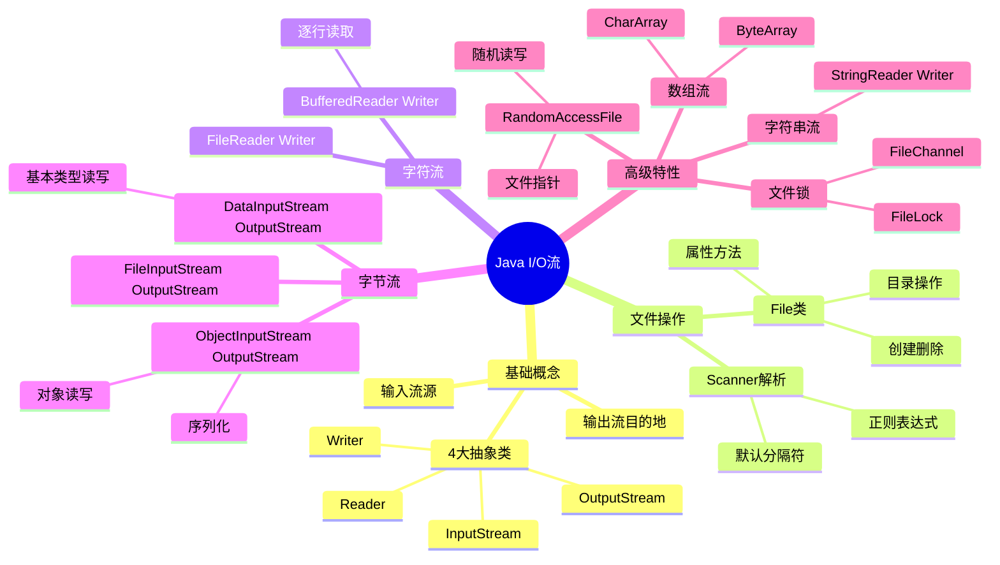

# 输入流和输出流

> 📝 **课程**: Java语言程序设计 第九章
> 
> 🎯 **学习目标**: 掌握Java I/O流的核心概念与文件操作技术

---

## 📋 目录结构



**章节列表**:

1. 文件 (File类)
2. 使用Scanner解析文件
3. 文件字符流
4. 缓冲流
5. 文件字节流
6. 数据流
7. 对象流
8. 序列化和对象克隆
9. 数组流
10. 字符串流
11. 随机读写流
12. 文件锁

---

## 🔍 引言

### 💡 I/O流的基本概念

**定义**:
- 读写文件时可以使用输入/输出流，简称**I/O (input/output) 流**
- 输入流 (input stream)：程序从源读取数据
- 输出流 (output stream)：程序向目的地写入数据

**流的源和目的地**:

| 类型 | 可能的源/目的地 |
|------|----------------|
| 输入流的源 | 文件、键盘、鼠标、内存、网络 |
| 输出流的目的地 | 文件、显示器窗口、内存、网络 |

> 💡 **最佳实践**: 显式地关闭任何一个打开的流是一个好的编程习惯

### 🏷️ Java I/O的4大抽象类

**java.io包中的核心抽象类**:



| 抽象类 | 类型 | 处理单元 |
|--------|------|---------|
| `InputStream` | 字节输入流 | 字节 (byte) |
| `OutputStream` | 字节输出流 | 字节 (byte) |
| `Reader` | 字符输入流 | 字符 (char) |
| `Writer` | 字符输出流 | 字符 (char) |

### 📊 文本文件 vs 二进制文件

| 特性   | 文本文件                 | 二进制文件                    |
| ---- | -------------------- | ------------------------ |
| 数据表示 | 人类可读形式 (ASCII/UTF-8) | 二进制形式                    |
| 处理效率 | 较低 (需要编码/解码)         | 较高                       |
| 适用场景 | 文本编辑器创建的文件           | Java程序创建的数据文件            |
| 推荐流  | Reader/Writer        | InputStream/OutputStream |

> 📌 **参考资源**: [Oracle Java I/O Tutorial](https://docs.oracle.com/javase/tutorial/essential/io/)

---

## 🔍 9.1 文件

### 🏷️ File类概述

**核心特点**:
- File类用于**获取文件本身的信息**（目录、长度、权限等）
- **不涉及**文件的读写操作
- 位于`java.io`包

### 🛠️ 构造方法

```java
// 方式1: 直接指定文件名（推荐使用"/"作为分隔符）
File file1 = new File("C:/ch8/hello.txt");

// 方式2: 分别指定目录和文件名
File file2 = new File("C:/ch8", "hello.txt");

// 方式3: 使用File对象作为目录
File dir = new File("C:/ch8");
File file3 = new File(dir, "hello.txt");
```

> ⚠️ **路径分隔符注意**:
> - ✅ 推荐: `"C:/ch8"` (跨平台)
> - ✅ 可用: `"C:\\ch8"` (需要转义)
> - ❌ 错误: `"C:\ch8"` (转义错误)

### 📌 文件属性方法

#### 基本信息

| 方法 | 返回类型 | 功能 |
|------|---------|------|
| `getName()` | `String` | 获取文件名 |
| `getAbsolutePath()` | `String` | 获取绝对路径 |
| `getParent()` | `String` | 获取父目录 |
| `length()` | `long` | 获取文件长度（字节） |
| `lastModified()` | `long` | 获取最后修改时间 |

#### 权限与状态

| 方法 | 返回类型 | 功能 |
|------|---------|------|
| `exists()` | `boolean` | 判断文件是否存在 |
| `canRead()` | `boolean` | 判断文件是否可读 |
| `canWrite()` | `boolean` | 判断文件是否可写 |
| `isFile()` | `boolean` | 判断是否是普通文件 |
| `isDirectory()` | `boolean` | 判断是否是目录 |
| `isHidden()` | `boolean` | 判断是否是隐藏文件 |

### 📁 目录操作

#### 创建目录

```java
File dir = new File("C:/myFolder");
boolean success = dir.mkdir();  // 创建单级目录
// 或
boolean success = dir.mkdirs(); // 创建多级目录
```

#### 列出目录内容

**返回字符串数组**:

| 方法 | 功能 |
|------|------|
| `String[] list()` | 返回目录下所有文件名 |
| `String[] list(FilenameFilter ff)` | 返回指定类型的文件名 |

**返回File对象数组**:

| 方法 | 功能 |
|------|------|
| `File[] listFiles()` | 返回目录下所有文件对象 |
| `File[] listFiles(FilenameFilter ff)` | 返回指定类型的文件对象 |

### 🔧 文件创建与删除

**创建新文件**:

```java
File file = new File("C:/myletter", "letter.txt");

if (!file.exists()) {
    file.createNewFile();  // 创建新文件
} else {
    // 文件已存在，打开该文件
}
```

**删除文件**:

```java
boolean deleted = file.delete();  // 删除文件
```

> 💡 **工作流程**:
> 1. 如果文件不存在 → 调用`createNewFile()`创建
> 2. 如果文件已存在 → 直接打开
> 3. 删除文件 → 调用`delete()`

### 💻 文件过滤器示例

#### FilenameFilter接口实现

```java
import java.io.*;

class FileAccept implements FilenameFilter {
    String str = null;
    
    FileAccept(String s) {
        str = "." + s;  // 添加文件扩展名前缀
    }
    
    @Override
    public boolean accept(File dir, String name) {
        return name.endsWith(str);  // 判断文件名是否以指定扩展名结尾
    }
}
```

#### 使用示例

```java
public class Example9_1 {
    public static void main(String args[]) {
        // 创建目录对象
        File dir = new File("C:/ch8");
        
        // 创建文件过滤器（只接受.java文件）
        FileAccept fileAccept = new FileAccept("java");
        File[] files = dir.listFiles(fileAccept);
        
        // 遍历并显示文件信息
        for (int i = 0; i < files.length; i++) {
            System.out.println(files[i].getName() + ": " + 
                             files[i].length() + " bytes");
        }
        
        // 删除第一个文件
        boolean flag = false;
        if (files.length > 0) {
            flag = files[0].delete();
        }
        
        if (flag) {
            System.out.println(files[0].getName() + " has been deleted.");
        }
    }
}
```

### 🚀 运行可执行文件

**使用Runtime类**:

```java
import java.io.*;

public class Example9_2 {
    public static void main(String args[]) {
        try {
            // 获取Runtime对象
            Runtime rt = Runtime.getRuntime();
            
            // 创建文件对象
            File file = new File("C:\\windows", "Notepad.exe");
            
            // 执行可执行文件
            rt.exec(file.getAbsolutePath());
        } catch (Exception e) {
            e.printStackTrace();
        }
    }
}
```

```Java
// 安全警示：Runtime.exec() 执行外部程序属于高危操作

import java.io.*;
import java.nio.file.*;
import java.util.*;
import java.util.concurrent.TimeUnit;

public class SafeExec {

    // TODO：只改这里！绝对路径白名单（必须写完整路径）
    private static final Set<String> WHITE_LIST = Set.of(
        "C:\\Windows\\System32\\notepad.exe",
        "C:\\Windows\\System32\\calc.exe",
        "C:\\Windows\\System32\\mspaint.exe",
        "C:\\Program Files\\Git\\bin\\git.exe",
        "D:\\Tools\\ffmpeg.exe"
        // 需要加别的？继续往这里写一行
    );

    /** 安全执行外部程序 */
    public static boolean run(String exePath, String... args) {
        String absolute = Path.of(exePath).toAbsolutePath().normalize().toString();

        // 1. 白名单校验
        if (!WHITE_LIST.contains(absolute)) {
            System.err.println("[安全拒绝] 不允许执行 → " + absolute);
            return false;
        }

        // 2. 文件存在性校验
        if (!Files.isRegularFile(Path.of(absolute))) {
            System.err.println("[安全拒绝] 文件不存在或不是正常文件");
            return false;
        }

        try {
            List<String> command = new ArrayList<>();
            command.add(absolute);
            if (args != null) command.addAll(Arrays.asList(args));

            ProcessBuilder pb = new ProcessBuilder(command);
            pb.inheritIO();                          // 输出直接显示在控制台

            Process p = pb.start();

            // 3. 超时自动杀死（防止挖矿程序常驻）
            boolean ok = p.waitFor(30, TimeUnit.SECONDS);
            if (!ok) {
                p.destroyForcibly();
                System.err.println("[强制终止] 程序运行超时");
                return false;
            }
            return p.exitValue() == 0;

        } catch (Exception e) {
            e.printStackTrace();
            return false;
        }
    }

    public static void main(String[] args) {
        run("C:\\Windows\\System32\\notepad.exe");     // 成功
        run("D:\\Temp\\test01.exe");                  // 被白名单拒绝
    }
}
```

**Runtime类方法**:

| 方法 | 功能 |
|------|------|
| `Runtime.getRuntime()` | 获取Runtime实例（静态方法） |
| `exec(String command)` | 执行本地可执行文件或操作 |

---

## 🔍 9.12 使用Scanner解析文件

### 🏷️ 解析策略

**两种策略对比**:

| 策略 | 优点 | 缺点 | 特点 |
|------|------|------|------|
| 全部读入内存 | 处理速度快 | 消耗内存多 | "以空间换时间" |
| Scanner逐步解析 | 节省内存 | 处理速度较慢 | "以时间换空间" |

### 📌 1. 使用默认分隔符解析

**基本用法**:

```java
File file = new File("hello.txt");
Scanner scanner = new Scanner(file);

while (scanner.hasNext()) {
    String word = scanner.next();  // 读取下一个单词（空格分隔）
    System.out.println(word);
}
```

```Java
// 模板1：文件放项目根目录
try (Scanner sc = new Scanner(new File("hello.txt"), "UTF-8")) {
	// 1. try-with-resources → 自动关闭，绝不泄露 
	// 2. 指定 UTF-8 → 中文永不乱码 
	// 3. 文件放项目根目录（和 src 同级）
	
    while (sc.hasNextLine()) {
        System.out.println(sc.nextLine());
    }
} catch (FileNotFoundException e) {
    System.err.println("找不到文件！路径：" + System.getProperty("user.dir"));
}

// 模板2：文件放 src 或 resources
try (Scanner sc = new Scanner(
        Objects.requireNonNull(
            getClass().getClassLoader().getResourceAsStream("hello.txt")),
        StandardCharsets.UTF_8)) {

    while (sc.hasNextLine()) System.out.println(sc.nextLine());

} catch (Exception e) {
    System.err.println("读取失败：" + e.getMessage());
}
```

**Scanner常用方法**:

| 方法 | 功能 | 返回类型 |
|------|------|---------|
| `hasNext()` | 判断是否有下一个元素 | `boolean` |
| `next()` | 读取下一个字符串 | `String` |
| `nextInt()` | 读取下一个整数 | `int` |
| `nextDouble()` | 读取下一个浮点数 | `double` |

> ⚠️ **异常处理**: 如果调用`nextInt()`或`nextDouble()`时单词不是数字，会抛出`InputMismatchException`

### 💻 示例: 解析消费数据

**文件内容** (cost.txt):
```
TV cost 876 dollar, Computer cost 2398 dollar. 
The milk cost 98 dollar. The apple cost 198 dollar.
```

**代码实现**:

```java
import java.io.*;
import java.util.*;

public class Demo {
    public static void main(String args[]) {
        File file = new File("D:\\chp09\\cost.txt");
        Scanner scanner = null;
        int sum = 0;
        
        try {
            scanner = new Scanner(file);
            
            while (scanner.hasNext()) {
                try {
                    int price = scanner.nextInt();  // 尝试读取整数
                    sum += price;
                    System.out.println(price);
                } catch (InputMismatchException exp) {
                    String t = scanner.next();  // 跳过非数字单词
                }
            }
            
            System.out.println("Total Cost: " + sum + " dollar");
        } catch (Exception exp) {
            System.out.println(exp);
        }
    }
}
```

**输出结果**:
```
876
2398
98
198
Total Cost: 3570 dollar
```

### 📌 2. 使用正则表达式作为分隔符

**语法**:

```java
File file = new File("hello.txt");
Scanner scanner = new Scanner(file);
scanner.useDelimiter(正则表达式);  // 设置自定义分隔符
```

### 💻 示例: 解析通信费用

**文件内容** (communicate.txt):
```
市话费:176.89元,长途费:187.98元,网络费:928.66元
```

**代码实现**:

```java
import java.io.*;
import java.util.*;

public class Demo {
    public static void main(String args[]) {
        File file = new File("D:\\chp09\\communicate.txt");
        Scanner scanner = null;
        double sum = 0;
        
        try {
            scanner = new Scanner(file);
            // 使用正则表达式：匹配所有非数字字符作为分隔符
            scanner.useDelimiter("[^0123456789.]+");
            
            while (scanner.hasNextDouble()) {
                double fare = scanner.nextDouble();
                sum += fare;
                System.out.println(fare);
            }
            
            System.out.println("Total: " + sum);
        } catch (Exception exp) {
            System.out.println(exp);
        }
    }
}
```

**输出结果**:
```
176.89
187.98
928.66
Total: 1293.53
```

**正则表达式说明**:

| 正则表达式 | 含义 |
|-----------|------|
| `[^0123456789.]+` | 匹配一个或多个非数字字符（不包括小数点） |
| `[^a-zA-Z]+` | 匹配一个或多个非字母字符 |
| `\\s+` | 匹配一个或多个空白字符 |

### 📌 3. 单词记忆训练应用

**功能需求**:
1. 从文件word.txt读取英文单词（空格分隔）
2. 显示单词后要求用户输入
3. 用户输入时隐藏显示的单词
4. 统计正确率

---

## 🔍 9.3 文件字符流

### 🏷️ FileReader类

**构造方法**:

```java
// 方式1: 通过文件名创建
FileReader reader = new FileReader("hello.txt");

// 方式2: 通过File对象创建
File file = new File("hello.txt");
FileReader reader = new FileReader(file);
```

**常用方法**:

| 方法 | 功能 | 返回值 |
|------|------|--------|
| `int read()` | 读取一个字符 | 0~65535 (Unicode值)，末尾返回-1 |
| `int read(char[] b)` | 读取b.length个字符到数组b | 实际读取的字符数，末尾返回-1 |
| `int read(char[] b, int off, int len)` | 读取len个字符到数组b，从off位置开始存放 | 实际读取的字符数，末尾返回-1 |

> 💡 **编码说明**: 
> - Java内部使用2字节UTF-16编码表示字符
> - 文件中的物理字节数可能是1、2或3个字节

### 🏷️ FileWriter类

**构造方法**:

```java
// 方式1: 通过文件名创建
FileWriter writer = new FileWriter("hello.txt");

// 方式2: 通过File对象创建
File file = new File("hello.txt");
FileWriter writer = new FileWriter(file);
```

**常用方法**:

| 方法 | 功能 |
|------|------|
| `void write(char[] b)` | 写入整个字符数组 |
| `void write(char[] b, int off, int len)` | 写入数组的一部分 |
| `void write(String str)` | 写入整个字符串 |
| `void write(String str, int off, int len)` | 写入字符串的一部分 |

### 💻 代码示例

```java
import java.io.*;

public class Example9_4 {
    public static void main(String args[]) {
        File file = new File("hello.txt");
        char b[] = "深圳大学".toCharArray();
        
        try {
            // 写入数据
            FileWriter output = new FileWriter(file);
            output.write(b);              // 写入字符数组
            output.write("脚踏实地！");    // 写入字符串
            output.close();
            
            // 读取数据
            FileReader input = new FileReader(file);
            int n = 0;
            while ((n = input.read(b, 0, 2)) != -1) {  // 每次最多读2个字符
                String str = new String(b, 0, n);      // 转换为字符串
                System.out.println(str);
            }
            input.close();
        } catch (IOException e) {
            System.out.println(e);
        }
    }
}
```

**输出结果**:
```
深圳
大学
脚踏
实地
！
```

---

## 🔍 9.5 缓冲流

### 🏷️ BufferedReader类

**构造方法**:

```java
FileReader fr = new FileReader("Student.txt");
BufferedReader input = new BufferedReader(fr);
```

**核心方法**:

| 方法 | 功能 | 返回类型 |
|------|------|---------|
| `String readLine()` | 读取一行文本 | `String`，末尾返回`null` |

**工作流程**:


### 🏷️ BufferedWriter类

**构造方法**:

```java
FileWriter fw = new FileWriter("hello.txt");
BufferedWriter output = new BufferedWriter(fw);
```

**常用方法**:

| 方法 | 功能 |
|------|------|
| `write(String s)` | 写入整个字符串 |
| `write(String s, int off, int len)` | 写入字符串的一部分 |
| `newLine()` | 写入行分隔符 |
| `flush()` | 刷新缓冲区 |

### 💻 代码示例

```java
import java.io.*;

public class Example9_5 {
    public static void main(String args[]) {
        try {
            // 创建输入流
            FileReader fr = new FileReader("input.txt");
            BufferedReader input = new BufferedReader(fr);
            
            // 创建输出流
            FileWriter fw = new FileWriter("output.txt");
            BufferedWriter output = new BufferedWriter(fw);
            
            // 逐行读取并添加行号
            String s = null;
            int i = 0;
            while ((s = input.readLine()) != null) {
                i++;
                output.write(i + ": " + s);
                output.newLine();  // 写入换行符
            }
            
            // 关闭流
            output.flush();
            output.close();
            fw.close();
            input.close();
            fr.close();
        } catch (IOException e) {
            System.out.println(e);
        }
    }
}
```

**功能**: 为文本文件的每一行添加行号

---

## 🔍 9.2 文件字节流

### 🏷️ FileInputStream类

**构造方法**:

```java
// 方式1: 通过文件名创建
FileInputStream fis = new FileInputStream("hello.txt");

// 方式2: 通过File对象创建
File file = new File("hello.txt");
FileInputStream fis = new FileInputStream(file);
```

**核心方法**:

| 方法 | 功能 | 返回值 |
|------|------|--------|
| `int read()` | 读取单个字节 | 0~255，末尾返回-1 |
| `int read(byte[] b)` | 读取b.length个字节到数组b | 实际读取的字节数，末尾返回-1 |
| `int read(byte[] b, int off, int len)` | 读取len个字节到数组b，从off位置开始存放 | 实际读取的字节数，末尾返回-1 |

### 🏷️ FileOutputStream类

**构造方法**:

```java
// 方式1: 通过文件名创建
FileOutputStream fos = new FileOutputStream("hello.txt");

// 方式2: 通过File对象创建
File file = new File("hello.txt");
FileOutputStream fos = new FileOutputStream(file);
```

**常用方法**:

| 方法 | 功能 |
|------|------|
| `void write(byte[] b)` | 写入整个字节数组 |
| `void write(byte[] b, int off, int len)` | 写入数组的一部分 |

### 💻 代码示例

```java
import java.io.*;

public class Example9_3 {
    public static void main(String args[]) {
        File file = new File("hello.txt");
        byte b[] = "深圳大学".getBytes();
        
        try {
            // 写入数据
            FileOutputStream output = new FileOutputStream(file);
            output.write(b);  // 写入字节数组
            output.close();
            
            // 读取数据
            FileInputStream input = new FileInputStream(file);
            int n = 0;
            while ((n = input.read(b, 0, 3)) != -1) {  
                // 最多读3个字节（文件中的物理字节数）
                // 读到内存后统一用2个字节表示一个汉字
                String str = new String(b, 0, n);
                System.out.println(str);
            }
        } catch (IOException e) {
            System.out.println(e);
        }
    }
}
```

> 💡 **编码说明**:
> - 文件中: 物理字节数可能是1、2或3个字节（取决于编码）
> - 内存中: Java统一用2个字节表示一个字符（UTF-16）

---

## 🔍 9.8 数据流

### 🏷️ DataInputStream类和DataOutputStream类

**核心特点**:
- DataInputStream: 数据输入流
- DataOutputStream: 数据输出流
- 可以读写Java基本数据类型

**构造方法**:

```java
// 数据输入流
FileInputStream fis = new FileInputStream("jerry.dat");
DataInputStream input = new DataInputStream(fis);

// 数据输出流
FileOutputStream fos = new FileOutputStream("jerry.dat");
DataOutputStream output = new DataOutputStream(fos);
```

### 📊 常用方法

**DataOutputStream写入方法**:

| 方法 | 功能 |
|------|------|
| `writeInt(int v)` | 写入int值 |
| `writeDouble(double v)` | 写入double值 |
| `writeBoolean(boolean v)` | 写入boolean值 |
| `writeChar(int v)` | 写入char值 |
| `writeChars(String s)` | 写入字符串 |
| `writeUTF(String s)` | 以UTF-8格式写入字符串 |

**DataInputStream读取方法**:

| 方法 | 功能 |
|------|------|
| `int readInt()` | 读取int值 |
| `double readDouble()` | 读取double值 |
| `boolean readBoolean()` | 读取boolean值 |
| `char readChar()` | 读取char值 |
| `String readUTF()` | 读取UTF-8格式字符串 |

### 💻 代码示例

```java
import java.io.*;

public class Example9_8 {
    public static void main(String args[]) {
        try {
            // 写入数据
            FileOutputStream fos = new FileOutputStream("jerry.dat");
            DataOutputStream output = new DataOutputStream(fos);
            output.writeInt(100);
            output.writeChars("I am ok");
            output.close();
        } catch (IOException e) {
            e.printStackTrace();
        }
        
        try {
            // 读取数据
            FileInputStream fis = new FileInputStream("jerry.dat");
            DataInputStream input = new DataInputStream(fis);
            
            System.out.println(input.readInt());  // 输出: 100
            
            char c;
            while ((c = input.readChar()) != '\0') {  // '\0'表示空字符
                System.out.print(c);  // 输出: I am ok
            }
            input.close();
        } catch (IOException e) {
            e.printStackTrace();
        }
    }
}
```

---

## 🔍 9.9 对象流

### 🏷️ ObjectInputStream和ObjectOutputStream

**核心特点**:
- ObjectInputStream: 对象输入流
- ObjectOutputStream: 对象输出流
- 可以读写整个对象

**构造方法**:

```java
// 对象输入流
FileInputStream fis = new FileInputStream("a.txt");
ObjectInputStream objectIn = new ObjectInputStream(fis);

// 对象输出流
FileOutputStream fos = new FileOutputStream("a.txt");
ObjectOutputStream objectOut = new ObjectOutputStream(fos);
```

**核心方法**:

| 方法 | 功能 |
|------|------|
| `writeObject(Object obj)` | 将对象obj写入输出流 |
| `Object readObject()` | 从输入流读取一个对象 |

### 🔐 Serializable接口

**序列化的定义**:
- 一个类如果实现了`Serializable`接口，该类创建的对象就是**序列化对象** (serializable object)
- Serializable接口中的方法对程序不可见
- 实现该接口的类不需要实现额外的方法
- JVM会自动处理序列化和反序列化过程

**为什么需要序列化**:
- 将对象转换为字节流存储到文件
- 通过网络传输对象
- 实现对象的深度克隆

### 💻 代码示例

**定义可序列化的类**:

```java
import java.io.*;

class Goods implements Serializable {
    String name = null;
    double unitPrice;
    
    Goods(String name, double unitPrice) {
        this.name = name;
        this.unitPrice = unitPrice;
    }
    
    public void setUnitPrice(double unitPrice) {
        this.unitPrice = unitPrice;
    }
    
    public double getUnitPrice() {
        return unitPrice;
    }
    
    public void setName(String name) {
        this.name = name;
    }
    
    public String getName() {
        return name;
    }
}
```

**使用对象流**:

```java
public class Example9_9 {
    public static void main(String args[]) {
        Goods TV1 = new Goods("HaierTV", 3468);
        
        try {
            // 写入对象
            FileOutputStream fileOut = new FileOutputStream("a.txt");
            ObjectOutputStream objectOut = new ObjectOutputStream(fileOut);
            objectOut.writeObject(TV1);
            objectOut.close();
            
            // 读取对象
            FileInputStream fileIn = new FileInputStream("a.txt");
            ObjectInputStream objectIn = new ObjectInputStream(fileIn);
            Goods TV2 = (Goods) objectIn.readObject();  // 需要强制类型转换
            objectIn.close();
            
            // 修改TV2，不影响TV1
            TV2.setUnitPrice(8888);
            TV2.setName("GreatWall");
            
            System.out.printf("\nTV1: %s, %f", TV1.getName(), TV1.getUnitPrice());
            System.out.printf("\nTV2: %s, %f", TV2.getName(), TV2.getUnitPrice());
        } catch (Exception event) {
            System.out.println(event);
        }
    }
}
```

**输出结果**:
```
TV1: HaierTV, 3468.000000
TV2: GreatWall, 8888.000000
```

---

## 🔍 9.10 序列化和对象克隆

### 🏷️ 深度克隆原理

**使用对象流实现深度克隆**:
1. 将原对象写入对象输出流
2. 用对象输入流读回对象
3. 读回的对象就是原对象的深度克隆

**深度克隆 vs 浅度克隆**:

| 克隆类型 | 引用型变量 | 修改克隆对象 | 原对象受影响 |
|---------|-----------|-------------|-------------|
| 浅度克隆 | 复制引用 | 修改引用对象 | ✅ 受影响 |
| 深度克隆 | 复制对象 | 修改引用对象 | ❌ 不受影响 |

### 💻 代码示例

**定义可序列化的类**:

```java
import java.io.*;

class Goods implements Serializable {
    String name = null;
    
    Goods(String name) {
        this.name = name;
    }
    
    public void setName(String name) {
        this.name = name;
    }
    
    public String getName() {
        return name;
    }
}

class Shop implements Serializable {
    Goods goods[];
    
    public void setGoods(Goods[] s) {
        goods = s;
    }
    
    public Goods[] getGoods() {
        return goods;
    }
}
```

**深度克隆实现**:

```java
public class Example9_10 {
    public static void main(String args[]) {
        Shop shop1 = new Shop();
        Goods s1[] = {new Goods("TV"), new Goods("PC")};
        shop1.setGoods(s1);
        
        try {
            // 使用ByteArrayOutputStream作为临时存储
            ByteArrayOutputStream out = new ByteArrayOutputStream();
            ObjectOutputStream objectOut = new ObjectOutputStream(out);
            objectOut.writeObject(shop1);
            
            // 从字节数组读取对象
            ByteArrayInputStream in = new ByteArrayInputStream(out.toByteArray());
            ObjectInputStream objectIn = new ObjectInputStream(in);
            Shop shop2 = (Shop) objectIn.readObject();
            
            // 验证深度克隆
            Goods goods2[] = shop2.getGoods();
            System.out.println("shop2:");
            for (int i = 0; i < goods2.length; i++) {
                System.out.println(goods2[i].getName());
            }
        } catch (Exception event) {
            System.out.println(event);
        }
    }
}
```

> 💡 **关键方法**: `out.toByteArray()` - 返回输出流写入到缓冲区的全部字节

---

## 🔍 9.6 数组流

### 🏷️ 字节数组流

**核心特点**:
- 使用**字节数组**作为流的源和目的地
- 在内存中进行I/O操作

**类型**:

| 类 | 类型 | 功能 |
|----|------|------|
| `ByteArrayInputStream` | 字节输入流 | 从字节数组读取数据 |
| `ByteArrayOutputStream` | 字节输出流 | 向字节数组写入数据 |

### 🛠️ 构造方法

**ByteArrayInputStream**:

```java
// 方式1: 使用整个数组作为源
byte[] buf = {65, 66, 67};
ByteArrayInputStream input = new ByteArrayInputStream(buf);

// 方式2: 使用数组的一部分作为源
ByteArrayInputStream input = new ByteArrayInputStream(buf, offset, length);
```

**ByteArrayOutputStream**:

```java
// 方式1: 默认缓冲区大小32字节
ByteArrayOutputStream output = new ByteArrayOutputStream();

// 方式2: 指定缓冲区初始大小
ByteArrayOutputStream output = new ByteArrayOutputStream(size);
```

> 💡 **自动扩容**: 如果写入的字节数超过缓冲区大小，缓冲区会自动增加

### 📌 重要方法

| 方法 | 功能 |
|------|------|
| `byte[] toByteArray()` | 返回输出流写入缓冲区的全部字节 |

### 💻 代码示例

```java
import java.io.*;

public class Example9_6 {
    public static void main(String args[]) {
        int n = -1;
        
        // 创建字节数组输出流
        ByteArrayOutputStream output = new ByteArrayOutputStream();
        
        // 写入ASCII字符 A-E
        for (int i = 0; i < 5; i++) {
            output.write('A' + i);
        }
        
        // 从输出流的缓冲区创建输入流
        ByteArrayInputStream input = new ByteArrayInputStream(output.toByteArray());
        
        // 读取并显示
        while ((n = input.read()) != -1) {
            System.out.println(n + ": " + (char) n);
        }
    }
}
```

**输出结果**:
```
65: A
66: B
67: C
68: D
69: E
```

### 🏷️ 字符数组流

**核心特点**:
- 使用**字符数组**作为流的源和目的地
- 读操作可能发生`IOException`异常，需要try-catch语句

**类型**:

| 类 | 类型 | 功能 |
|----|------|------|
| `CharArrayReader` | 字符输入流 | 从字符数组读取数据 |
| `CharArrayWriter` | 字符输出流 | 向字符数组写入数据 |

### 💻 代码示例

```java
import java.io.*;

public class Example9_7 {
    public static void main(String args[]) {
        int n = -1;
        
        // 创建字符数组输出流
        CharArrayWriter output = new CharArrayWriter();
        
        // 写入Unicode字符
        for (int i = 65; i <= 69; i++) {
            output.write(i);
        }
        
        // 从输出流的缓冲区创建输入流
        CharArrayReader input = new CharArrayReader(output.toCharArray());
        
        try {
            // 读取并显示
            while ((n = input.read()) != -1) {
                System.out.println(n + ": " + (char) n);
            }
        } catch (IOException e) {
            e.printStackTrace();
        }
    }
}
```

> 💡 **关键方法**: `output.toCharArray()` - 返回输出流写入缓冲区的全部字符

---

## 🔍 9.7 字符串流

### 🏷️ StringReader类

**核心特点**:
- 使用**字符串**作为流的源
- 不需要指向实际文件

**构造方法**:

```java
String s = "Hello World";
StringReader reader = new StringReader(s);
```

**常用方法**:

| 方法 | 功能 | 返回类型 |
|------|------|---------|
| `int read()` | 读取一个字符 | Unicode位置，末尾返回-1 |
| `int read(char[] buf, int off, int len)` | 读取len个字符到数组buf | 实际读取的字符数 |

### 🏷️ StringWriter类

**核心特点**:
- 将**内存**作为流的目的地
- 数据写入缓冲区

**构造方法**:

```java
// 方式1: 默认缓冲区
StringWriter writer = new StringWriter();

// 方式2: 指定初始大小
StringWriter writer = new StringWriter(size);
```

**常用方法**:

| 方法 | 功能 |
|------|------|
| `void write(int b)` | 写入一个字符 |
| `void write(char[] buf, int off, int len)` | 写入字符数组的一部分 |
| `void write(String str)` | 写入整个字符串 |
| `void write(String str, int off, int len)` | 写入字符串的一部分 |
| `String toString()` | 返回缓冲区的全部字符 |

### 💻 代码示例

```java
import java.io.*;

public class StringStreamDemo {
    public static void main(String args[]) {
        // StringWriter示例
        StringWriter writer = new StringWriter();
        writer.write("Hello ");
        writer.write("World!");
        String result = writer.toString();
        System.out.println(result);  // 输出: Hello World!
        
        // StringReader示例
        StringReader reader = new StringReader(result);
        try {
            int c;
            while ((c = reader.read()) != -1) {
                System.out.print((char) c);
            }
        } catch (IOException e) {
            e.printStackTrace();
        }
    }
}
```

---

## 🔍 9.11 随机读写流

### 🏷️ RandomAccessFile类

**核心特点**:
- 可以在文件的**任意位置**读写数据
- 既可以读也可以写（前面的流都是只读或只写）
- 使用**文件指针** (file pointer) 定位读写位置

**文件指针机制**:


### 🛠️ 构造方法

```java
// 方式1: 通过文件名创建
RandomAccessFile file = new RandomAccessFile("tom.dat", "rw");

// 方式2: 通过File对象创建
File f = new File("tom.dat");
RandomAccessFile file = new RandomAccessFile(f, "r");
```

**访问模式**:

| 模式 | 说明 | 使用建议 |
|------|------|---------|
| `"r"` | 只读模式 | 文件不需要修改时使用，防止意外修改 |
| `"rw"` | 读写模式 | 需要修改文件时使用 |

> ⚠️ **最佳实践**: 如果文件不打算修改，使用"r"模式打开，防止意外修改

### 📊 常用方法

**文件指针操作**:

| 方法 | 功能 |
|------|------|
| `long getFilePointer()` | 获取当前文件指针位置 |
| `void seek(long pos)` | 将文件指针移动到指定位置 |
| `long length()` | 获取文件长度 |

**读写方法**:

| 方法                          | 功能     |
| --------------------------- | ------ |
| `int readInt()`             | 读取int值 |
| `void writeInt(int v)`      | 写入int值 |
| `String readLine()`         | 读取一行文本 |
| `void writeBytes(String s)` | 写入字符串  |

### 💻 示例1: 反向读取整数

```java
import java.io.*;

public class Example9_11 {
    public static void main(String args[]) {
        RandomAccessFile inAndOut = null;
        int[] data = {20, 30, 40, 50, 60};
        
        try {
            inAndOut = new RandomAccessFile("a.dat", "rw");
            
            // 写入整数
            for (int i = 0; i < data.length; i++) {
                inAndOut.writeInt(data[i]);
            }
            
            // 反向读取（每个int占4字节）
            for (long i = data.length - 1; i >= 0; i--) {
                inAndOut.seek(i * 4);  // 移动文件指针
                System.out.println(inAndOut.readInt());
            }
            
            inAndOut.close();
        } catch (IOException e) {
            e.printStackTrace();
        }
    }
}
```

**输出结果**:
```
60
50
40
30
20
```

### 💻 示例2: 使用readLine()读取文本

```java
import java.io.*;

public class Example9_12 {
    public static void main(String args[]) {
        RandomAccessFile input = null;
        
        try {
            input = new RandomAccessFile("test.txt", "rw");
            long length = input.length();  // 获取文件长度
            long position = 0;
            
            input.seek(position);  // 移动到文件开始
            
            while (position < length) {
                String str = input.readLine();
                position = input.getFilePointer();  // 获取当前指针位置
                System.out.println(str);
            }
        } catch (IOException e) {
            e.printStackTrace();
        }
    }
}
```

---

## 🔍 9.13 文件锁

### 🏷️ FileLock类

**核心特点**:
- JDK 1.4引入
- 对文件加锁后，其他线程无法操作被锁定的文件
- 只有解除锁才能继续操作

### 🔐 使用步骤

**Step 1: 创建RandomAccessFile流**:

```java
RandomAccessFile input = new RandomAccessFile("Example.java", "rw");
```

> ⚠️ **注意**: 读写属性必须是`"rw"`

**Step 2: 获取文件信道 (FileChannel)**:

```java
FileChannel channel = input.getChannel();
```

**Step 3: 获取文件锁**:

```java
FileLock lock = channel.tryLock();  // 或使用lock()方法
```

**锁方法对比**:

| 方法 | 阻塞行为 | 返回值 |
|------|---------|--------|
| `tryLock()` | 非阻塞，立即返回 | 成功返回FileLock，失败返回null |
| `lock()` | 阻塞，直到获取锁 | 返回FileLock |

### 📌 其他流也可使用文件锁

```java
// FileInputStream也可以获取文件锁
FileInputStream fis = new FileInputStream("file.txt");
FileChannel channel = fis.getChannel();
FileLock lock = channel.tryLock(0, Long.MAX_VALUE, true);  // 共享锁
```

### 💻 代码示例

```java
import java.io.*;
import java.nio.channels.*;

public class Example9_13 {
    public static void main(String args[]) {
        int b;
        byte tom[] = new byte[12];
        
        try {
            RandomAccessFile input = new RandomAccessFile("test.txt", "rw");
            FileChannel channel = input.getChannel();
            
            while ((b = input.read(tom, 0, 10)) != -1) {
                // 获取文件锁
                FileLock lock = channel.tryLock();
                
                String s = new String(tom, 0, b);
                System.out.print(s);
                
                try {
                    Thread.sleep(1000);  // 模拟处理时间
                    lock.release();      // 释放锁
                } catch (Exception e) {
                    System.out.println(e);
                }
            }
            
            input.close();
        } catch (Exception e) {
            System.out.println(e);
        }
    }
}
```

> 💡 **应用场景**: 在Java程序读取文件时使用文件锁，其他程序（如记事本）无法修改、保存该文件

---

## 🗂️ Java I/O类体系总结

### 📊 I/O类层次结构



### 📌 流的分类

#### 按功能分类

| 类别 | 字节流 | 字符流 |
|------|--------|--------|
| **文件流** | FileInputStream<br/>FileOutputStream | FileReader<br/>FileWriter |
| **缓冲流** | BufferedInputStream<br/>BufferedOutputStream | BufferedReader<br/>BufferedWriter |
| **数组流** | ByteArrayInputStream<br/>ByteArrayOutputStream | CharArrayReader<br/>CharArrayWriter |
| **字符串流** | - | StringReader<br/>StringWriter |
| **数据流** | DataInputStream<br/>DataOutputStream | - |
| **对象流** | ObjectInputStream<br/>ObjectOutputStream | - |

#### 其他重要类

| 类 | 功能 | 特点 |
|----|------|------|
| `File` | 文件属性操作 | 不涉及读写 |
| `Scanner` | 文本解析 | 支持正则表达式 |
| `RandomAccessFile` | 随机读写 | 实现DataInput和DataOutput接口 |
| `FileLock` | 文件锁 | 通过FileChannel获取 |
| `Serializable` | 序列化接口 | 标记接口，无需实现方法 |

### 🔄 流的包装（装饰器模式）

**包装示例**:

```java
// 缓冲字节输入流包装
BufferedInputStream input = new BufferedInputStream(
    new FileInputStream("input.dat")
);

// 数据输入流包装
DataInputStream input = new DataInputStream(
    new FileInputStream("input.dat")
);

// 对象输入流包装
ObjectInputStream input = new ObjectInputStream(
    new FileInputStream("input.dat")
);

// 双重包装：对象流 + 缓冲流
ObjectInputStream input = new ObjectInputStream(
    new BufferedInputStream(
        new FileInputStream("input.dat")
    )
);
```

> 💡 **装饰器模式优势**: 
> - 增强流的功能（如添加缓冲）
> - 灵活组合不同功能
> - 提高I/O效率

---

## 🏆 补充知识

### 📊 文本I/O vs 二进制I/O

**核心区别**:

| 特性 | 文本I/O | 二进制I/O |
|------|---------|-----------|
| 数据表示 | 人类可读形式 | 二进制形式 |
| 编码/解码 | 需要 | 不需要 |
| 处理效率 | 较低 | 较高 |
| 适用场景 | 文本编辑器创建的文件 | Java程序创建的数据文件 |
| 推荐类 | Reader/Writer、Scanner/PrintWriter | InputStream/OutputStream |

### 🏗️ 流的效率优化

**使用缓冲流提速**:

```java
// 不推荐：直接使用FileInputStream（慢）
FileInputStream fis = new FileInputStream("large.dat");

// 推荐：使用BufferedInputStream（快）
BufferedInputStream bis = new BufferedInputStream(
    new FileInputStream("large.dat")
);
```

> 💡 **最佳实践**: 始终使用缓冲I/O来提高输入输出速度

### 🔄 DataInputStream vs ObjectInputStream

**功能对比**:

| 特性 | DataInputStream | ObjectInputStream |
|------|----------------|-------------------|
| 读取基本类型 | ✅ 支持 | ✅ 支持 |
| 读取字符串 | ✅ 支持 | ✅ 支持 |
| 读取对象 | ❌ 不支持 | ✅ 支持 |
| 处理效率 | 高 | 相对较低 |
| 适用场景 | 基本数据类型 | 需要序列化对象 |

> 💡 **说明**: ObjectInputStream可以完全替代DataInputStream，但效率会低一些

### 📌 序列化 (Serializable)

**定义**:
- 能够被写入输出流的对象称为**序列化对象** (serializable object)
- 必须实现`java.io.Serializable`接口

**特点**:
- Serializable是**标记接口**（无方法）
- 无需实现任何方法
- JVM自动处理序列化过程

```java
class Student implements Serializable {
    // 无需实现任何方法
}
```

### 🔐 RandomAccessFile的接口

**实现的接口**:
- `DataInput`: 提供读取基本类型的方法
- `DataOutput`: 提供写入基本类型的方法

**特点**:
- 所有读写流都是**只读**或**只写**
- RandomAccessFile是唯一可以**随机位置读写**的类

---

## Try-with-resources (自动资源管理)

### 🏷️ 传统资源管理的问题

**传统方式的缺点**:

```java
// 传统方式：需要手动关闭流
FileInputStream fis = null;
try {
    fis = new FileInputStream("file.txt");
    // 读取操作
} catch (IOException e) {
    e.printStackTrace();
} finally {
    // 必须手动关闭，容易遗忘
    if (fis != null) {
        try {
            fis.close();
        } catch (IOException e) {
            e.printStackTrace();
        }
    }
}
```

**问题**:
- 代码冗长，需要在finally块中手动关闭
- 容易忘记关闭资源，造成资源泄漏
- 嵌套的try-catch使代码难以阅读

### 🚀 Try-with-resources语法 (JDK 7+)

**基本语法**:

```java
try (资源声明1; 资源声明2; ...) {
    // 使用资源
} catch (Exception e) {
    // 异常处理
}
// 资源会自动关闭
```

**示例1: 单个资源**:

```java
try (FileInputStream fis = new FileInputStream("input.txt")) {
    int data = fis.read();
    while (data != -1) {
        System.out.print((char) data);
        data = fis.read();
    }
} catch (IOException e) {
    e.printStackTrace();
}
// fis会自动关闭
```

**示例2: 多个资源**:

```java
try (FileReader reader = new FileReader("input.txt");
     BufferedReader br = new BufferedReader(reader)) {
    String line;
    while ((line = br.readLine()) != null) {
        System.out.println(line);
    }
} catch (IOException e) {
    e.printStackTrace();
}
// reader和br都会自动关闭
```

**示例3: 文件复制**:

```java
public static void copyFile(String source, String dest) {
    try (FileInputStream fis = new FileInputStream(source);
         FileOutputStream fos = new FileOutputStream(dest)) {
        
        byte[] buffer = new byte[1024];
        int length;
        while ((length = fis.read(buffer)) > 0) {
            fos.write(buffer, 0, length);
        }
        System.out.println("文件复制成功!");
    } catch (IOException e) {
        System.out.println("文件复制失败: " + e.getMessage());
    }
}
```

### 📌 AutoCloseable接口

**要求**:
- try-with-resources只能用于实现了`AutoCloseable`或`Closeable`接口的类
- 所有I/O流都实现了这些接口

**自定义AutoCloseable资源**:

```java
class MyResource implements AutoCloseable {
    public MyResource() {
        System.out.println("资源已打开");
    }
    
    public void doSomething() {
        System.out.println("正在使用资源");
    }
    
    @Override
    public void close() {
        System.out.println("资源已关闭");
    }
}

// 使用
try (MyResource resource = new MyResource()) {
    resource.doSomething();
}
// 输出:
// 资源已打开
// 正在使用资源
// 资源已关闭
```

> 💡 **最佳实践**: 在Java 7及以上版本中，始终使用try-with-resources来管理I/O资源

---

## 🛠️ 常见错误和解决方案

### ❌ 错误1: FileNotFoundException

**原因**:
- 文件路径不正确
- 文件不存在
- 没有读取权限

**解决方案**:

```java
File file = new File("test.txt");
if (!file.exists()) {
    System.out.println("文件不存在: " + file.getAbsolutePath());
    // 创建文件
    file.createNewFile();
}

try (FileReader fr = new FileReader(file)) {
    // 读取操作
} catch (FileNotFoundException e) {
    System.out.println("找不到文件: " + e.getMessage());
} catch (IOException e) {
    System.out.println("读取错误: " + e.getMessage());
}
```

### ❌ 错误2: 中文乱码问题

**原因**: 字符编码不匹配

**解决方案**:

```java
// 方式1: 使用InputStreamReader指定编码
try (FileInputStream fis = new FileInputStream("test.txt");
     InputStreamReader isr = new InputStreamReader(fis, "UTF-8");
     BufferedReader br = new BufferedReader(isr)) {
    String line;
    while ((line = br.readLine()) != null) {
        System.out.println(line);
    }
}

// 方式2: 使用OutputStreamWriter指定编码
try (FileOutputStream fos = new FileOutputStream("output.txt");
     OutputStreamWriter osw = new OutputStreamWriter(fos, "UTF-8");
     BufferedWriter bw = new BufferedWriter(osw)) {
    bw.write("中文内容");
}

// 方式3: 使用Files类 (推荐，JDK 7+)
import java.nio.file.*;
import java.nio.charset.*;

// 读取
List<String> lines = Files.readAllLines(
    Paths.get("test.txt"), 
    StandardCharsets.UTF_8
);

// 写入
Files.write(
    Paths.get("output.txt"), 
    lines, 
    StandardCharsets.UTF_8
);
```

### ❌ 错误3: 忘记关闭流导致资源泄漏

**问题代码**:

```java
// ❌ 错误：没有关闭流
FileWriter fw = new FileWriter("test.txt");
fw.write("Hello");
// 忘记调用fw.close()
```

**解决方案**:

```java
// ✅ 正确：使用try-with-resources
try (FileWriter fw = new FileWriter("test.txt")) {
    fw.write("Hello");
} // 自动关闭
```

### ❌ 错误4: 读取时没有检查返回值

**问题代码**:

```java
// ❌ 错误：假设总能读取固定字节数
byte[] buffer = new byte[100];
fis.read(buffer);  // 可能只读取了部分数据
```

**解决方案**:

```java
// ✅ 正确：检查实际读取的字节数
byte[] buffer = new byte[100];
int bytesRead = fis.read(buffer);
if (bytesRead != -1) {
    // 处理实际读取的bytesRead个字节
    String data = new String(buffer, 0, bytesRead);
}
```

---

## ⚡ 性能优化技巧

### 1️⃣ 使用缓冲流

**性能对比**:

```java
// ❌ 慢：直接使用FileInputStream
long start = System.currentTimeMillis();
try (FileInputStream fis = new FileInputStream("large.txt")) {
    while (fis.read() != -1) {
        // 每次读取1个字节，系统调用次数多
    }
}
long time1 = System.currentTimeMillis() - start;

// ✅ 快：使用BufferedInputStream
start = System.currentTimeMillis();
try (BufferedInputStream bis = new BufferedInputStream(
         new FileInputStream("large.txt"))) {
    while (bis.read() != -1) {
        // 内部使用缓冲区，减少系统调用
    }
}
long time2 = System.currentTimeMillis() - start;

System.out.println("无缓冲: " + time1 + "ms");
System.out.println("有缓冲: " + time2 + "ms");
// 有缓冲通常快10-100倍
```

### 2️⃣ 使用字节数组批量读写

```java
// ❌ 慢：逐字节读写
try (FileInputStream fis = new FileInputStream("source.dat");
     FileOutputStream fos = new FileOutputStream("dest.dat")) {
    int b;
    while ((b = fis.read()) != -1) {
        fos.write(b);
    }
}

// ✅ 快：使用字节数组
try (FileInputStream fis = new FileInputStream("source.dat");
     FileOutputStream fos = new FileOutputStream("dest.dat")) {
    byte[] buffer = new byte[8192];  // 8KB缓冲区
    int length;
    while ((length = fis.read(buffer)) > 0) {
        fos.write(buffer, 0, length);
    }
}
```

### 3️⃣ 选择合适的缓冲区大小

```java
// 不同缓冲区大小的性能测试
int[] bufferSizes = {512, 1024, 2048, 4096, 8192, 16384};

for (int size : bufferSizes) {
    long start = System.currentTimeMillis();
    try (FileInputStream fis = new FileInputStream("large.dat");
         FileOutputStream fos = new FileOutputStream("copy.dat")) {
        byte[] buffer = new byte[size];
        int length;
        while ((length = fis.read(buffer)) > 0) {
            fos.write(buffer, 0, length);
        }
    }
    long time = System.currentTimeMillis() - start;
    System.out.println("缓冲区 " + size + " 字节: " + time + "ms");
}
```

> 💡 **推荐缓冲区大小**: 4KB-8KB通常是最佳选择

### 4️⃣ 使用NIO (New I/O)进行大文件操作

```java
import java.nio.file.*;
import java.nio.channels.*;

// 使用FileChannel进行高效复制
public static void fastCopy(String source, String dest) throws IOException {
    try (FileChannel srcChannel = FileChannel.open(
             Paths.get(source), StandardOpenOption.READ);
         FileChannel destChannel = FileChannel.open(
             Paths.get(dest), StandardOpenOption.WRITE, 
             StandardOpenOption.CREATE)) {
        
        // 直接传输，效率最高
        destChannel.transferFrom(srcChannel, 0, srcChannel.size());
    }
}
```

---

## 📝 实战练习题

### 练习1: 文件统计工具

**需求**: 编写程序统计文本文件的行数、单词数、字符数

```java
import java.io.*;

public class FileStatistics {
    public static void main(String[] args) {
        String filename = "test.txt";
        int lines = 0, words = 0, chars = 0;
        
        try (BufferedReader br = new BufferedReader(
                 new FileReader(filename))) {
            String line;
            while ((line = br.readLine()) != null) {
                lines++;
                chars += line.length();
                String[] wordArray = line.split("\\s+");
                words += wordArray.length;
            }
            
            System.out.println("行数: " + lines);
            System.out.println("单词数: " + words);
            System.out.println("字符数: " + chars);
        } catch (IOException e) {
            e.printStackTrace();
        }
    }
}
```

### 练习2: 文本文件加密/解密

**需求**: 使用简单的异或加密算法加密文本文件

```java
import java.io.*;

public class FileEncryption {
    private static final int KEY = 123;  // 加密密钥
    
    // 加密
    public static void encrypt(String source, String dest) {
        try (FileInputStream fis = new FileInputStream(source);
             FileOutputStream fos = new FileOutputStream(dest)) {
            int data;
            while ((data = fis.read()) != -1) {
                fos.write(data ^ KEY);  // 异或加密
            }
            System.out.println("加密完成!");
        } catch (IOException e) {
            e.printStackTrace();
        }
    }
    
    // 解密（异或加密的特性：加密两次等于解密）
    public static void decrypt(String source, String dest) {
        encrypt(source, dest);  // 解密方法与加密相同
        System.out.println("解密完成!");
    }
    
    public static void main(String[] args) {
        encrypt("original.txt", "encrypted.txt");
        decrypt("encrypted.txt", "decrypted.txt");
    }
}
```

### 练习3: 学生信息管理系统

**需求**: 将学生对象序列化保存到文件，并能读取

```java
import java.io.*;
import java.util.*;

class Student implements Serializable {
    private static final long serialVersionUID = 1L;
    private String id;
    private String name;
    private int age;
    
    public Student(String id, String name, int age) {
        this.id = id;
        this.name = name;
        this.age = age;
    }
    
    @Override
    public String toString() {
        return "学号: " + id + ", 姓名: " + name + ", 年龄: " + age;
    }
}

public class StudentManager {
    // 保存学生列表
    public static void saveStudents(List<Student> students, String filename) {
        try (ObjectOutputStream oos = new ObjectOutputStream(
                 new FileOutputStream(filename))) {
            oos.writeObject(students);
            System.out.println("保存成功!");
        } catch (IOException e) {
            e.printStackTrace();
        }
    }
    
    // 读取学生列表
    @SuppressWarnings("unchecked")
    public static List<Student> loadStudents(String filename) {
        try (ObjectInputStream ois = new ObjectInputStream(
                 new FileInputStream(filename))) {
            return (List<Student>) ois.readObject();
        } catch (IOException | ClassNotFoundException e) {
            e.printStackTrace();
            return new ArrayList<>();
        }
    }
    
    public static void main(String[] args) {
        // 创建学生列表
        List<Student> students = new ArrayList<>();
        students.add(new Student("001", "张三", 20));
        students.add(new Student("002", "李四", 21));
        students.add(new Student("003", "王五", 19));
        
        // 保存
        saveStudents(students, "students.dat");
        
        // 读取
        List<Student> loaded = loadStudents("students.dat");
        System.out.println("\n读取的学生信息:");
        for (Student s : loaded) {
            System.out.println(s);
        }
    }
}
```

### 练习4: 日志文件分析器

**需求**: 分析日志文件，统计ERROR和WARNING的数量

```java
import java.io.*;
import java.util.*;

public class LogAnalyzer {
    public static void main(String[] args) {
        String logFile = "application.log";
        int errorCount = 0;
        int warningCount = 0;
        List<String> errors = new ArrayList<>();
        
        try (BufferedReader br = new BufferedReader(
                 new FileReader(logFile))) {
            String line;
            while ((line = br.readLine()) != null) {
                if (line.contains("ERROR")) {
                    errorCount++;
                    errors.add(line);
                } else if (line.contains("WARNING")) {
                    warningCount++;
                }
            }
            
            System.out.println("=== 日志分析结果 ===");
            System.out.println("ERROR数量: " + errorCount);
            System.out.println("WARNING数量: " + warningCount);
            System.out.println("\nERROR详情:");
            for (String error : errors) {
                System.out.println(error);
            }
        } catch (IOException e) {
            e.printStackTrace();
        }
    }
}
```

### 练习5: 大文件分割与合并

**需求**: 将大文件分割成多个小文件，并能合并回原文件

```java
import java.io.*;

public class FileSplitter {
    // 分割文件
    public static void splitFile(String sourceFile, int partSize) {
        try (FileInputStream fis = new FileInputStream(sourceFile)) {
            byte[] buffer = new byte[partSize];
            int partNum = 1;
            int bytesRead;
            
            while ((bytesRead = fis.read(buffer)) > 0) {
                String partFile = sourceFile + ".part" + partNum;
                try (FileOutputStream fos = new FileOutputStream(partFile)) {
                    fos.write(buffer, 0, bytesRead);
                }
                System.out.println("创建: " + partFile);
                partNum++;
            }
            System.out.println("分割完成，共" + (partNum - 1) + "个文件");
        } catch (IOException e) {
            e.printStackTrace();
        }
    }
    
    // 合并文件
    public static void mergeFiles(String baseFile, String outputFile, int parts) {
        try (FileOutputStream fos = new FileOutputStream(outputFile)) {
            for (int i = 1; i <= parts; i++) {
                String partFile = baseFile + ".part" + i;
                try (FileInputStream fis = new FileInputStream(partFile)) {
                    byte[] buffer = new byte[8192];
                    int bytesRead;
                    while ((bytesRead = fis.read(buffer)) > 0) {
                        fos.write(buffer, 0, bytesRead);
                    }
                }
                System.out.println("合并: " + partFile);
            }
            System.out.println("合并完成: " + outputFile);
        } catch (IOException e) {
            e.printStackTrace();
        }
    }
    
    public static void main(String[] args) {
        // 分割文件（每部分1MB）
        splitFile("large.dat", 1024 * 1024);
        
        // 合并文件
        mergeFiles("large.dat", "merged.dat", 3);
    }
}
```

---

## 🗂️ 知识体系总结



### 📋 使用建议

| 场景 | 推荐方案 |
|------|---------|
| 读取文本文件 | FileReader + BufferedReader |
| 写入文本文件 | FileWriter + BufferedWriter |
| 解析文本文件 | Scanner |
| 读取二进制文件 | FileInputStream + BufferedInputStream |
| 写入二进制文件 | FileOutputStream + BufferedOutputStream |
| 读写基本类型 | DataInputStream/DataOutputStream |
| 读写对象 | ObjectInputStream/ObjectOutputStream |
| 随机读写 | RandomAccessFile |
| 内存操作 | ByteArrayStream/CharArrayStream |
| 字符串操作 | StringReader/StringWriter |
| 并发访问文件 | RandomAccessFile + FileLock |

> 💡 **总体原则**: 
> - 文本数据 → 使用字符流 (Reader/Writer)
> - 二进制数据 → 使用字节流 (InputStream/OutputStream)
> - 总是使用缓冲流提高效率
> - 及时关闭流释放资源
