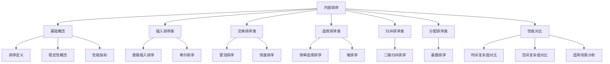
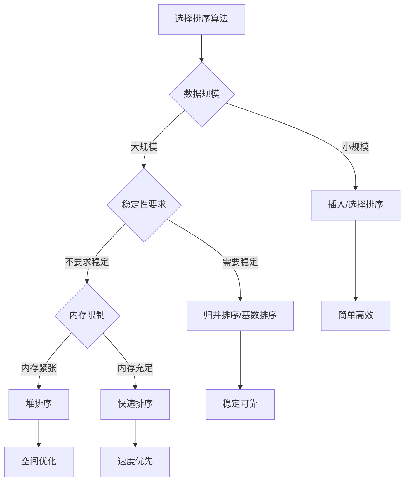

> 📝 **主题**: 数据结构 - 内部排序算法
> 🎯 **目标**: 掌握常用内部排序算法的原理、实现和性能分析
> 📅 **创建日期**: 2025-12-12
> 🔄 **更新日期**: 2025-12-12
> 📊 **版本**: v1.0

---

## 📊 章节导航



---

## 🔍 1. 排序基础概念

### 🎯 1.1 排序的定义

**排序**是将一组任意排列的数据元素重新排列成按关键字有序的序列的过程。

**核心要素**:
- **关键字**: 用于比较的数据项
- **有序序列**: 升序或降序排列
- **稳定性**: 相同关键字元素的相对位置是否保持不变

**排序分类**:
- **内部排序**: 数据全部在内存中进行排序
- **外部排序**: 数据量太大，需要借助外存进行排序

### 📊 1.2 排序算法性能指标

| 性能指标       | 说明                   | 重要性 |
| :------------- | :--------------------- | :----- |
| **时间复杂度** | 排序所需时间           | ⭐⭐⭐⭐⭐  |
| **空间复杂度** | 额外内存开销           | ⭐⭐⭐⭐   |
| **稳定性**     | 相等元素相对位置       | ⭐⭐⭐    |
| **适应性**     | 对数据初始状态的敏感度 | ⭐⭐     |

### ⚠️ 1.3 稳定性概念

**稳定排序**: 如果待排序序列中存在两个相等的元素，排序后它们的相对位置保持不变。

**不稳定排序**: 相等元素的相对位置可能发生变化。

> 💡 **提示**: 稳定性在某些应用场景中非常重要，如多关键字排序。

---

## 🛠️ 2. 插入排序类算法

### 💡 2.1 直接插入排序

**算法思想**: 将待排序元素逐个插入到已排序序列的适当位置。

**算法步骤**:
1. 将第一个元素视为已排序序列
2. 从第二个元素开始，依次与已排序序列比较
3. 找到合适位置后插入
4. 重复直到所有元素排序完成

**代码实现**:
```cpp
/**
 * 函数功能：实现直接插入排序
 * 算法思想：将待排序元素逐个插入到已排序序列的适当位置
 * @param arr 待排序数组
 * @param n 数组长度
 * @return void
 * 时间复杂度：最好O(n)，平均O(n²)，最坏O(n²)
 * 空间复杂度：O(1)
 * 稳定性：稳定
 */
void insertionSort(int arr[], int n) {
    // 从第二个元素开始插入
    for (int i = 1; i < n; i++) {
        int key = arr[i];  // 当前待插入元素
        int j = i - 1;
        
        // 将大于key的元素向后移动
        while (j >= 0 && arr[j] > key) {
            arr[j + 1] = arr[j];
            j--;
        }
        
        // 插入key到正确位置
        arr[j + 1] = key;
    }
}
```

**性能分析**:

| 情况 | 时间复杂度 | 空间复杂度 | 稳定性 |
| :--- | :--------- | :--------- | :----- |
| 最好 | O(n)       | O(1)       | ✅ 稳定 |
| 平均 | O(n²)      | O(1)       | ✅ 稳定 |
| 最坏 | O(n²)      | O(1)       | ✅ 稳定 |

> 📊 **适用场景**: 数据量较小或基本有序的情况。

### 🚀 2.2 希尔排序

**算法思想**: 将待排序序列按增量分组，对每组进行直接插入排序，逐步减小增量直到为1。

**算法步骤**:
1. 选择一个增量序列（如n/2, n/4, ..., 1）
2. 按增量将序列分组
3. 对每组进行直接插入排序
4. 减小增量，重复步骤2-3
5. 当增量为1时，进行最后一次排序

**代码实现**:
```cpp
/**
 * 函数功能：实现希尔排序
 * 算法思想：分组插入排序，逐步细化
 * @param arr 待排序数组
 * @param n 数组长度
 * @return void
 * 时间复杂度：取决于增量序列，通常为O(n^1.3)
 * 空间复杂度：O(1)
 * 稳定性：不稳定
 */
void shellSort(int arr[], int n) {
    // 初始增量为n/2，逐步减半
    for (int gap = n / 2; gap > 0; gap /= 2) {
        // 对每个子序列进行插入排序
        for (int i = gap; i < n; i++) {
            int temp = arr[i];
            int j = i;
            
            // 插入排序，比较相隔gap的元素
            while (j >= gap && arr[j - gap] > temp) {
                arr[j] = arr[j - gap];
                j -= gap;
            }
            
            arr[j] = temp;
        }
    }
}
```

> ⚠️ **注意**: 希尔排序是不稳定的排序算法，相同元素可能改变相对位置。

---

## 🔄 3. 交换排序类算法

### 💡 3.1 冒泡排序

**算法思想**: 通过相邻元素的比较和交换，使较大的元素逐步"冒泡"到序列末端。

**算法步骤**:
1. 从第一个元素开始，比较相邻元素
2. 如果前一个元素大于后一个元素，则交换
3. 重复步骤1-2，直到没有交换发生
4. 每轮排序后，最大的元素"冒泡"到正确位置

**代码实现**:
```cpp
/**
 * 函数功能：实现冒泡排序
 * 算法思想：相邻元素比较交换，大元素逐步后移
 * @param arr 待排序数组
 * @param n 数组长度
 * @return void
 * 时间复杂度：最好O(n)，平均O(n²)，最坏O(n²)
 * 空间复杂度：O(1)
 * 稳定性：稳定
 */
void bubbleSort(int arr[], int n) {
    bool swapped;
    
    for (int i = 0; i < n - 1; i++) {
        swapped = false;
        
        // 每轮将最大的元素冒泡到最后
        for (int j = 0; j < n - i - 1; j++) {
            if (arr[j] > arr[j + 1]) {
                // 交换相邻元素
                int temp = arr[j];
                arr[j] = arr[j + 1];
                arr[j + 1] = temp;
                swapped = true;
            }
        }
        
        // 如果没有交换，说明已经有序
        if (!swapped) break;
    }
}
```

**优化技巧**: 设置标志位，当某一轮没有交换时提前结束。

### 🚀 3.2 快速排序

**算法思想**: 采用分治法，选择一个基准元素，将序列分为两部分，递归地对子序列进行排序。

**算法步骤**:
1. 选择基准元素（通常选择第一个、最后一个或中间元素）
2. 重新排列序列，使小于基准的元素在前，大于基准的元素在后
3. 递归地对两个子序列进行快速排序

**分区过程**:
```cpp
/**
 * 函数功能：快速排序的分区函数
 * @param arr 待排序数组
 * @param low 左边界
 * @param high 右边界
 * @return 基准元素的最终位置
 */
int partition(int arr[], int low, int high) {
    int pivot = arr[low]; // 选择第一个元素作为基准
    int i = low;          // 小于/等于基准的区域右边界
    int j = high;         // 大于基准的区域左边界

    // 双指针遍历，直到i>=j
    while (i < j) {
        // 从右向左找第一个小于等于基准的元素
        while (i < j && arr[j] > pivot)
            j--;
        // 从左向右找第一个大于基准的元素
        while (i < j && arr[i] <= pivot)
            i++;
        // 交换找到的两个元素，缩小范围
        if (i < j) {
            int temp = arr[i];
            arr[i] = arr[j];
            arr[j] = temp;
        }
    }

    // 将基准元素交换到最终位置（i/j重合处）
    arr[low] = arr[i];
    arr[i] = pivot;

    return i; // 返回基准元素的索引
}
```

**快速排序主函数**:
```cpp
/**
 * 函数功能：实现快速排序
 * 算法思想：分治法，选择基准进行分区
 * @param arr 待排序数组
 * @param low 左边界
 * @param high 右边界
 * @return void
 * 时间复杂度：最好O(nlogn)，平均O(nlogn)，最坏O(n²)
 * 空间复杂度：O(logn)（递归栈深度）
 * 稳定性：不稳定
 */
void quickSort(int arr[], int low, int high) {
    if (low < high) {
        // 找到分区点：基准归位，左区≤基准，右区>基准
        int pi = partition(arr, low, high);

        // 递归排序左子数组（[low,pi-1]）
        quickSort(arr, low, pi - 1);

        // 递归排序右子数组（[pi+1,high]）
        quickSort(arr, pi + 1, high);
    }
}
```

> 📊 **适用场景**: 数据量较大且随机分布的情况，快速排序通常是最快的通用排序算法。

---

## 🎯 4. 选择排序类算法

### 💡 4.1 简单选择排序

**算法思想**: 每次从待排序序列中选择最小（或最大）元素，放到已排序序列的末端。

**算法步骤**:
1. 初始时，整个序列视为待排序序列
2. 从待排序序列中找到最小元素
3. 将最小元素与待排序序列的第一个元素交换
4. 重复步骤2-3，直到所有元素排序完成

**代码实现**:
```cpp
/**
 * 函数功能：实现简单选择排序
 * 算法思想：选择最小元素放到正确位置
 * @param arr 待排序数组
 * @param n 数组长度
 * @return void
 * 时间复杂度：O(n²)
 * 空间复杂度：O(1)
 * 稳定性：不稳定
 */
void selectionSort(int arr[], int n) {
    for (int i = 0; i < n - 1; i++) {
        int minIdx = i;  // 假设当前位置是最小值
        
        // 在未排序部分找到真正的最小值
        for (int j = i + 1; j < n; j++) {
            if (arr[j] < arr[minIdx]) {
                minIdx = j;
            }
        }
        
        // 交换最小值到正确位置
        if (minIdx != i) {
            int temp = arr[i];
            arr[i] = arr[minIdx];
            arr[minIdx] = temp;
        }
    }
}
```

### 🚀 4.2 堆排序

**算法思想**: 利用堆数据结构进行排序，首先构建大顶堆，然后 repeatedly 取出堆顶元素并调整堆。

**堆的定义**: 满足以下条件的完全二叉树：
- 大顶堆：每个节点的值都大于或等于其子节点的值
- 小顶堆：每个节点的值都小于或等于其子节点的值

**堆调整函数**:
```cpp
/**
 * 函数功能：调整堆结构
 * @param arr 数组表示的堆
 * @param n 堆的大小
 * @param i 需要调整的节点索引
 * @return void
 */
void heapify(int arr[], int n, int i) {
    int largest = i;        // 假设当前节点最大
    int left = 2 * i + 1;   // 左子节点
    int right = 2 * i + 2;  // 右子节点
    
    // 如果左子节点更大
    if (left < n && arr[left] > arr[largest]) {
        largest = left;
    }
    
    // 如果右子节点更大
    if (right < n && arr[right] > arr[largest]) {
        largest = right;
    }
    
    // 如果最大值不是当前节点，需要交换并继续调整
    if (largest != i) {
        int temp = arr[i];
        arr[i] = arr[largest];
        arr[largest] = temp;
        
        // 递归调整受影响的子树
        heapify(arr, n, largest);
    }
}
```

**堆排序主函数**:
```cpp
/**
 * 函数功能：实现堆排序
 * 算法思想：构建大顶堆，反复取出最大值
 * @param arr 待排序数组
 * @param n 数组长度
 * @return void
 * 时间复杂度：O(nlogn)
 * 空间复杂度：O(1)
 * 稳定性：不稳定
 */
void heapSort(int arr[], int n) {
    // 构建大顶堆
    for (int i = n / 2 - 1; i >= 0; i--) {
        heapify(arr, n, i);
    }
    
    // 一个个取出堆顶元素
    for (int i = n - 1; i > 0; i--) {
        // 将当前最大值（堆顶）移到数组末尾
        int temp = arr[0];
        arr[0] = arr[i];
        arr[i] = temp;
        
        // 重新调整剩余元素为堆
        heapify(arr, i, 0);
    }
}
```

---

## 🔄 5. 归并排序类算法

### 🚀 5.1 二路归并排序

**算法思想**: 采用分治法，将序列分成两半，分别排序后合并。

**算法步骤**:
1. 将序列分成两个长度相等的子序列
2. 递归地对两个子序列进行归并排序
3. 将两个已排序的子序列合并成一个有序序列

**合并函数**:
```cpp
/**
 * 函数功能：合并两个已排序的子数组
 * @param arr 原数组
 * @param left 左边界
 * @param mid 中间位置
 * @param right 右边界
 * @return void
 */
void merge(int arr[], int left, int mid, int right) {
    int n1 = mid - left + 1;     // 左子数组长度
    int n2 = right - mid;        // 右子数组长度
    
    // 创建临时数组
    int* leftArr = new int[n1];
    int* rightArr = new int[n2];
    
    // 复制数据到临时数组
    for (int i = 0; i < n1; i++) {
        leftArr[i] = arr[left + i];
    }
    for (int j = 0; j < n2; j++) {
        rightArr[j] = arr[mid + 1 + j];
    }
    
    // 合并临时数组回原数组
    int i = 0, j = 0, k = left;
    
    while (i < n1 && j < n2) {
        if (leftArr[i] <= rightArr[j]) {
            arr[k] = leftArr[i];
            i++;
        } else {
            arr[k] = rightArr[j];
            j++;
        }
        k++;
    }
    
    // 复制剩余元素
    while (i < n1) {
        arr[k] = leftArr[i];
        i++;
        k++;
    }
    
    while (j < n2) {
        arr[k] = rightArr[j];
        j++;
        k++;
    }
    
    // 释放临时数组内存
    delete[] leftArr;
    delete[] rightArr;
}
```

**归并排序主函数**:
```cpp
/**
 * 函数功能：实现二路归并排序
 * 算法思想：分治法，先分后合
 * @param arr 待排序数组
 * @param left 左边界
 * @param right 右边界
 * @return void
 * 时间复杂度：O(nlogn)
 * 空间复杂度：O(n)
 * 稳定性：稳定
 */
void mergeSort(int arr[], int left, int right) {
    if (left < right) {
        // 找到中间点
        int mid = left + (right - left) / 2;
        
        // 递归排序左半部分
        mergeSort(arr, left, mid);
        
        // 递归排序右半部分
        mergeSort(arr, mid + 1, right);
        
        // 合并两个已排序的部分
        merge(arr, left, mid, right);
    }
}
```

> 📊 **适用场景**: 需要稳定排序且对时间复杂度要求较高的场景。

---

## 📊 6. 分配排序类算法

### 🚀 6.1 基数排序

**算法思想**: 基数排序是一种非比较型整数排序算法，它将整数按位数切割成不同的数字，然后按每个位数分别排序。从最低位开始，依次对每一位进行计数排序，最终得到有序序列。

**算法步骤** (LSD 最低位优先)：
1. 确定待排序数组中的最大数，计算其位数
2. 从最低位（个位）开始，对每一位进行计数排序
3. 重复步骤2，直到处理完最高位
4. 每轮排序后，数组在当前位数上有序
5. 所有位数处理完毕后，数组完全有序

**代码实现**:
```cpp
/**
 * 函数功能：实现基数排序（LSD，从最低位开始）
 * @param arr 待排序数组
 * @param n 数组长度
 * @return void
 * 时间复杂度：O(d*(n+k))，d为位数，k为基数（10）
 * 空间复杂度：O(n+k)
 * 稳定性：稳定
 */
void radixSort(int arr[], int n) {
    // 1. 找出数组中的最大值，确定最大位数
    int maxVal = arr[0];
    for (int i = 1; i < n; i++) {
        if (arr[i] > maxVal) {
            maxVal = arr[i];
        }
    }

    // 2. 从个位开始，对每一位进行计数排序
    for (int exp = 1; maxVal / exp > 0; exp *= 10) {
        countSortByDigit(arr, n, exp);
    }
}

/**
 * 函数功能：按指定位数对数组进行计数排序
 * @param arr 待排序数组
 * @param n 数组长度
 * @param exp 当前处理的位数（1表示个位，10表示十位，100表示百位等）
 * @return void
 */
void countSortByDigit(int arr[], int n, int exp) {
    int* output = new int[n]; // 输出数组
    int count[10] = {0};      // 计数数组，基数为10

    // 1. 统计当前位上各数字出现的次数
    for (int i = 0; i < n; i++) {
        int digit = (arr[i] / exp) % 10;
        count[digit]++;
    }

    // 2. 计算每个数字在输出数组中的起始位置
    for (int i = 1; i < 10; i++) {
        count[i] += count[i - 1];
    }

    // 3. 从后往前遍历原数组，将元素放入输出数组的正确位置
    // 从后往前遍历是为了保持排序的稳定性
    for (int i = n - 1; i >= 0; i--) {
        int digit = (arr[i] / exp) % 10;
        output[count[digit] - 1] = arr[i];
        count[digit]--;
    }

    // 4. 将排序后的结果复制回原数组
    for (int i = 0; i < n; i++) {
        arr[i] = output[i];
    }

    // 释放临时数组内存
    delete[] output;
}
```

**性能分析**:

| 情况 | 时间复杂度 | 空间复杂度 | 稳定性 |
| :--- | :--------- | :--------- | :----- |
| 最好 | O(d*(n+k)) | O(n+k)     | ✅ 稳定 |
| 平均 | O(d*(n+k)) | O(n+k)     | ✅ 稳定 |
| 最坏 | O(d*(n+k)) | O(n+k)     | ✅ 稳定 |

> 注：d为最大数的位数，k为基数（这里k=10）

> 📊 **适用场景**: 适用于整数排序，尤其是位数较少的情况；对于字符串等其他类型，需要进行适当的转换。基数排序在处理大量数据时效率较高，尤其是当数据的位数不大时。

---

## 📊 7. 排序算法性能对比分析

### 📈 7.1 时间复杂度对比

| 排序算法         | 最好情况 | 平均情况 | 最坏情况 | 稳定性   |
| :--------------- | :------- | :------- | :------- | :------- |
| **直接插入排序** | O(n)     | O(n²)    | O(n²)    | ✅ 稳定   |
| **希尔排序**     | O(n^1.3) | O(n^1.3) | O(n^1.3) | ❌ 不稳定 |
| **冒泡排序**     | O(n)     | O(n²)    | O(n²)    | ✅ 稳定   |
| **快速排序**     | O(nlogn) | O(nlogn) | O(n²)    | ❌ 不稳定 |
| **简单选择排序** | O(n²)    | O(n²)    | O(n²)    | ❌ 不稳定 |
| **堆排序**       | O(nlogn) | O(nlogn) | O(nlogn) | ❌ 不稳定 |
| **归并排序**     | O(nlogn) | O(nlogn) | O(nlogn) | ✅ 稳定   |
| **基数排序**     | O(d(n+k))| O(d(n+k))| O(d(n+k))| ✅ 稳定   |

### 🎯 7.2 算法选择指南

**根据数据规模选择**:
- **小规模数据** (n < 50): 直接插入排序、简单选择排序
- **中等规模数据** (50 ≤ n ≤ 1000): 快速排序、归并排序
- **大规模数据** (n > 1000): 快速排序、堆排序、归并排序、基数排序

**根据数据特性选择**:
- **基本有序**: 直接插入排序、冒泡排序
- **随机分布**: 快速排序、归并排序
- **含有大量重复元素**: 归并排序、三路快速排序
- **需要稳定性**: 归并排序、直接插入排序、冒泡排序、基数排序
- **整数排序**: 基数排序、快速排序

**根据内存限制选择**:
- **内存紧张**: 堆排序、希尔排序
- **内存充足**: 归并排序、快速排序、基数排序

### ⚡ 7.3 实际应用建议



> 💡 **提示**: 在实际应用中，通常会结合多种算法的优点，如Timsort（结合归并排序和插入排序）。

---

## 🎯 8. 高级排序技巧

### 🚀 8.1 三路快速排序

**算法思想**: 将序列分为三部分：小于、等于、大于基准元素，特别适用于含有大量重复元素的序列。

**代码实现**:
```cpp
/**
 * 函数功能：实现三路快速排序
 * 算法思想：将序列分为<、=、>三部分
 * @param arr 待排序数组
 * @param low 左边界
 * @param high 右边界
 * @return void
 */
void threeWayQuickSort(int arr[], int low, int high) {
    if (low < high) {
        int lt = low;      // 小于基准的区域边界
        int gt = high;     // 大于基准的区域边界
        int i = low + 1;   // 当前考察元素
        int pivot = arr[low];  // 选择第一个元素作为基准
        
        while (i <= gt) {
            if (arr[i] < pivot) {
                // 当前元素小于基准，交换到左边
                int temp = arr[i];
                arr[i] = arr[lt];
                arr[lt] = temp;
                lt++;
                i++;
            } else if (arr[i] > pivot) {
                // 当前元素大于基准，交换到右边
                int temp = arr[i];
                arr[i] = arr[gt];
                arr[gt] = temp;
                gt--;
            } else {
                // 当前元素等于基准，继续考察下一个
                i++;
            }
        }
        
        // 递归排序小于和大于的部分
        threeWayQuickSort(arr, low, lt - 1);
        threeWayQuickSort(arr, gt + 1, high);
    }
}
```

### 📊 8.2 排序算法的优化技巧

**优化策略总结**:

| 优化方法       | 适用算法           | 效果                       |
| :------------- | :----------------- | :------------------------- |
| **小数组切换** | 快速排序、归并排序 | 对小规模数据切换到插入排序 |
| **三数取中法** | 快速排序           | 改善最坏情况性能           |
| **尾递归优化** | 快速排序           | 减少递归深度               |
| **自底向上**   | 归并排序           | 避免递归开销               |
| **提前退出**   | 冒泡排序           | 对有序数据提前结束         |

---

## 📋 9. 实践应用

### 🎯 9.1 排序算法在实际中的应用

**系统排序函数实现**:
- **C++ STL sort()**: 结合快速排序、堆排序和插入排序的introsort
- **Java Arrays.sort()**: 对基本类型使用双轴快速排序，对对象使用Timsort
- **Python sorted()**: 使用Timsort算法

**选择建议**:
1. **通用场景**: 使用系统提供的排序函数
2. **特殊需求**: 根据数据特性选择专用算法
3. **性能关键**: 进行基准测试选择最优算法

### ⚡ 9.2 性能测试框架

```cpp
/**
 * 函数功能：测试排序算法性能
 * @param sortFunc 排序函数指针
 * @param testData 测试数据生成函数
 * @param dataSize 数据规模
 * @return 排序耗时（毫秒）
 */
double testSortPerformance(void (*sortFunc)(int[], int), 
                          void (*testData)(int[], int), 
                          int dataSize) {
    int* arr = new int[dataSize];
    testData(arr, dataSize);  // 生成测试数据
    
    auto start = chrono::high_resolution_clock::now();
    sortFunc(arr, dataSize);  // 执行排序
    auto end = chrono::high_resolution_clock::now();
    
    delete[] arr;
    
    auto duration = chrono::duration_cast<chrono::milliseconds>(end - start);
    return duration.count();
}
```

---

> 🎯 **本章小结**: 内部排序算法是数据结构的核心内容，掌握各种排序算法的原理、实现和性能特点，能够根据具体应用场景选择最合适的算法。理解排序算法的内在机制对于提高程序性能和解决实际问题具有重要意义。

---

## 📚 参考资料与扩展阅读

### 🔗 在线资源
- [Sorting Algorithms Animations](https://www.toptal.com/developers/sorting-algorithms)
- [VisuAlgo - 排序算法可视化](https://visualgo.net/en/sorting)
- [Big-O Cheat Sheet](https://www.bigocheatsheet.com/)

### 🚀 进阶内容
- 外部排序算法
- 并行排序算法
- 字符串排序算法
- 多维数据排序

---

### 📋 版本更新记录

#### v1.0 (2025-12-12)
- 📝 **新增**: 内部排序算法完整知识文档
- 📊 **包含**: 六大类排序算法详解
- 💻 **代码**: 完整的算法实现示例
- 📈 **分析**: 详细的性能对比分析
- 🎯 **应用**: 实际应用场景和选择指南