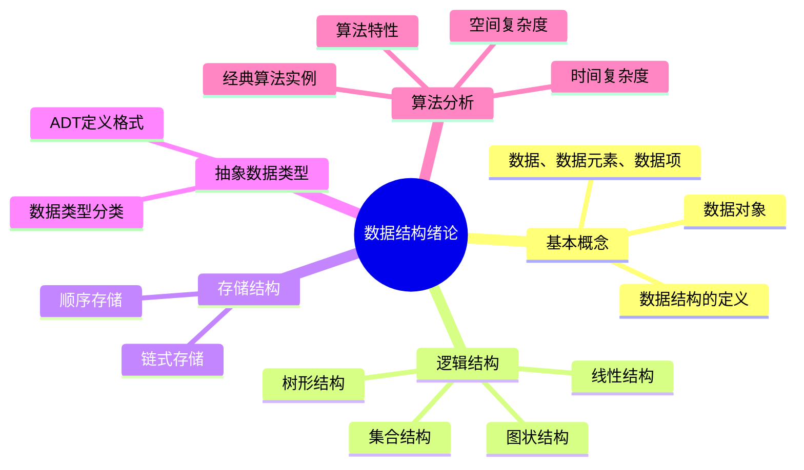
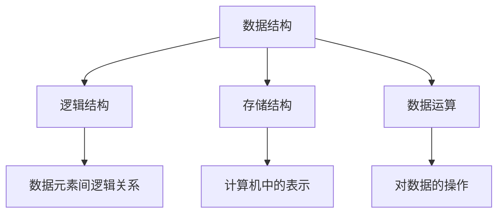
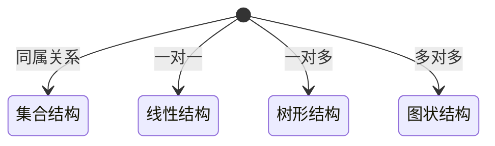
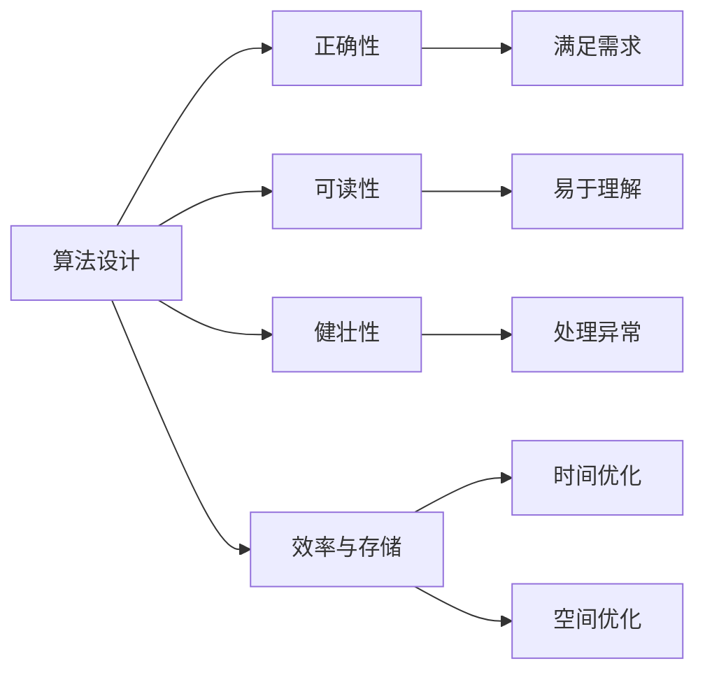
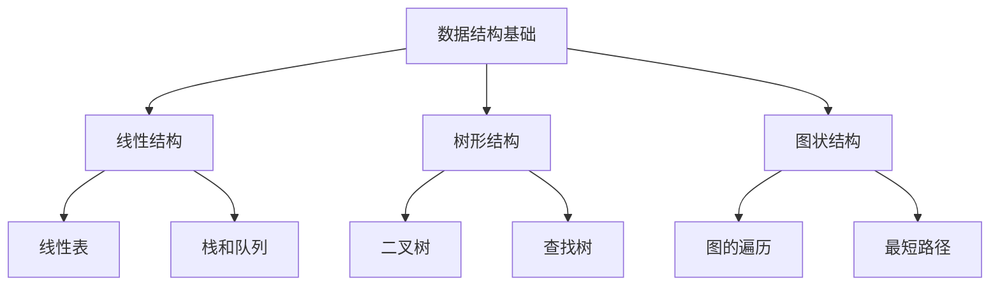

> 📝 **课程**: 数据结构 第一章
> 
> 🎯 **学习目标**: 掌握数据结构的基本概念、逻辑结构与存储结构、抽象数据类型定义以及算法分析方法

---

## 📋 目录结构



**章节列表**:

1. 数据结构的基本概念
2. 逻辑结构与存储结构
3. 抽象数据类型
4. 算法和算法分析
5. 算法分析实例
6. 本章小结

---

## 🔍 1.1 数据结构的基本概念

### 💡 引言

数据结构是计算机存储、组织数据的方式，指相互之间存在一种或多种特定关系的数据元素的集合。

**发展历程**:

| 发展阶段 | 关注重点 | 应用场景 |
|---------|---------|---------|
| 早期 | 数据存储效率 | 文件系统、数据库 |
| 现代 | 算法与数据结构结合 | 大数据处理、人工智能 |

> 💡 **核心理念**: 选择合适的数据结构可以显著提高算法的效率

### 🏷️ 核心概念对比

| 概念 | 定义 | 特点 |
|------|------|------|
| **数据** | 客观事物的符号表示 | 所有能被计算机处理的符号总称 |
| **数据元素** | 数据的基本单位 | 通常作为整体考虑和处理 |
| **数据项** | 组成数据元素的最小单位 | 有独立含义、不可分割 |
| **数据对象** | 性质相同的数据元素集合 | 数据的一个子集 |

### 📊 数据结构三要素



---

## 🔍 1.2 逻辑结构与存储结构

### 🏷️ 逻辑结构分类

**四种基本逻辑结构**:



#### 1️⃣ 集合结构
- 数据元素间除了"属于同一集合"外无其他关系
- 例如：数学中的集合概念

#### 2️⃣ 线性结构
- 数据元素之间存在一对一的关系
- 例如：数组、链表、栈、队列

#### 3️⃣ 树形结构
- 数据元素之间存在一对多的关系
- 例如：文件系统、组织结构图

#### 4️⃣ 图状结构
- 数据元素之间存在多对多的关系
- 例如：社交网络、交通网络

### 🏗️ 存储结构实现

#### 顺序存储结构
```cpp
// 顺序表实现示例
#define MAXSIZE 100
typedef struct {
    ElemType data[MAXSIZE];
    int length;
} SqList;
```

**特点**:
- ✅ 随机访问效率高 $O(1)$
- ✅ 存储密度高
- ❌ 插入删除效率低 $O(n)$
- ❌ 需要预先分配空间

#### 链式存储结构
```cpp
// 单链表结点定义
typedef struct LNode {
    ElemType data;
    struct LNode *next;
} LNode, *LinkList;
```

**特点**:
- ✅ 插入删除效率高 $O(1)$
- ✅ 动态分配空间
- ❌ 随机访问效率低 $O(n)$
- ❌ 存储密度低（需要额外指针）

---

## 🔍 1.3 抽象数据类型

### 📋 数据类型分类

| 类型 | 特征 | 示例 |
|------|------|------|
| **原子类型** | 值不可再分 | int, float, char |
| **结构类型** | 值可再分解 | array, struct |

### 📝 ADT标准定义格式

```
ADT 抽象数据类型名 {
    数据对象：<数据对象的定义>
    数据关系：<数据关系的定义>  
    基本操作：<基本操作的定义>
} ADT 抽象数据类型名
```

### ⚙️ 基本操作定义格式

```
基本操作名（参数表）
初始条件：<初始条件描述>
操作结果：<操作结果描述>
```

> 📌 **示例**: 线性表ADT定义
> - 数据对象：$D = {a_i | a_i \in ElemSet, i = 1,2,...,n, n \geq 0}$
> - 数据关系：$R = {<a_{i-1}, a_i> | a_{i-1}, a_i \in D, i = 2,...,n}$

---

## 🔍 1.4 算法和算法分析

### 🎯 算法的五大特性

| 特性 | 说明 | 重要性 |
|------|------|--------|
| **有穷性** | 必须在有限步后结束 | ⭐⭐⭐⭐⭐ |
| **确定性** | 每条指令有确切含义 | ⭐⭐⭐⭐⭐ |
| **可行性** | 操作可通过基本运算实现 | ⭐⭐⭐⭐⭐ |
| **输入** | 零个或多个输入 | ⭐⭐⭐ |
| **输出** | 一个或多个输出 | ⭐⭐⭐⭐⭐ |

### 📋 算法设计要求



### 📊 复杂度分析

#### 时间复杂度表示
$$T(n) = O(f(n))$$

其中：
- $n$：问题规模
- $f(n)$：基本操作执行次数

#### 常见时间复杂度对比

| 复杂度 | 名称 | 示例 | 适用场景 |
|--------|------|------|----------|
| $O(1)$ | 常数阶 | 数组访问 | 哈希表查找 |
| $O(\log n)$ | 对数阶 | 二分查找 | 平衡树操作 |
| $O(n)$ | 线性阶 | 线性查找 | 数组遍历 |
| $O(n\log n)$ | 线性对数阶 | 归并排序 | 高效排序算法 |
| $O(n^2)$ | 平方阶 | 冒泡排序 | 简单排序算法 |
| $O(n^3)$ | 立方阶 | 矩阵乘法 | 三重循环算法 |

---

## 🔍 1.5 算法分析实例

### 🧮 实例1：矩阵乘法

```cpp
// 时间复杂度：O(n³)
for (i = 1; i <= n; i++) {
    for (j = 1; j <= n; j++) {
        c[i][j] = 0;                    // 初始化
        for (k = 1; k <= n; k++) {
            c[i][j] += a[i][k] * b[k][j]; // 乘积累加
        }
    }
}
```

**分析过程**:
- 外层循环：n次
- 中层循环：n次  
- 内层循环：n次
- 总次数：$n \times n \times n = n^3$
- **时间复杂度**：$O(n^3)$

### 🔄 实例2：冒泡排序

```cpp
// 时间复杂度：O(n²)
for (i = 0; i < n-1; i++) {           // n-1趟
    for (j = 0; j < n-i-1; j++) {     // 每趟比较次数递减
        if (a[j] > a[j+1]) {          // 相邻元素比较
            temp = a[j];
            a[j] = a[j+1];            // 交换位置
            a[j+1] = temp;
        }
    }
}
```

**分析过程**:
- 外层循环：n-1次
- 内层循环：(n-1) + (n-2) + ... + 1 = $\frac{n(n-1)}{2}$
- **时间复杂度**：$O(n^2)$

### 🔎 实例3：二分查找

```cpp
// 时间复杂度：O(log n)
int binarySearch(int a[], int n, int key) {
    int low = 0, high = n-1, mid;
    
    while (low <= high) {               // 搜索区间有效
        mid = (low + high) / 2;         // 取中间位置
        
        if (a[mid] == key) return mid;  // 查找成功
        else if (a[mid] < key) 
            low = mid + 1;              // 在右半区继续查找
        else 
            high = mid - 1;             // 在左半区继续查找
    }
    
    return -1;                          // 查找失败
}
```

**分析过程**:
- 每次比较后搜索区间减半
- 最多比较次数：$\log_2 n$
- **时间复杂度**：$O(\log n)$

---

## 📚 1.6 本章小结

### 🎯 核心知识点

| 知识点 | 关键内容 | 重要程度 |
|--------|----------|----------|
| **数据结构** | 三要素：逻辑结构、存储结构、数据运算 | ⭐⭐⭐⭐⭐ |
| **逻辑结构** | 四种类型：集合、线性、树形、图状 | ⭐⭐⭐⭐⭐ |
| **存储结构** | 两种方式：顺序存储、链式存储 | ⭐⭐⭐⭐⭐ |
| **抽象数据类型** | ADT定义格式和基本操作规范 | ⭐⭐⭐⭐ |
| **算法分析** | 时间复杂度和空间复杂度计算 | ⭐⭐⭐⭐⭐ |

### 🚀 学习路径建议



### 💡 学习要点

1. **理解概念**：掌握数据结构的基本概念和术语
2. **掌握分类**：熟悉逻辑结构的四种基本类型
3. **对比分析**：理解顺序存储和链式存储的优缺点
4. **算法思维**：培养算法设计和分析的能力
5. **实践应用**：通过编程实现加深理解
