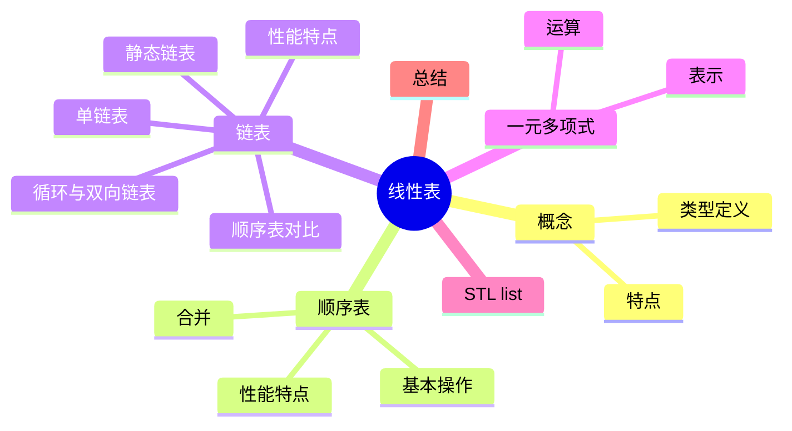
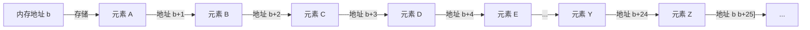
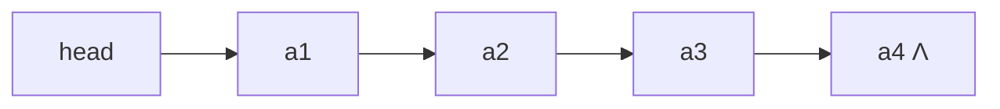
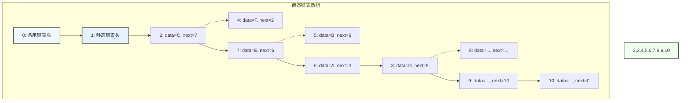
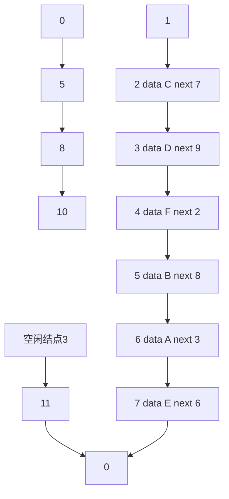
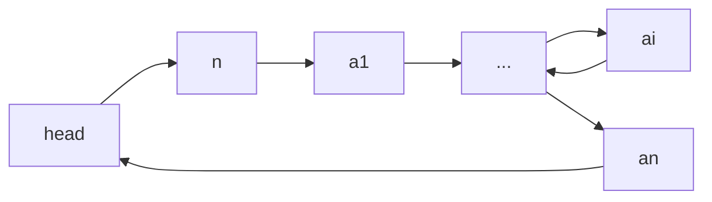
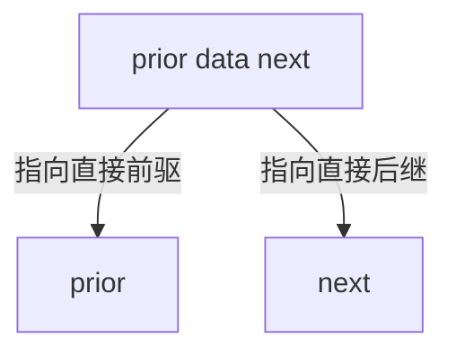
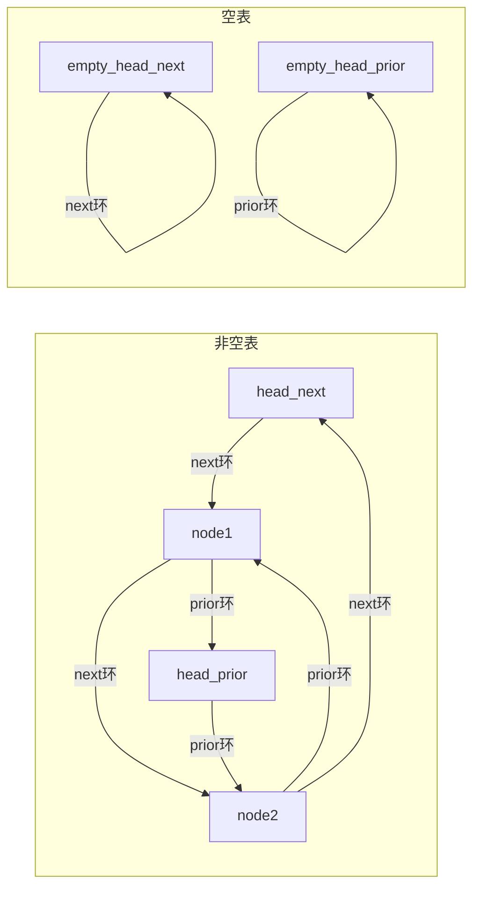

# 线性表

> 📝 **课程**: 数据结构
> 🎯 **学习目标**:
> -  掌握线性表的基本概念
> - 顺序存储与链式存储的实现
> - 各种操作的时间复杂度分析，并理解静态链表、循环链表、双向链表以及一元多项式的表示与运算。

---

## 📋 目录结构



**章节列表**:
1.  线性表核心概念
2.  线性表的顺序表示和实现
3.  线性表的链式表示和实现
4.  一元多项式表示及相加
5.  顺序表与链表的比较
6.  STL `list` 容器简介
7.  本章总结

---

## 🔍 1. 线性表核心概念

### 💡 核心概念

**线性数据结构特点**:
在线性数据元素的非空有限集中，存在以下特性：
1.  存在唯一的“第一个”数据元素。
2.  存在唯一的“最后一个”数据元素。
3.  除第一个元素外，每个数据元素均只有一个前驱。
4.  除最后一个元素外，每个数据元素均只有一个后继。

**线性表 (Linear List) 定义**:
线性表是最常用且最简单的一种数据结构。它是由 `n` 个数据元素组成的有限序列，相邻数据元素之间存在着**序偶关系**。

表示形式: `(a₁, a₂, ..., aᵢ₋₁, aᵢ, aᵢ₊₁, ..., aₙ)`
其中:
*   `aᵢ` 是表中元素。
*   `i` 表示元素 `aᵢ` 的位置 (通常 `1 ≤ i ≤ n`)。
*   `n` 是表的长度。
*   当 `n = 0` 时，称为**空表**。

> 💡 **关键**: 线性表中的元素具有**相同特性**，属于同一数据对象。

**线性表基本操作**:
*   初始化 (Initialization)
*   插入 (Insertion)
*   删除 (Deletion)
*   访问 (Access)
*   求表长 (Get Length)
*   清空表 (Clear List)
*   有序表合并 (Merge Sorted Lists)
*   多项式求和 (Polynomial Addition)

---

## 🔍 2. 线性表的顺序表示和实现

### 💡 核心概念

**顺序表 (Sequential List)** 是线性表的**顺序存储表示**。
它使用一组**地址连续**的存储单元依次存储线性表的数据元素。


> 📊 **图示**: 顺序表在内存中是地址连续的，元素A、B、C等依次存储，可以通过基地址和偏移量直接访问任意元素。

### 🛠️ 实践操作

#### 寻址公式和随机访问特性

顺序表数据元素的存储位置公式:
*   `LOC(aᵢ) = LOC(aᵢ₋₁) + l`
*   `LOC(aᵢ) = LOC(a₁) + (i-1) * l`
其中 `l` 表示元素占用的内存单元数。

**随机访问特性**: 顺序表支持随机访问，根据下标访问元素的时间复杂度为 `O(1)`。

#### 顺序表定义

采用**动态分配**的一维数组（或定长数组）表示顺序表。

```cpp
#define LIST_INIT_SIZE 100 // 初始容量
typedef int ElemType;      // 元素类型

class Sqlist {
  private:
    ElemType *elem; // 存储基址
    int length;     // 当前长度
    int listsize;   // 当前容量

  public:
    Sqlist(int n, ElemType num[]);
    ~Sqlist();

    // 基本操作
    int listinsert(int i, Elemtype e);  // 在第i个位置插入e
    int listdelete(int i, ElemType &e); // 删除第i个位置元素
    int listfind(ElemType e);           // 查找e，返回下标（未找到返回-1）
    int getlength();                    // 返回表长
    void display();                     // 输出全部元素
};
```

#### 顺序表初始化

构造函数创建存储空间并初始化表元素。

```cpp
Sqlist::Sqlist(int n, ElemType num[]) {
    // 为顺序表分配初始存储空间 LIST_INIT_SIZE
    elem = new ElemType[LIST_INIT_SIZE];
    if (!elem)
        exit(-1); // 内存分配失败，终止程序

    // 将传入数组num的前n个元素复制到顺序表中
    for (int i = 0; i < n; i++)
        elem[i] = num[i];

    // 设置当前最大容量（初始容量）
    length = n;
    listsize = LIST_INIT_SIZE;
}
```

#### 顺序表插入

在顺序表的第 `i-1` 个数据元素和第 `i` 个数据元素之间插入一个新的数据元素 `e`。
长度为 `n` 的顺序表 `(a₁, ..., aᵢ₋₁, aᵢ, ..., aₙ)` 变为长度为 `n+1` 的 `(a₁, ..., aᵢ₋₁, e, aᵢ, ..., aₙ)`。

**思路**: 若位置合法 (`1 ≤ i ≤ n+1`)，将 `aᵢ, ..., aₙ` 后移，写入 `e`，表长加 `1`。

**算法描述 (数组下标从 0 开始，i 从 1 开始)**:
1.  若 `i < 1` 或 `i > n+1`，不能插入，返回 `0`；否则，转 `(2)`。
2.  `k = n - 1` (从最后一个元素开始移动)。
3.  若 `k ≥ i - 1`，则 `a[k+1] = a[k]`，`k--`，转 `(3)`；否则转 `(4)`。
4.  `a[i-1] = e`，`n++` (表长加 1)，插入成功，返回 `1`。

```cpp
int SqList::listinsert(int i, ElemType e) {
    // 注意: 数组下标从 0 开始，这里插入位置从 1 开始
    // 合法插入位置 1 ~ length + 1
    if (i < 1 || i > length + 1) {
        return 0; // 插入位置非法，插入不成功，返回0
    }
    // 如果当前存储空间已满，需要扩容。这里省略了扩容逻辑。

    // 第 length 个, ..., 第 i 个元素依此后移，为新元素腾出位置
    for (int j = length - 1; j >= i - 1; j--) {
        elem[j + 1] = elem[j];
    }
    elem[i - 1] = e; // 在第 i 个位置 (数组下标 i-1) 写入新元素 e
    length++;        // 元素数加 1，更新表长
    return 1;        // 插入成功，返回1
}
```

#### 顺序表插入时间复杂度分析

*   **最好情况**: 末尾插入，移动 `0` 个元素，时间复杂度 `O(1)`。
*   **最坏情况**: 表头插入，移动 `n` 个元素，时间复杂度 `O(n)`。
*   **平均情况**:
    *   在顺序表中第 `i` 个位置插入一个元素，需要向后移动 `n - i + 1` 个元素。
    *   假设在第 `i` 个元素之前插入的概率为 `pᵢ`，当插入位置等概率时 `pᵢ = 1 / (n+1)`。
    *   平均移动元素数 `Eᵢₛ = Σ[1/(n+1)] * (n - i + 1) = n/2`。
    *   因此，顺序表插入操作的平均情况时间复杂度为 `O(n)`。

#### 顺序表删除

删除顺序表的第 `i` 个数据元素。
长度为 `n` 的顺序表 `(a₁, ..., aᵢ₋₁, aᵢ, aᵢ₊₁, ..., aₙ)` 变为长度为 `n-1` 的 `(a₁, ..., aᵢ₋₁, aᵢ₊₁, ..., aₙ)`。

**思路**: 若位置合法 (`1 ≤ i ≤ n`)，将 `aᵢ₊₁, ..., aₙ` 前移，表长减 `1`。

**算法描述 (数组下标从 0 开始，i 从 1 开始)**:
1.  若 `i < 1` 或 `i > n`，不能删除，返回 `0`；否则转 `(2)`。
2.  `k = i` (从要删除的元素位置开始前移)。
3.  若 `k < n`，则 `a[k-1] = a[k]`，`k++`，转 `(3)`；否则转 `(4)`。
4.  `n--` (表长减 1)，删除成功，返回 `1`。

```cpp
int SqList::listdelete(int i, ElemType &e) {
    // 合法删除位置 1 ~ length
    if (i < 1 || i > length) {
        return 0; // 删除位置非法，返回 0
    }

    e = elem[i - 1]; // 记录被删除的元素值：将要删除的元素保存在引用变量 e 中
    // 第 i + 1 个, ..., 第 length 个元素依此前移，覆盖掉被删除的元素
    for (int j = i; j < length; j++) {
        elem[j - 1] = elem[j];
    }
    length--; // 元素数减 1，更新表长
    return 1; // 删除成功，返回1
}
```

#### 顺序表删除时间复杂度分析

*   **最好情况**: 删除末尾元素，移动 `0` 个元素，时间复杂度 `O(1)`。
*   **最坏情况**: 删除表头元素，移动 `n-1` 个元素，时间复杂度 `O(n)`。
*   **平均情况**:
    *   在顺序表中删除第 `i` 个元素，需要向前移动 `n - i` 个元素。
    *   当删除位置等概率时 `qᵢ = 1 / n`。
    *   平均移动元素数 `E_dl = Σ(1/n) * (n - i) = (n-1)/2`。
    *   因此，顺序表删除操作的平均情况时间复杂度为 `O(n)`。

#### 顺序表的其它操作

*   **查找第 `i` 个位置的元素值**: `O(1)`
*   **查找元素所在位置**: 遍历，`O(n)`
*   **计算表长**: `length` 属性，`O(1)`
*   **置空表**: `length = 0`，`O(1)`
*   **销毁表**: 调用析构函数 `~SqList()`，释放内存。

#### 顺序表的优缺点

| 特性     | 优点                                                                           | 缺点                                        |
| :------- | :----------------------------------------------------------------------------- | :------------------------------------------ |
| **优点** | 1. 元素可以**随机存取**。 <br> 2. 元素位置可用一个简单、直观的公式表示并求取。 | --                                          |
| **缺点** | --                                                                             | 1. 插入或删除操作时，需要**移动大量元素**。 |

#### 有序表合并

已知线性表 `LA` ( `n` 个元素) 和 `LB` ( `m` 个元素) 均按值非递减有序排列，将 `LA` 和 `LB` 合并到一个新的线性表 `LC`，且 `LC` 中的数据元素仍按值非递减有序排列。

**思路**: 初始取 `LA`, `LB` 的第一个元素比较，小者写入 `LC`，然后 `LA` 或 `LB` 顺序后移。
**时间复杂度**: `O(n+m)`。

---

## 🔍 3. 线性表的链式表示和实现

### 💡 核心概念

**链表 (Linked List)** 是线性表的**链式存储表示**。
*   链表中逻辑关系相邻的元素不一定在存储位置上相邻。
*   用**指针**表示元素之间的邻接关系。
*   相比于顺序表，实现更复杂。

#### 线性链表 (单链表)

*   线性链表的元素称为**结点 (node)**。
*   `n` 个结点链结成一个链表，即为线性表的链式存储结构。
*   链表的每个结点中只包含一个指针域，故又称**线性链表**或**单链表**。
*   结点除包含数据元素信息的**数据域 (data)** 外，还包含指示直接后继的**指针域 (next)**。


> 📊 **图示**: 单链表通过头指针 `head` 指向第一个结点 `a1`，每个结点包含数据和指向下一个结点的指针 `next`，最后一个结点的 `next` 指向 `Λ` (空指针)。

**特点**:
*   可由**头指针 (head)** 唯一确定。
*   每个结点在需要时动态生成，在删除时释放 (C++: `new`, `delete`；C: `malloc`, `free`)。
*   遍历时只能从前往后，是**单向**的，一旦错过某个节点，只能从头再遍历一次。

#### 结点定义

```cpp
class LNode { // 结点类
  private:
    int data;    // 数据域
    LNode *next; // 指针域

  public:
    // 构造函数：初始化结点的数据和next指针
    LNode(int e = 0, LNode *nextval = nullptr);
    LNode *getnext();             // 获取后继结点指针
    void setnext(LNode *nextval); // 设置后继结点指针
    int getdata();                // 获取数据域值
    void setdata(int e);          // 设置数据域值
};
```

#### 链表定义

定义链表类，其属性为**头指针 `head`**。

```cpp
class LinkList { // 链表类
  private:
    LNode *head; // 头指针
    int length;  // 链表长度

  public:
    LinkList();  // 构造函数：创建头结点
    ~LinkList(); // 析构函数

    int getlength();                   // 计算结点个数
    LNode *getelem(int i);             // 查找第 i 个结点
    int listinsert(int i, int e);      // 在第 i 个位置插入元素 e
    int listdelete(int i, int &e);     // 删除第 i 个结点，e 返回被删值
    void listdisplay();                // 遍历并打印链表
    void createlist(int n, int num[]); // 创建链表 (头插法/尾插法)
};
```

#### 不带头结点的线性链表 (Singly Linked List without Head Node)

**初始化**: 构造函数初始化头指针 `head = nullptr`，表示空链表。

**插入操作**:
1.  **在第一个位置插入元素 `e`**:
    *   构建新结点 `s`，数据为 `e`，`next` 指向 `head` 原来的结点。
    *   修改 `head` 指向 `s` 结点。

	```cpp
	// 假设是LinkList::listinsert方法中处理第一个位置插入
	if (i == 1) {                      // 如果要在第一个位置插入
	    LNode *s = new LNode(e, head); // 构建新结点s，next指向当前的head
	    head = s;                      // 头指针指向新结点s
	    return 1;
	}
	```

2.  **在第 `i` 个位置插入元素 `e` (`1 < i ≤ n+1`)**:
    *   先找到第 `i-1` 个结点 `p`。
    *   构建新结点 `s`，`s->next` 指向 `p->next` (即原来的第 `i` 个结点)。
    *   修改 `p->next` 指向 `s` 结点。

    ```cpp
    // 假设是LinkList::listinsert方法中处理非第一个位置插入
    // 先找到第 i-1 个结点 p
    LNode *p = head;
    int k = 1;
    while (p && k < i - 1) { // 遍历找到第 i-1 个结点
        p = p->getnext();
        k++;
    }
    if (p) { // 若存在第 i-1 个结点 p，则可以进行插入
        LNode *s = new LNode(e, p->getnext()); // 构建新结点s，其next指向p的后继
        p->setnext(s); // p的next指向s，完成插入
        return 1;
    }
    return 0; // 第 i-1 个结点不存在，不能插入，返回0
    ```

#### 带头结点的线性链表 (Singly Linked List with Head Node)

**特点**:
*   增加一个**头结点 (也称哨兵结点)**，头指针 `head` 始终指向头结点，方便插入、删除等操作的实现。
*   头结点不存储实际数据，其 `next` 指针指向第一个实际数据结点。

**初始化**: 构造函数生成头结点 `head = new LNode;`。

**查找操作 (getelem)**:
*   在带头结点的线性链表中查找第 `i` 个结点，并返回结点指针。
*   若不存在第 `i` 个结点，返回空指针 `nullptr`。
*   **思路**: 初始 `p` 指向头结点 (第 `0` 个结点)，`k = 0`。移动指针 `p` 和 `k`，顺链查找，直到 `k = i`。移动中 `p` 要求非空。

```cpp
LNode* LinkList::getelem(int i) {
    // 获取第 i 个结点指针（从 0 开始计数，头结点是第 0 个）
    if (i < 0) return nullptr;   // 非法下标，直接返回空指针

    LNode* p = head;             // p 指向头结点
    int k = 0;                   // k 记录当前 p 对应的结点序号

    // 沿链向后移动，直到 p 为空或 k == i
    while (p && k < i) {
        p = p->getnext();        // 走向下一个结点
        k++;                     // 序号加 1
    }

    // 若 p 为 nullptr，则说明链表长度不足 i+1
    // 否则 p 正好指向第 i 个结点
    return p;
}
```
**线性链表查找的时间复杂度**: `O(n)`，因为最坏情况下需要遍历整个链表。

**插入操作 (listinsert)**:
*   在带头结点的线性链表的第 `i` 个位置插入一个新元素 `e`。
*   **基本操作**: 找到线性表中第 `i-1` 个结点 `p`。若 `p` 存在，创建新结点 `s`，修改 `p` 结点和 `s` 结点的 `next` 指针。
    *   `s->next = p->next;` // 新结点s的next指向p的当前后继
    *   `p->next = s;`       // p的next指向新结点s
*   **查找第 `i-1` 个结点指针**: `p = getelem(i-1);`
*   第 `i-1` 个结点存在 (即 `p` 非空) 才可插入。

```cpp
int LinkList::listinsert(int i, int e) {
    // 在第 i 个位置插入元素 e（位序从 1 开始）
    // 插入位置 i 表示：新节点将放在原第 i-1 和第 i 个节点之间

    LNode *p = getelem(i - 1); // 获取第 i-1 个节点指针（头结点在 i=1 时被正确访问）
    if (!p) {                  // 若 i-1 位置不存在，则无法插入
        return 0;              // 插入失败
    }

    // 创建新节点 s，将其 next 指向 p 原本的后继
    LNode *s = new LNode(e, p->getnext());
    p->setnext(s); // p 的 next 指向新节点 s，完成插入

    // 若链表类维护 length，则此处需要 length++
    return 1; // 插入成功
}
```
**线性链表插入的时间复杂度**: 算法时间复杂度主要取决于**查找**的时间复杂度 `O(n)`。仅插入动作是 `O(1)`。

**删除操作 (listdelete)**:
*   将线性链表的第 `i` 个元素删除，`p` 指向第 `i-1` 个结点。
*   **思路**:
    1.  找到第 `i-1` 个结点 `p`。
    2.  `q` 指向要删除的第 `i` 个结点 (`q = p->next;`)。
    3.  修改 `p->next` 指向 `q->next`。
    4.  释放 `q` 结点 (`delete q;`)。

```cpp
int LinkList::listdelete(int i, ElemType &e) {
    // 删除第 i 个位置的元素（位序从 1 开始）
    // 删除操作需要找到第 i-1 个节点 p，让它跳过第 i 个节点

    LNode *p = getelem(i - 1); // 找到第 i-1 个节点 p（若 i=1，p 为头结点）
    if (!p || !p->getnext()) { // 若 p 不存在，或 p 没有后继（代表第 i 个节点不存在）
        return 0;              // 删除失败
    }

    LNode *q = p->getnext();  // q 指向要删除的第 i 个节点
    e = q->getdata();         // 保存要删除节点的数据
    p->setnext(q->getnext()); // p 跳过 q，直接连接 q 的后继节点
    delete q;                 // 删除 q，释放内存

    // 若链表内部维护 length，需要 length--
    return 1; // 删除成功
}
```


**线性链表删除的时间复杂度**: 算法时间复杂度主要取决于**查找**的时间复杂度 `O(n)`。仅删除动作是 `O(1)`。

**输出操作 (listdisplay)**:
*   `head->next` 为线性表的第一个结点，顺链访问。

```cpp
void LinkList::listdisplay() {
    LNode *p = head->getnext(); // p 从第一个数据结点开始遍历 (跳过头结点)
    while (p) { // 当 p 不为空时，继续遍历
        std::cout << p->getdata() << " "; // 输出结点数据
        p = p->getnext();                // p 后移，指向下一个结点
    }
    std::cout << std::endl; // 输出完毕后换行
}
```
**最后一个结点的判断条件**: `p->next == nullptr;` (对于非空表)

**析构操作 (~LinkList)**:
*   释放单链表空间。

```cpp
LinkList::~LinkList() {
    LNode *p = head;    // p 指向当前要处理的节点，从头结点开始
    LNode *q = nullptr; // q 用来暂存要被释放的节点

    while (p) {           // 遍历整个链表
        q = p;            // q 保存当前节点
        p = p->getnext(); // p 移到下一个节点（一定要在 delete 前移动）
        delete q;         // 释放当前节点
    }

    head = nullptr; // 链表已被完全释放，头指针置空，防止悬挂指针
}
```

**其他操作 (getlength)**:
*   计算表长，顺链遍历，计数结点数。

```cpp
int LinkList::getlength() {
    LNode *p = head; // 从头结点开始遍历（头结点不算在表长中）
    int k = 0;       // 用 k 统计实际节点个数

    while (p->getnext()) { // 只要存在下一个节点，就继续数
        p = p->getnext();  // 向前走到下一个数据节点
        k++;               // 数据节点数量 +1
    }

    return k; // 返回链表的实际长度
}
```

**创建操作 (createlist)**:
链表是一个动态的结构，不需要预分配空间，生成链表的过程是一个结点“逐个插入”的过程。
依次调用 `listinsert(i, e)` 创建单链表的时间复杂度为 `O(n²)`。

**效率更高的链表创建方法**: 不遍历位置，采用**头插法**或**尾插法**。

1.  **头插法创建带头结点线性链表**:
    *   在表头 (头结点后) 不断插入新结点。
    *   特点: **逆序输入数据值**。
    *   时间复杂度: `O(n)`。

    ```cpp
    void LinkList::createlist(int n, int num[]) {
	    // 使用头插法建立一个包含 n 个元素的单链表。
	    // 为了使链表最终顺序与 num[0]~num[n-1] 相同，需要从后往前插。

	    for (int i = n - 1; i >= 0; i--) { // 逆序扫描数组
	        LNode *s = new LNode(num[i], head->getnext());
	        head->setnext(s); // 新节点挂在头结点之后
	        // length++;  // 若维护长度，这里应更新
	    }
	}
    ```

2.  **尾插法创建带头结点线性链表**:
    *   在表尾不断插入新结点。
    *   按链表顺序输入数据值。
    *   为记录尾结点，增加一个**尾指针 `tail`**，指向最后一个结点。
    *   时间复杂度: `O(n)`。

    ```cpp
    void LinkList::createlist(int n, int num[]) {
	    // 使用尾插法建立一个包含 n 个元素的单链表。
	    // 尾插法保证链表中元素的顺序与 num[0] ~ num[n-1] 完全一致。
	
	    LNode *tail = head; // 初始 tail 指向头结点，头结点之后为空表
	
	    for (int i = 0; i < n; i++) {
	        LNode *s = new LNode(num[i]); // 新结点，next 默认空
	        tail->setnext(s);             // 接到当前链表尾部之后
	        tail = s;                     // 更新 tail，指向新的尾结点
	        // length++;                    // 若维护长度，这里更新
	    }
	
	    // 尾结点的 next 默认就是 nullptr，无需额外处理
	}
    ```

#### 有序单链表合并

将两个有序链表合并为一个有序链表。
**思路**:
*   两个指针分别指向链表第一个结点 (跳过头结点)，比较大小。
*   按序将当前结点链到结果链表，指针后移。
*   时间复杂度: `O(n+m)`。

```cpp
// 友元函数：合并两个非递减有序单链表 la 和 lb，结果存入 lc。
// 合并不创建新结点，而是直接重接原链表的结点。
// la 和 lb 在合并后被置空（其结点已转移到 lc）。

LinkList &mergelist(LinkList &la, LinkList &lb) {
    static LinkList lc;             // 返回引用需要静态对象；默认构造会生成头结点
    LNode *pa = la.head->getnext(); // pa 指向 la 的第一个数据结点
    LNode *pb = lb.head->getnext(); // pb 指向 lb 的第一个数据结点
    LNode *pc = lc.head;            // pc 是 lc 的尾结点，从头结点开始进行尾插构造

    // 同时扫描 pa 和 pb，谁的数据小就接谁
    while (pa && pb) {
        if (pa->getdata() <= pb->getdata()) {
            pc->setnext(pa);    // 接入 pa
            pc = pa;            // pc 后移到新尾结点
            pa = pa->getnext(); // pa 前进
        } else {
            pc->setnext(pb); // 接入 pb
            pc = pb;
            pb = pb->getnext();
        }
    }

    // 将未合并部分直接挂到尾部（两者最多一个有剩余）
    pc->setnext(pa ? pa : pb);

    // 清空原链表（避免残留旧结构）
    la.head->setnext(nullptr);
    lb.head->setnext(nullptr);

    return lc; // 返回合并后的链表
}
```

#### 顺序表和链表时间复杂度对比

| 操作         | 顺序表 | 链表                |
| :----------- | :----- | :------------------ |
| **序号访问** | `O(1)` | `O(n)`              |
| **查找**     | `O(n)` | `O(n)`              |
| **插入**     | `O(n)` | `O(1)` (仅插入动作) |
| **删除**     | `O(n)` | `O(1)` (仅删除动作) |

> 💡 **关键**: 链表的插入、删除操作的 `O(1)` 是指在已知待插入/删除结点的前驱结点指针的情况下。如果需要先查找，则总时间复杂度仍为 `O(n)`。

### 📊 数据对比

#### 静态链表 (Static Linked List)

**核心概念**: 线性链表也可以采用**静态数组**实现。
与顺序表有两点不同:
1.  每个元素包括**数据域 (data)** 和**指针域 (next)**。
2.  元素的逻辑关系由**指针 (下标，游标)** 确定。


> 📊 **图示**: 静态链表使用数组来模拟链表结构，`next` 域存储的是下一个结点在数组中的下标（游标），而非内存地址。图示展示了数据结点在数组中的逻辑连接。

**与单链表区别**:
1.  **插入时**: 从**备用链表**中申请结点。
2.  **删除结点时**: 将结点放入**备用链表**。最简单的方式是**头插**。

##### 静态链表实现策略

*   静态链表暂时不用结点时，需链成一个**备用链表**，即维护两个链表：**静态链表**和**备用链表**。
*   **备用链表**: 为了辨明数组中哪些分量未被使用，将所有未使用的分量用游标链成备用链。
*   **一种策略 (浪费两个分量)**:
    *   数组的第二个分量 (下标为 1) 用来做静态链表头结点。
    *   数组的第一个分量 (下标为 0) 用来做备用链表头结点。


> 📊 **图示**: 静态链表通过维护两个独立的链表来管理空间。备用链表头结点 (下标0) 链接所有空闲结点；静态链表头结点 (下标1) 链接实际存储数据的结点。当需要插入时从备用链表取，删除时归还到备用链表。

##### 静态链表定义

```cpp
// 静态链表定义
#define MAX_SIZE 1000 // 静态链表最大容量

// 结点数据：数据+游标（下一个节点的数组下标）
typedef struct Node {
    int data; // 数据域
    int next; // 指针域（游标）
} Node;

typedef Node StaticList[MAX_SIZE]; // 静态链表类型定义
StaticList list;                   // 静态链表示例
```

##### 静态链表初始化

*   **备用链表初始化**: `list[0]` 为头结点。
    *   将 `list[0]` 到 `list[SIZE-2]` 的 `next` 指向下一个元素，形成一个链。
    *   `list[SIZE-1].next = 0` (链表结束标志)。
    *   `list[0].next = 2` (摘去静态链表头结点 `list[1]`，因为 `list[1]` 要用作静态链表的头)。
*   **静态链表初始化**: `list[1]` 为头结点。
    *   `list[1].next = 0` (初始为空表)。

```cpp
// 静态链表初始化
void InitStaticList(Node list[], int size) {
    // 1.初始化备用链表：所有节点链接成空闲链
    for (int i = 0; i < size - 1; ++i) {
        list[i].next = i + 1;
    }
    list[size - 1].next = 0; // 备用链表尾节点指向0

    // 2.配置静态链表头：将list[1]从备用链表中分离
    list[0].next = 2;
    // 用链表调过list[1]，直接指向list[2]

    // 3.初始化静态链表：list[1]作为头结点，初始为空
    list[1].next = 0;
}
```

##### 静态链表头插入

*   **思路**: 从备用链表 `list[0]` 中申请一个空闲结点 `k`。
    *   将 `k` 结点的数据域写入 `e`。
    *   将 `k` 结点头插到静态链表 `list[1]` 中。

```cpp
// 静态链表头插入操作
// 参数：list-静态链表，e-待插入数据
// 返回：true-插入成功，false-插入失败
bool StaticListHeadInsert(Node list[], int e) {
    int freeNode = list[0].next; // 获取备用链表的第一个空闲结点

    if (freeNode == 0) {
        return false; // 备用链表为空，插入失败
    }

    // 1.从备用链表移除空闲结点
    list[0].next = list[freeNode].next;

    // 2.插入到静态链表头部
    list[freeNode].data = e;            // 设置数据
    list[freeNode].next = list[1].next; // 新结点指向原第一个数据结点
    list[1].next = freeNode;            // 头结点指向新结点

    return true; // 插入成功
}
```

##### 静态链表删除结点

*   **思路**: 删除静态链表中的第 `i` 个结点。假设对应下标为 `p`，其前一个结点下标为 `q`。
    *   从静态链表删除 `p` (`list[q].next = list[p].next;`)。
    *   将 `p` 结点头插到备用链表 `list[0]` 中。

```cpp
// 静态链表按位置删除
// 参数：list-静态链表，pos-删除位置（1开始），val-输出删除数据
// 返回：true-成功，false-失败
bool StaticListDelete(Node list[], int pos, int *val) {
    if (pos < 1 || !val)
        return false; // 参数检查

    int prev = 1, curr = list[1].next, cnt = 1;

    // 查找目标结点及其前驱
    while (curr && cnt < pos) {
        prev = curr;
        curr = list[curr].next;
        cnt++;
    }

    if (!curr)
        return false; // 位置无效

    // 1.删除结点（从静态链表移除）
    *val = list[curr].data;
    list[prev].next = list[curr].next;

    // 2.归还结点（插入备用链表头）
    list[curr].next = list[0].next;
    list[0].next = curr;

    return true;
}
```

#### 循环链表 (Circular Linked List)

*   循环链表是一种特殊的线性链表。
*   循环链表中最后一个结点的指针域指向**头结点**或**第一个结点** (无头结点)，整个链表形成一个**环**。


> 📊 **图示**: 循环链表的最后一个结点 `an` 的 `next` 指针指向链表的头结点 `head`，形成一个闭环，使得从任何结点开始都可以遍历整个链表。

**创建单链表后增加语句**: `tail->next = head;`
或尾插法创建单链表，每次插入节点，`new LNode(e, head)` (如果直接让新结点指向头结点)。

**循环链表的查找、插入和删除**:
*   在循环链表中查找指定元素、插入一个结点或删除一个结点的操作与线性链表基本一致。
*   差别仅在于算法中的**循环条件**不是 `p->next` 或 `p` 是否为空 (`nullptr`)，而是**是否等于头指针 (`head`)**。

```cpp
#include <iostream>
using namespace std;

// 节点类定义
class LNode {
  private:
    int data;    // 数据域
    LNode *next; // 指针域

  public:
    // 构造函数
    LNode(int e = 0, LNode *nextval = nullptr) {
        data = e, next = nextval;
    }

    // 获取数据
    int getData() const {
        return data;
    }

    // 获取下一个结点
    LNode *getNext() const {
        return next;
    }

    // 设置下一个结点
    void setNext(LNode *nextval) {
        next = nextval;
    }
};

// 循环链表类定义
class CircularLinkedList {
  private:
    LNode *head; // 头结点指针
    int length;  // 链表长度

  public:
    // 构造函数：创建空循环链表
    CircularLinkedList() {
        head = new LNode();  // 创建头结点
        head->setNext(head); // 空循环链表：头结点指向自己
        length = 0;
    }

    // 析构函数：释放所有节点
    ~CircularLinkedList() {
        if (length == 0) {
            delete head;
            return;
        }

        LNode *current = head->getNext();
        LNode *nextNode = nullptr;

        // 遍历并释放所有数据结点
        while (current != head) {
            nextNode = current->getNext();
            delete current;
            current = nextNode;
        }

        // 释放头结点
        delete head;
    }

    // 头插入法：在链表头部插入结点
    void insertAtHead(int e) {
        LNode *newNode = new LNode(e, head->getNext());
        head->setNext(newNode);
        length++;
    }

    // 尾插入法：在链表尾部插入结点
    void insertAtTail(int e) {
        LNode *newNode = new LNode(e, head); // 新结点指向头结点

        // 查找尾节点：从头节点开始，找到next指向头结点的结点
        LNode *tail = head;
        while (tail->getNext() != head) {
            tail = tail->getNext();
        }

        tail->setNext(newNode); // 尾节点指向新节点
        length++;
        ;
    }

    // 在指定位置插入结点（位置从1开始）
    bool insert(int pos, int e) {
        if (pos < 1 || pos > length + 1) {
            return false; // 位置无效
        }
        // 查找插入位置的前一个结点
        LNode *prev = head;
        for (int i = 1; i < pos; i++) {
            prev = prev->getNext();
        }

        // 插入新结点
        LNode *newNode = new LNode(e, prev->getNext());
        prev->setNext(newNode);
        length++;

        return true;
    }

    // 删除指定位置的结点（位置从1开始）
    bool deleteNode(int pos, int &e) {
        if (pos < 1 || pos > length) {
            return false; // 位置无效
        }

        // 查找删除位置的前一个结点
        LNode *prev = head;
        for (int i = 1; i < pos; i++) {
            prev = prev->getNext();
        }

        // 删除结点
        LNode *delNode = prev->getNext();
        e = delNode->getData();
        prev->setNext(delNode->getNext());
        delete delNode;
        length--;

        return true;
    }

    // 查找指定元素的位置（从1开始）
    int search(int e) const {
        LNode *current = head->getNext();
        int pos = 1;

        // 遍历链表，循环条件是current!=head
        while (current != head) {
            if (current->getData() == e) {
                return pos;
            }
            current = current->getNext();
            pos++;
        }
        return -1; // 未找到
    }

    // 显示链表内容
    void display() const {
        if (length == 0) {
            cout << "Circular Linked List is empty" << endl;
            return;
        }

        LNode *current = head->getNext();
        cout << "Circular Linked List: ";

        // 遍历链表，循环条件是current!=head
        while (current != head) {
            cout << current->getData() << "->";
            current = current->getNext();
        }
        cout << "head" << endl; // 最后指向头结点
    }

    // 获取链表长度
    int getLenght() const {
        return length;
    }
}
```

#### 双向链表 (Doubly Linked List)

*   双向链表也是一种特殊的线性链表。
*   双向链表中每个结点有两个指针:
    *   一个指针 `next` 指向**直接后继**。
    *   另一个指针 `prior` 指向**直接前驱**。


> 📊 **图示**: 双向链表的结点除了数据域外，还包含两个指针：`prior` 指向前驱结点，`next` 指向后继结点。这使得链表可以双向遍历。

#### 双向循环链表 (Doubly Circular Linked List)

*   双向循环链表中存在**两个环** (一个是直接后继环，另一个是直接前驱环)。


> 📊 **图示**: 双向循环链表包含两个闭合的环。`next` 指针形成一个向前遍历的环，`prior` 指针形成一个向后遍历的环。空表状态下，头结点的 `next` 和 `prior` 都指向自身。

#### 双向链表的定义

```cpp
// 双向链表结点结构
template <typename T>
struct DuLNode {
    T data;           // 数据域
    DuLNode *prior;   // 前驱指针
    DuLNode *next;    // 后继指针
    
    // 构造函数
    DuLNode(T val = T()) : data(val), prior(nullptr), next(nullptr) {}
};
```

#### 双向链表的插入

双向链表的插入操作需改变**两个方向的指针**。
在 `p` 结点后插入 `s` 结点，需改变**四个指针**:
1.  `p` 直接后继结点的 `prior` 指针。
2.  `s` 结点的 `prior`、`next` 指针。
3.  `p` 结点的 `next` 指针。

**语句顺序 (不唯一)**:
*   `s->next = p->next;`       // 1. 将新结点s的next指向p的当前后继
*   `s->prior = p;`        // 2. 将新结点s的prior指向p
*   `p->next->prior = s;`  // 3. 将p的后继结点的prior指向s (如果p的后继存在)
*   `p->next = s;`         // 4. 将p的next指向s，完成插入

#### 双向链表的删除

双向链表的删除操作需改变**两个方向的指针**。
删除 `p` 结点之后的 `q` 结点，需改变**两个指针**:
1.  `p` 的 `next` 指针。
2.  `q` 下一个结点的 `prior` 指针。

**操作**:
*   `q = p->next;`         // 1. q 指向要删除的结点 p 的后继
*   `p->next = q->next;`   // 2. p 的 next 指向 q 的 next，将 q 从链表中逻辑移除
*   `q->next->prior = p;`  // 3. q 的下一个结点的 prior 指向 p (如果 q 的下一个结点存在)
*   `delete q;`             // 4. 释放 q 结点占用的内存

#### 双向链表完整实现

```cpp
#include <iostream>
using namespace std;

// 双向链表结点类
template <typename T>
class DuLNode {
public:
    T data;           // 数据域
    DuLNode *prior;   // 前驱指针
    DuLNode *next;    // 后继指针
    
    DuLNode(T val = T()) : data(val), prior(nullptr), next(nullptr) {}
};

// 双向链表类
template <typename T>
class DoublyLinkedList {
private:
    DuLNode<T> *head;  // 头结点指针
    int length;        // 链表长度
    
public:
    // 构造函数：创建空循环双向链表
    DoublyLinkedList() {
        head = new DuLNode<T>();
        head->prior = head;  // 头结点前驱指向自身
        head->next = head;   // 头结点后继指向自身
        length = 0;
    }
    
    // 析构函数：释放所有结点
    ~DoublyLinkedList() {
        clear();
        delete head;
    }
    
    // 清空链表：释放所有数据结点
    void clear() {
        DuLNode<T> *p = head->next;
        while (p != head) {
            DuLNode<T> *temp = p;
            p = p->next;
            delete temp;
        }
        head->next = head;   // 恢复循环结构
        head->prior = head;
        length = 0;
    }
    
    // 在指定结点后插入新结点
    bool insertAfter(DuLNode<T> *p, T e) {
        if (!p) return false;
        
        DuLNode<T> *s = new DuLNode<T>(e);
        s->next = p->next;      // 新结点指向p的后继
        s->prior = p;           // 新结点前驱指向p
        p->next->prior = s;     // p的后驱前驱指向新结点
        p->next = s;            // p的后继指向新结点
        length++;
        return true;
    }
    
    // 删除指定结点的后继结点
    bool deleteNext(DuLNode<T> *p, T &e) {
        if (!p || p->next == head) return false;  // p为空或后继为头结点
        
        DuLNode<T> *q = p->next;    // q指向要删除的结点
        e = q->data;                // 保存删除的数据
        p->next = q->next;          // p的后继指向q的后继
        q->next->prior = p;         // q的后继前驱指向p
        delete q;                   // 释放q结点
        length--;
        return true;
    }
    
    // 头插法：在链表头部插入
    void insertAtHead(T e) {
        insertAfter(head, e);
    }
    
    // 尾插法：在链表尾部插入
    void insertAtTail(T e) {
        insertAfter(head->prior, e);
    }
    
    // 删除头结点
    bool deleteAtHead(T &e) {
        return deleteNext(head, e);
    }
    
    // 删除尾结点
    bool deleteAtTail(T &e) {
        return deleteNext(head->prior->prior, e);
    }
    
    // 正向遍历显示链表
    void displayForward() {
        DuLNode<T> *p = head->next;
        cout << "Forward: ";
        while (p != head) {
            cout << p->data << " ";
            p = p->next;
        }
        cout << endl;
    }
    
    // 反向遍历显示链表
    void displayBackward() {
        DuLNode<T> *p = head->prior;
        cout << "Backward: ";
        while (p != head) {
            cout << p->data << " ";
            p = p->prior;
        }
        cout << endl;
    }
    
    // 获取链表长度
    int getLength() const {
        return length;
    }
    
    // 判断链表是否为空
    bool isEmpty() const {
        return length == 0;
    }
};
```

---

## 🔍 4. 一元多项式表示及相加

### 💡 核心概念

**一元多项式**: `Pₙ(x) = p₀ + p₁x + p₂x² + ... + pₙxⁿ`
- 一般表示: 线性表存储系数 `(p₀, p₁, ..., pₙ)`
- 稀疏多项式: 仅存储非零项的系数和指数 `((p₁, e₁), (p₂, e₂), ..., (pₘ, eₘ))`

### 🛠️ 实践操作

**链式存储实现**:
```cpp
// 多项式结点结构
template <typename T>
struct PolyNode {
    T coef;        // 系数
    int expn;      // 指数
    PolyNode *next; // 指针域
    
    PolyNode(T c = T(), int e = 0) : coef(c), expn(e), next(nullptr) {}
};
```

**多项式相加**: 类似有序链表合并，比较指数大小
**多项式减法**: 将 `PolyB` 系数取反后与 `PolyA` 相加
**多项式乘法**: 遍历 `PolyB` 每项与 `PolyA` 相乘，结果累加

#### 一元多项式完整实现

```cpp
#include <iostream>
using namespace std;

// 多项式结点结构
template <typename T>
struct PolyNode {
    T coef;        // 系数
    int expn;      // 指数
    PolyNode *next; // 指针域
    
    PolyNode(T c = T(), int e = 0) : coef(c), expn(e), next(nullptr) {}
};

// 多项式链表类
template <typename T>
class Polynomial {
private:
    PolyNode<T> *head;  // 头结点指针
    int length;         // 多项式项数
    
public:
    // 构造函数：创建空多项式
    Polynomial() {
        head = new PolyNode<T>();
        length = 0;
    }
    
    // 析构函数：释放所有结点
    ~Polynomial() {
        clear();
        delete head;
    }
    
    // 清空多项式
    void clear() {
        PolyNode<T> *p = head->next;
        while (p) {
            PolyNode<T> *temp = p;
            p = p->next;
            delete temp;
        }
        head->next = nullptr;
        length = 0;
    }
    
    // 按指数有序插入一项
    void insertTerm(T coef, int expn) {
        if (coef == 0) return;  // 零系数不插入
        
        PolyNode<T> *p = head;
        while (p->next && p->next->expn < expn) {
            p = p->next;
        }
        
        // 如果指数已存在，合并系数
        if (p->next && p->next->expn == expn) {
            p->next->coef += coef;
            if (p->next->coef == 0) {  // 合并后系数为零，删除该项
                PolyNode<T> *temp = p->next;
                p->next = temp->next;
                delete temp;
                length--;
            }
        } else {  // 插入新项
            PolyNode<T> *s = new PolyNode<T>(coef, expn);
            s->next = p->next;
            p->next = s;
            length++;
        }
    }
    
    // 多项式相加：this = this + poly
    Polynomial<T>& add(const Polynomial<T> &poly) {
        PolyNode<T> *pa = head->next;
        PolyNode<T> *pb = poly.head->next;
        Polynomial<T> result;
        
        while (pa && pb) {
            if (pa->expn < pb->expn) {
                result.insertTerm(pa->coef, pa->expn);
                pa = pa->next;
            } else if (pa->expn > pb->expn) {
                result.insertTerm(pb->coef, pb->expn);
                pb = pb->next;
            } else {  // 指数相等
                T sum = pa->coef + pb->coef;
                if (sum != 0) {
                    result.insertTerm(sum, pa->expn);
                }
                pa = pa->next;
                pb = pb->next;
            }
        }
        
        // 处理剩余项
        while (pa) {
            result.insertTerm(pa->coef, pa->expn);
            pa = pa->next;
        }
        while (pb) {
            result.insertTerm(pb->coef, pb->expn);
            pb = pb->next;
        }
        
        *this = result;
        return *this;
    }
    
    // 多项式减法：this = this - poly
    Polynomial<T>& subtract(const Polynomial<T> &poly) {
        // 将poly的系数取反，然后相加
        PolyNode<T> *p = poly.head->next;
        Polynomial<T> negPoly;
        while (p) {
            negPoly.insertTerm(-p->coef, p->expn);
            p = p->next;
        }
        return add(negPoly);
    }
    
    // 多项式乘法：this = this * poly
    Polynomial<T>& multiply(const Polynomial<T> &poly) {
        Polynomial<T> result;
        PolyNode<T> *pa = head->next;
        
        while (pa) {
            PolyNode<T> *pb = poly.head->next;
            while (pb) {
                T coef = pa->coef * pb->coef;
                int expn = pa->expn + pb->expn;
                result.insertTerm(coef, expn);
                pb = pb->next;
            }
            pa = pa->next;
        }
        
        *this = result;
        return *this;
    }
    
    // 显示多项式
    void display() {
        PolyNode<T> *p = head->next;
        bool first = true;
        
        while (p) {
            if (!first && p->coef > 0) {
                cout << " + ";
            } else if (!first) {
                cout << " - ";
            }
            
            if (p->expn == 0) {
                cout << (first ? p->coef : abs(p->coef));
            } else if (p->expn == 1) {
                cout << (first ? p->coef : abs(p->coef)) << "x";
            } else {
                cout << (first ? p->coef : abs(p->coef)) << "x^" << p->expn;
            }
            
            first = false;
            p = p->next;
        }
        
        if (first) {
            cout << "0";
        }
        cout << endl;
    }
    
    // 获取多项式项数
    int getLength() const {
        return length;
    }
};
```

#### 两个一元多项式减、乘实现

1.  **减法 (`PolyA - PolyB`)**:
    *   遍历备份 `PolyB` 的每个结点，将其系数乘以 `-1`。
    *   调用加法操作，即 `PolyA + (-PolyB)`。

2.  **乘法 (`PolyA * PolyB`)**:
    *   初始结果链表 `PolyRes` 为空链表。
    *   遍历 `PolyB` 的每个结点 `node`。
    *   计算 `PolyTemp = node * PolyA` (即 `PolyA` 的每个项与 `node` 项相乘)。
    *   将 `PolyTemp` 加到 `PolyRes` 中，即 `PolyRes = PolyRes + PolyTemp`。

---

## 🔍 5. 顺序表与链表的比较

### 📊 数据对比

#### 一、基于空间的比较

| 特性             | 顺序表                                                      | 链表                                                                           |
| :--------------- | :---------------------------------------------------------- | :----------------------------------------------------------------------------- |
| **存储分配方式** | 存储空间是**静态**的 (连续的)                               | 存储空间是**动态**的 (不连续的)                                                |
| **存储密度**     | `结点数据本身所占的存储量 / 结点结构所占的存储总量` = **1** | `结点数据本身所占的存储量 / 结点结构所占的存储总量` < **1** (因为有指针域开销) |

#### 二、基于时间的比较

| 特性                        | 顺序表                              | 链表                                                    |
| :-------------------------- | :---------------------------------- | :------------------------------------------------------ |
| **存取方式**                | 可以**随机存取**，也可以顺序存取    | 必须**顺序存取**                                        |
| **插入/删除时移动元素个数** | 平均需要移动近**一半元素** (`O(n)`) | 不需要移动元素，只需**修改指针** (`O(1)`，不含查找时间) |

#### 三、基于应用的比较

| 场景                                       | 推荐使用 | 理由                                                                                           |
| :----------------------------------------- | :------- | :--------------------------------------------------------------------------------------------- |
| **主要用于序号查找**                       | 顺序表   | 随机存取效率高，如数据库中按索引查找。                                                         |
| **存储的数据元素经常需要做插入与删除操作** | 链表     | 插入删除操作效率高 (不涉及大量元素移动)，如操作系统中的进程控制块 (PCB) 管理、内存空间管理等。 |

---

## 🔍 6. STL `list` 容器简介

### 💡 核心概念

`list` 是 C++ STL 中的**双向链表容器**，需要包含头文件 `#include <list>`。

### 🛠️ 基本操作

```cpp
list<int> lst;          // 创建空链表
lst.push_back(1);       // 尾部插入
lst.push_front(2);      // 头部插入  
lst.pop_back();         // 删除尾部
lst.pop_front();        // 删除头部
lst.insert(it, val);    // 在迭代器位置插入
lst.erase(it);          // 删除迭代器位置元素
lst.front();            // 访问首元素
lst.back();             // 访问尾元素
```

### 📋 遍历示例

```cpp
// 正向遍历
for (auto it = lst.begin(); it != lst.end(); ++it) {
    cout << *it << " ";
}

// 反向遍历
for (auto rit = lst.rbegin(); rit != lst.rend(); ++rit) {
    cout << *rit << " ";
}

// 范围for遍历
for (const auto& item : lst) {
    cout << item << " ";
}
```

### 🔍 查找示例

```cpp
// 使用find_if查找
auto it = find_if(lst.begin(), lst.end(), 
    [](const Room& r) { return r.no == target_no; });

if (it != lst.end()) {
    cout << "找到: " << it->name << endl;
}
```

---

## 🔍 7. 本章总结

### � 核心对比

| 特性          | 顺序表           | 链表             |
| ------------- | ---------------- | ---------------- |
| **存储**      | 连续空间         | 离散空间         |
| **访问**      | O(1) 随机访问    | O(n) 顺序访问    |
| **插入/删除** | O(n) 移动元素    | O(1) 修改指针    |
| **适用场景**  | 频繁访问，少修改 | 频繁修改，少访问 |

### 🎯 重点掌握

1. **线性表**: 一对一关系的有序序列
2. **顺序表**: 数组实现，支持随机访问
3. **链表**: 指针连接，插入删除高效
4. **特殊链表**:
   - **循环链表**: 尾指向头，形成闭环
   - **静态链表**: 数组模拟，游标链接
   - **双向链表**: 双指针，支持双向遍历
5. **多项式**: 系数+指数的链式存储，有序合并算法
*   **C++ STL `list`**: 了解其作为双向链表容器的基本使用，包括插入、删除、遍历和查找等操作。

---