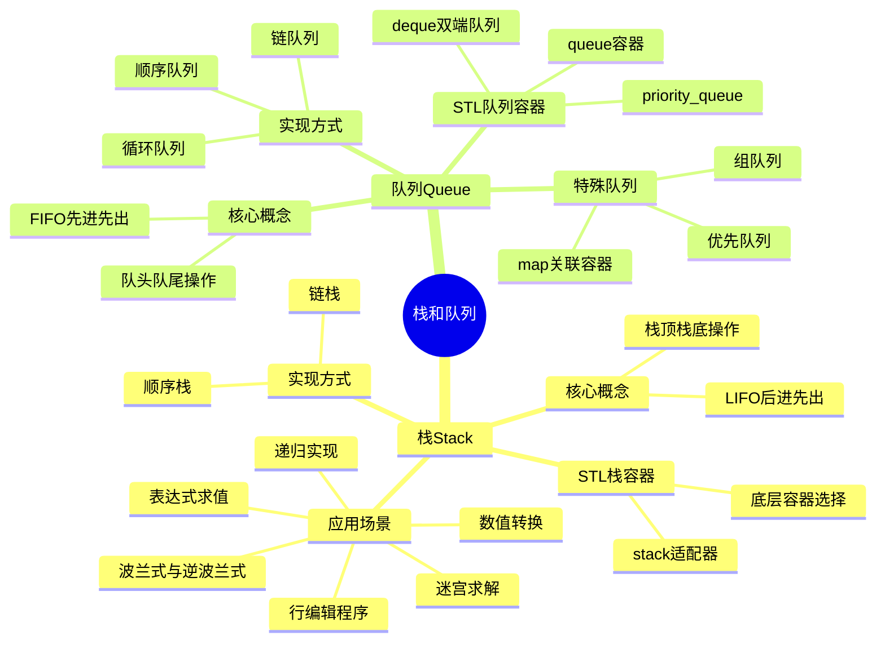

# 栈和队列

> 📝 **主题**: 数据结构中的栈和队列
> 
> 🎯 **学习目标**:
> -  掌握栈和队列的基本概念
> - 实现方式
> - STL容器使用及实际应用

---

## 📋 目录结构



---

## 🔍 1. 知识体系总览

### 💡 核心对比

| 特性 | 栈(Stack) | 队列(Queue) |
|------|-----------|-------------|
| **操作原则** | 后进先出(LIFO) | 先进先出(FIFO) |
| **操作端** | 仅栈顶可操作 | 队头删除、队尾插入 |
| **典型应用** | 递归、表达式求值 | 任务调度、消息队列 |
| **顺序实现** | 顺序栈 | 循环队列 |
| **链式实现** | 链栈 | 链队列 |

---

## 🔍 2. 栈(Stack)

### 2.1 基本概念

#### 💡 定义

栈是限定仅在表的一端(top)进行插入或删除操作的线性表，具有**后进先出(LIFO)**的特性。

#### 📊 核心术语

| 术语 | 说明 |
|------|------|
| **栈顶(Top)** | 允许插入和删除的一端 |
| **栈底(Bottom)** | 固定不动的另一端 |
| **push(e)** | 入栈操作 |
| **pop()** | 出栈操作 |
| **top()** | 获取栈顶元素 |
| **isEmpty()** | 判空操作 |

---

### 2.2 顺序栈实现

#### 🏷️ 原理说明

顺序栈使用**连续内存(数组)**存储元素，通过`top`指针管理栈顶位置。

#### 📊 存储结构

```
低地址
┌─────────┐ ← base[0] (栈底)
│ 元素1   │
├─────────┤
│ 元素2   │
├─────────┤
│  ...    │
├─────────┤ ← base[top-1] (栈顶元素)
│ 未使用  │ ← base[top] (下一个插入位置)
└─────────┘ ← base[capacity-1]
高地址
```

#### 🏷️ 关键状态

| 状态 | 条件 | 说明 |
|------|------|------|
| **空栈** | `top == 0` | 栈中无元素 |
| **满栈** | `top == capacity` | 栈已达到容量上限 |
| **栈长** | `top` | 栈中元素个数 |
| **栈顶元素** | `base[top-1]` | 最后插入的元素 |

#### 🛠️ 核心代码实现

**顺序栈类定义**

```cpp
class SeqStack {
private:
    int *base;              // 栈空间基址指针
    int top;                // 栈顶指针（指向下一个空闲位置）
    int capacity;           // 当前栈容量
    static const int INIT_SIZE = 100;
    static const int INCREMENT = 10;

public:
    // 构造与析构
    SeqStack() : base(new int[INIT_SIZE]), top(0), capacity(INIT_SIZE) {}
    ~SeqStack() { delete[] base; }
    
    // 基本操作
    bool push(int element);
    bool pop(int &element);
    bool getTop(int &element) const;
    bool isEmpty() const { return top == 0; }
    bool isFull() const { return top == capacity; }
    bool resize(int newCapacity);
};
```

**入栈操作**

```cpp
bool SeqStack::push(int element) {
    // 检查是否需要扩容
    if (isFull())
        if (!resize(capacity + INCREMENT))
            return false;
    
    // 将元素放入栈顶位置，栈顶指针上移
    base[top++] = element;
    return true;
}

// 入栈过程可视化：
// 入栈前: [10, 20, 30, _, _]  top=3
//          ↑          ↑
//        栈底       栈顶
// push(40);
// 入栈后: [10, 20, 30, 40, _]  top=4
```

**出栈操作**

```cpp
bool SeqStack::pop(int &element) {
    if (isEmpty()) 
        return false;
    
    // 栈顶指针下移，获取栈顶元素
    element = base[--top];
    return true;
}

// 出栈过程可视化：
// 出栈前: [10, 20, 30, 40, _]  top=4
// pop(value);  // value = 40
// 出栈后: [10, 20, 30, 40, _]  top=3
//         ↑          ↑
//       栈底       栈顶
```

**获取栈顶元素**

```cpp
bool SeqStack::getTop(int &element) const {
    if (isEmpty())
        return false;
    
    // 获取栈顶元素但不移动指针
    element = base[top - 1];
    return true;
}
```

**动态扩容实现**

```cpp
bool SeqStack::resize(int newCapacity) {
    if (newCapacity <= capacity)
        return false;
    
    int *newBase = new int[newCapacity];
    if (!newBase) return false;
    
    // 复制原有数据
    for (int i = 0; i < top; i++)
        newBase[i] = base[i];
    
    // 释放旧内存，更新指针
    delete[] base;
    base = newBase;
    capacity = newCapacity;
    return true;
}
```

#### 📊 性能分析

| 操作 | 时间复杂度 | 空间复杂度 | 最坏情况 | 说明 |
|------|-----------|-----------|---------|------|
| **入栈(push)** | O(1) | O(1) | O(n) | 扩容时需复制 |
| **出栈(pop)** | O(1) | O(1) | O(1) | 常数时间 |
| **获取栈顶** | O(1) | O(1) | O(1) | 直接访问 |
| **判空/判满** | O(1) | O(1) | O(1) | 简单比较 |

---

### 2.3 链栈实现

#### 🏷️ 原理说明

链栈使用**链式存储**，每个元素独立分配内存，通过指针链接。所有操作在链表头部进行。

#### 📊 存储结构

```
top → [data|next] → [data|next] → [data|next] → NULL
       ↑             ↑             ↑
     栈顶          中间          栈底
```

#### 🏷️ 关键状态

| 状态 | 条件 | 说明 |
|------|------|------|
| **空栈** | `top == NULL` | 栈中无元素 |
| **栈顶元素** | `top->data` | 链表头节点数据 |

#### 🛠️ 核心代码实现

**链栈节点定义**

```cpp
struct StackNode {
    int data;
    StackNode *next;
    StackNode(int val = 0, StackNode *ptr = nullptr) 
        : data(val), next(ptr) {}
};
```

**链栈类定义**

```cpp
class LinkedStack {
private:
    StackNode *top;
    int size;

public:
    LinkedStack() : top(nullptr), size(0) {}
    ~LinkedStack() { clear(); }
    
    bool push(int element);
    bool pop(int &element);
    bool getTop(int &element) const;
    bool isEmpty() const { return top == nullptr; }
    void clear();
};
```

**入栈操作**

```cpp
bool LinkedStack::push(int element) {
    // 创建新节点，指向当前栈顶
    StackNode *newNode = new StackNode(element, top);
    if (!newNode) return false;
    
    // 新节点成为新的栈顶
    top = newNode;
    size++;
    return true;
}

// 入栈前: top → [30] → [20] → [10] → NULL
// push(40);
// 入栈后: top → [40] → [30] → [20] → [10] → NULL
```

**出栈操作**

```cpp
bool LinkedStack::pop(int &element) {
    if (isEmpty()) return false;
    
    // 保存栈顶元素和指针
    element = top->data;
    StackNode *temp = top;
    
    // 移动栈顶指针，删除原栈顶节点
    top = top->next;
    delete temp;
    size--;
    return true;
}

// 出栈前: top → [40] → [30] → [20] → [10] → NULL
// pop(value);  // value = 40
// 出栈后: top → [30] → [20] → [10] → NULL
```

**获取栈顶元素**

```cpp
bool LinkedStack::getTop(int &element) const {
    if (isEmpty()) return false;
    element = top->data;
    return true;
}
```

**清空栈操作**

```cpp
void LinkedStack::clear() {
    while (top) {
        StackNode *temp = top;
        top = top->next;
        delete temp;
    }
    size = 0;
}
```

#### 📊 性能分析

| 操作 | 时间复杂度 | 空间复杂度 | 说明 |
|------|-----------|-----------|------|
| **入栈(push)** | O(1) | O(1) | 头插法，常数时间 |
| **出栈(pop)** | O(1) | O(1) | 删除头节点 |
| **获取栈顶** | O(1) | O(1) | 直接访问 |
| **清空栈** | O(n) | O(1) | 需遍历所有节点 |

#### 📊 对比分析

| 特性 | 顺序栈 | 链栈 |
|------|--------|------|
| **存储方式** | 连续内存 | 离散内存 |
| **容量限制** | 固定（可扩容） | 动态无限 |
| **内存开销** | 仅数据 | 数据+指针 |
| **访问速度** | 快 | 较慢（指针跳转） |
| **空间浪费** | 可能有 | 无 |
| **适用场景** | 大小可预估 | 动态变化大 |

---

### 2.4 STL栈适配器容器

#### 💡 STL栈适配器基本概念

STL中的stack是一个**容器适配器**，提供栈的功能（LIFO），基于其他序列容器实现。

#### 🛠️ 基本用法

**头文件与定义方式**

```cpp
#include <stack>
#include <vector>
#include <deque>
#include <list>

// 常用定义方式
stack<int> s;                       // 默认底层 = deque<int>
stack<int, vector<int>> s1;         // 显式用 vector
stack<int, list<int>> s2;           // 显式用 list
stack<string> s3;                   // 自定义类型
```

#### 📊 底层容器对比

| 底层容器 | 内存布局 | push/pop速度 | 随机访问 | 推荐场景 |
|---------|---------|-------------|---------|---------|
| **deque（默认）** | 分块连续 | 极快 | 较慢 | 99% 场景（最推荐） |
| **vector** | 完全连续 | 快（扩容慢） | 极快 | 需要快速索引 |
| **list** | 节点分散 | 快（稳定） | 极慢 | 极频繁插入删除 |

#### 🏷️ 核心接口

| 功能 | 函数 | 说明 |
|------|------|------|
| **入栈** | `push(x)` | 把 x 压入栈顶 |
|  | `emplace(args...)` | 原地构造（C++11，避免拷贝） |
| **出栈** | `pop()` | 删除栈顶（不返回！） |
| **访问栈顶** | `top()` | 返回栈顶引用（可读可改） |
| **是否为空** | `empty()` | 返回 bool |
| **元素个数** | `size()` | 返回 size_t |
| **交换** | `swap(stack&)` | 交换两个栈内容 |

#### 💡 使用示例

```cpp
stack<int> s;
s.push(10);
s.push(20);
s.push(30);

// 正确用法：先top()再pop()
while (!s.empty()) {
    int val = s.top();  // 先取值
    s.pop();            // 再删除
    cout << val << " "; // 30 20 10
}

// 比较运算符
stack<int> a, b;
a.push(1), a.push(2);
b.push(1), b.push(2);
cout << (a == b);  // true
```

> ⚠️ **注意**: `pop()`不返回值，必须先用`top()`获取值再`pop()`

---

### 2.5 栈的应用实例

#### 📊 应用场景总结

| 应用场景 | 栈的作用 | 核心算法 | 时间复杂度 |
|---------|---------|---------|-----------|
| **数值转换** | 存储余数逆序输出 | 除基取余 | O(logN) |
| **行编辑程序** | 存储字符序列 | 退格处理 | O(N) |
| **迷宫求解** | 记录搜索路径 | 深度优先搜索 | O(M×N) |
| **表达式求值** | 管理运算符优先级 | 调度场算法 | O(N) |
| **递归实现** | 保存函数调用信息 | 栈式管理 | O(深度) |

#### 🛠️ 数值转换

将十进制数转换为其他进制数，利用栈的LIFO特性。

**算法步骤**：
1. 除基取余：将十进制数不断除以目标进制基数
2. 余数入栈：每次的余数压入栈中
3. 逆序出栈：将余数从栈中弹出得到结果

```cpp
string decimalToBase(int decimal, int base) {
    if (decimal == 0) return "0";
    if (base < 2 || base > 16) return "";
    
    stack<int> digits;
    
    // 除基取余，余数入栈
    while (decimal > 0) {
        digits.push(decimal % base);
        decimal /= base;
    }
    
    // 出栈组合结果
    string result;
    const char digitChars[] = "0123456789ABCDEF";
    while (!digits.empty()) {
        result += digitChars[digits.top()];
        digits.pop();
    }
    
    return result;
}
```

#### 🛠️ 行编辑程序

用户输入一行字符时，允许用退格符"#"及时更正输入错误。

**算法步骤**：
1. 依次读取字符
2. 若为"#"，栈非空时栈顶出栈
3. 非"#"，字符入栈
4. 结束后，栈底到栈顶顺序输出

```cpp
string lineEditor(const string &input) {
    stack<char> charStack;
    
    for (char ch : input) {
        if (ch == '#') {
            // 退格处理：栈非空时出栈
            if (!charStack.empty())
                charStack.pop();
        } else {
            // 正常字符入栈
            charStack.push(ch);
        }
    }
    
    // 将栈内容转移到另一个栈实现逆序
    stack<char> tempStack;
    while (!charStack.empty()) {
        tempStack.push(charStack.top());
        charStack.pop();
    }
    
    // 构建结果字符串
    string result;
    while (!tempStack.empty()) {
        result += tempStack.top();
        tempStack.pop();
    }
    
    return result;
}
```

#### 🛠️ 迷宫求解

在给定的迷宫中找到从起点到终点的路径，采用深度优先搜索（DFS）策略。

**算法思想**：
1. 深度优先：沿一个方向深入搜索
2. 回溯机制：遇到死路时回退到上一个岔路口
3. 栈记录路径：用栈保存已走过的路径点

```cpp
struct Point {
    int x, y;
    Point(int x=0, int y=0) : x(x), y(y) {}
    bool operator==(const Point &p) const { 
        return x == p.x && y == p.y; 
    }
};

vector<Point> solveMaze(vector<vector<int>> &maze, Point start, Point end) {
    stack<Point> path;
    vector<vector<bool>> visited(maze.size(), 
                                 vector<bool>(maze[0].size(), false));
    
    path.push(start);
    visited[start.x][start.y] = true;
    
    int dx[] = {0, 1, 0, -1};  // 右下左上
    int dy[] = {1, 0, -1, 0};
    
    while (!path.empty()) {
        Point current = path.top();
        
        // 找到出口
        if (current == end) {
            vector<Point> result;
            stack<Point> temp = path;
            while (!temp.empty()) {
                result.insert(result.begin(), temp.top());
                temp.pop();
            }
            return result;
        }
        
        bool found = false;
        // 尝试四个方向
        for (int i = 0; i < 4; i++) {
            int nx = current.x + dx[i];
            int ny = current.y + dy[i];
            
            if (nx >= 0 && nx < maze.size() && 
                ny >= 0 && ny < maze[0].size() &&
                maze[nx][ny] == 0 && !visited[nx][ny]) {
                path.push({nx, ny});
                visited[nx][ny] = true;
                found = true;
                break;
            }
        }
        
        if (!found) path.pop();  // 回溯
    }
    
    return {};  // 无解
}
```

#### 🛠️ 表达式求值

计算包含运算符、操作数和括号的数学表达式。

```cpp
class ExpressionEvaluator {
private:
    map<char, int> precedence = {
        {'+', 1}, {'-', 1}, {'*', 2}, {'/', 2}
    };
    
    double applyOperator(double a, double b, char op) {
        switch(op) {
            case '+': return a + b;
            case '-': return a - b;
            case '*': return a * b;
            case '/': return a / b;
        }
        return 0;
    }

public:
    double evaluate(const string &expr) {
        stack<double> values;
        stack<char> ops;
        
        for (size_t i = 0; i < expr.length(); i++) {
            if (isspace(expr[i])) continue;
            
            if (isdigit(expr[i])) {
                double val = 0;
                while (i < expr.length() && isdigit(expr[i])) {
                    val = val * 10 + (expr[i] - '0');
                    i++;
                }
                i--;
                values.push(val);
            } else if (expr[i] == '(') {
                ops.push(expr[i]);
            } else if (expr[i] == ')') {
                while (!ops.empty() && ops.top() != '(') {
                    double b = values.top(); values.pop();
                    double a = values.top(); values.pop();
                    values.push(applyOperator(a, b, ops.top()));
                    ops.pop();
                }
                ops.pop();
            } else {
                while (!ops.empty() && ops.top() != '(' &&
                       precedence[ops.top()] >= precedence[expr[i]]) {
                    double b = values.top(); values.pop();
                    double a = values.top(); values.pop();
                    values.push(applyOperator(a, b, ops.top()));
                    ops.pop();
                }
                ops.push(expr[i]);
            }
        }
        
        while (!ops.empty()) {
            double b = values.top(); values.pop();
            double a = values.top(); values.pop();
            values.push(applyOperator(a, b, ops.top()));
            ops.pop();
        }
        
        return values.top();
    }
};
```

#### 🛠️ 波兰式与逆波兰式

**基本概念**

| 表达式类型 | 示例 | 说明 |
|----------|------|------|
| **中缀表达式** | `a+b*(c-d)-e/f` | 运算符在操作数中间 |
| **前缀表达式(波兰式)** | `-+a*b-cd/ef` | 运算符在前 |
| **后缀表达式(逆波兰式)** | `abcd-*+ef/-` | 运算符在后 |

**转换规则**

| 读到字符类型 | 处理规则 |
|-------------|---------|
| **操作数** | 直接输出到结果序列 |
| **左括号 `(`** | 压入运算符栈 |
| **右括号 `)`** | 反复弹出栈顶到输出，直到弹出 `(` |
| **运算符 op** | 弹出优先级≥当前的运算符，再压栈 |
| **表达式结束** | 弹出栈中所有剩余运算符 |

**中缀转后缀**

```cpp
string infixToPostfix(const string &infix) {
    stack<char> ops;
    stringstream result;
    map<char, int> precedence = {{'+',1}, {'-',1}, {'*',2}, {'/',2}};
    
    for (char c : infix) {
        if (isspace(c)) continue;
        
        if (isdigit(c)) {
            result << c << ' ';
        } else if (c == '(') {
            ops.push(c);
        } else if (c == ')') {
            while (!ops.empty() && ops.top() != '(') {
                result << ops.top() << ' ';
                ops.pop();
            }
            ops.pop();  // 丢弃'('
        } else {
            while (!ops.empty() && ops.top() != '(' &&
                   precedence[ops.top()] >= precedence[c]) {
                result << ops.top() << ' ';
                ops.pop();
            }
            ops.push(c);
        }
    }
    
    while (!ops.empty()) {
        result << ops.top() << ' ';
        ops.pop();
    }
    
    return result.str();
}
```

**逆波兰式求值**

```cpp
double evaluateRPN(const string &postfix) {
    stack<double> stk;
    stringstream ss(postfix);
    string token;
    
    while (ss >> token) {
        if (isdigit(token[0])) {
            stk.push(stod(token));
        } else {
            double b = stk.top(); stk.pop();
            double a = stk.top(); stk.pop();
            
            switch(token[0]) {
                case '+': stk.push(a + b); break;
                case '-': stk.push(a - b); break;
                case '*': stk.push(a * b); break;
                case '/': stk.push(a / b); break;
            }
        }
    }
    
    return stk.top();
}
```

#### 🛠️ 函数调用与递归的栈机制

**核心原理**：
1. 每次函数调用压入栈帧，存储：实参、返回地址、局部变量
2. 函数返回时弹出栈帧：保存返回值→释放局部变量→按返回地址跳回
3. 所有函数调用严格"后调用先返回"

```cpp
// 典型的栈帧布局
struct StackFrame {
    ReturnAddress returnAddr;  // 返回地址
    Parameters params;         // 参数区域
    LocalVariables locals;     // 局部变量
    TemporaryStorage temp;     // 临时存储
};
```

**尾递归**

尾递归是递归调用发生在函数最后一步操作的特殊情况。

```cpp
// 普通递归：递归调用不是最后操作
int factorial(int n) {
    if (n <= 1) return 1;
    return n * factorial(n - 1);  // 递归后还有乘法操作
}

// 尾递归版本：递归调用是最后操作
int factorialTail(int n, int accumulator = 1) {
    if (n <= 1) return accumulator;
    return factorialTail(n - 1, n * accumulator);  // 最后操作
}
```

---

## 🔍 3. 队列(Queue)

### 3.1 基本概念

#### 💡 定义

队列是只允许在**一端插入**、**另一端删除**的线性表，遵循**先进先出(FIFO)**原则。

#### 📊 核心术语

| 术语 | 说明 |
|------|------|
| **队头(Front)** | 允许删除的一端 |
| **队尾(Rear)** | 允许插入的一端 |
| **enqueue(e)** | 入队(队尾插入) |
| **dequeue()** | 出队(队头删除) |
| **front()** | 获取队头元素 |
| **isEmpty()** | 判空 |

---

### 3.2 顺序队列与循环队列

#### ⚠️ 顺序队列的假溢出问题

**问题描述**: 使用数组实现队列时，队尾指针可能到达数组末尾，但数组前部有空闲空间。

**示例**：

```
初始: [_ _ _ _ _]  front=0, rear=0
入队3个: [10 20 30 _ _]  front=0, rear=3
出队2个: [_ _ 30 _ _]  front=2, rear=3

此时rear=3接近末尾，但前面有2个空位!
继续入队会报满，这就是"假溢出"
```

**解决方案**: 循环队列 - 将队列存储结构首尾相接，形成环形结构。

#### 🏷️ 循环队列原理

**核心思想**: 将数组首尾相连，形成逻辑环，通过模运算实现指针循环。

#### 📊 存储结构

```
      ┌─────┐
   ┌──┤  0  │←─ front (队头)
   │  ├─────┤
   │  │  1  │
   │  ├─────┤
   │  │  2  │←─ rear (队尾的下一个位置)
   │  ├─────┤
   └─→│ n-1 │
      └─────┘
```

#### 🏷️ 关键技术

**1. 空满判断(牺牲一个空间法)**

| 状态 | 条件 |
|------|------|
| **空队列** | `front == rear` |
| **满队列** | `(rear + 1) % capacity == front` |
| **元素个数** | `(rear - front + capacity) % capacity` |

**2. 指针移动**

```cpp
rear = (rear + 1) % capacity;   // 入队后
front = (front + 1) % capacity; // 出队后
```

#### 🛠️ 核心代码

**循环队列类定义**

```cpp
class CircularQueue {
private:
    int *base;
    int front, rear;
    int capacity;

public:
    CircularQueue(int size) : capacity(size + 1) {
        base = new int[capacity];
        front = rear = 0;
    }
    
    ~CircularQueue() { delete[] base; }
    
    bool enqueue(int value);
    bool dequeue(int &value);
    bool isEmpty() const { return front == rear; }
    bool isFull() const { return (rear + 1) % capacity == front; }
};
```

**入队操作**

```cpp
bool CircularQueue::enqueue(int value) {
    if (isFull()) return false;
    
    base[rear] = value;
    rear = (rear + 1) % capacity;
    return true;
}
```

**出队操作**

```cpp
bool CircularQueue::dequeue(int &value) {
    if (isEmpty()) return false;
    
    value = base[front];
    front = (front + 1) % capacity;
    return true;
}
```

#### 📊 空满判断的三种方案

| 方案 | 判空条件 | 判满条件 | 优缺点 |
|------|---------|---------|--------|
| **牺牲一个空间** | `front==rear` | `(rear+1)%cap==front` | ✅ 简单 ❌ 浪费1空间 |
| **使用计数器** | `count==0` | `count==capacity` | ✅ 无浪费 ❌ 额外变量 |
| **使用标志位** | `front==rear&&!flag` | `front==rear&&flag` | ✅ 无浪费 ❌ 逻辑复杂 |

#### 📊 操作语句总结

| 操作 | 代码实现 | 说明 |
|------|---------|------|
| **入队** | `base[rear]=e; rear=(rear+1)%MaxSize;` | 元素放入队尾，指针循环移动 |
| **出队** | `e=base[front]; front=(front+1)%MaxSize;` | 取出队头元素，指针循环移动 |
| **队空** | `front == rear` | 头尾指针相等 |
| **队满** | `(rear+1)%MaxSize == front` | 队尾下一个位置是队头 |
| **元素数** | `(rear-front+MaxSize)%MaxSize` | 模运算计算 |

---

### 3.3 链队列实现

#### 🏷️ 原理说明

链队列使用链表实现，需维护**队头指针front**和**队尾指针rear**。

#### 📊 存储结构

```
front → [data|next] → [data|next] → [data|next] → NULL ← rear
         ↑                           ↑
       队头                         队尾
```

#### 🏷️ 关键状态

| 状态 | 条件 | 说明 |
|------|------|------|
| **空队列** | `front == NULL` | 队列中无元素 |
| **队头元素** | `front->data` | 链表头节点数据 |
| **队尾元素** | `rear->data` | 链表尾节点数据 |

#### 🛠️ 核心代码实现

**链队列节点定义**

```cpp
struct QueueNode {
    int data;
    QueueNode *next;
    QueueNode(int val = 0, QueueNode *ptr = nullptr) 
        : data(val), next(ptr) {}
};
```

**链队列类定义**

```cpp
class LinkedQueue {
private:
    QueueNode *front, *rear;
    int size;

public:
    LinkedQueue() : front(nullptr), rear(nullptr), size(0) {}
    ~LinkedQueue() { clear(); }
    
    bool enqueue(int element);
    bool dequeue(int &element);
    bool getFront(int &element) const;
    bool isEmpty() const { return front == nullptr; }
    void clear();
};
```

**入队操作(尾插)**

```cpp
bool LinkedQueue::enqueue(int element) {
    QueueNode *newNode = new QueueNode(element);
    if (!newNode) return false;
    
    if (isEmpty()) {
        front = rear = newNode;
    } else {
        rear->next = newNode;
        rear = newNode;
    }
    size++;
    return true;
}

// 入队前: front → [10] → [20] → NULL ← rear
// enqueue(30);
// 入队后: front → [10] → [20] → [30] → NULL ← rear
```

**出队操作(头删)**

```cpp
bool LinkedQueue::dequeue(int &element) {
    if (isEmpty()) return false;
    
    element = front->data;
    QueueNode *temp = front;
    front = front->next;
    
    if (!front) rear = nullptr;  // 队列变空
    
    delete temp;
    size--;
    return true;
}

// 出队前: front → [10] → [20] → [30] → NULL ← rear
// dequeue(value);  // value = 10
// 出队后: front → [20] → [30] → NULL ← rear
```

**获取队头元素**

```cpp
bool LinkedQueue::getFront(int &element) const {
    if (isEmpty()) return false;
    element = front->data;
    return true;
}
```

**清空队列**

```cpp
void LinkedQueue::clear() {
    while (front) {
        QueueNode *temp = front;
        front = front->next;
        delete temp;
    }
    rear = nullptr;
    size = 0;
}
```

#### 📊 性能分析

| 操作 | 时间复杂度 | 空间复杂度 | 说明 |
|------|-----------|-----------|------|
| **入队(enqueue)** | O(1) | O(1) | 尾插法，常数时间 |
| **出队(dequeue)** | O(1) | O(1) | 头删法，常数时间 |
| **获取队头** | O(1) | O(1) | 直接访问头节点 |
| **清空队列** | O(n) | O(1) | 需遍历所有节点 |

#### 📊 对比分析

| 特性 | 顺序队列 | 链队列 |
|------|---------|--------|
| **存储结构** | 连续内存 | 离散内存 |
| **容量限制** | 固定 | 动态无限 |
| **内存使用** | 预分配 | 按需分配 |
| **内存开销** | 仅数据 | 数据+指针 |
| **适用场景** | 大小可预估 | 大小不确定 |

---

### 3.4 STL队列容器

#### 💡 queue容器基本操作

```cpp
#include <queue>

queue<int> q;
```

| 函数 | 功能 | 示例 |
|------|------|------|
| `push(x)` | 入队 | `q.push(10)` |
| `pop()` | 出队(不返回) | `q.pop()` |
| `front()` | 返回队头元素 | `q.front()` |
| `back()` | 返回队尾元素 | `q.back()` |
| `empty()` | 判断是否为空 | `if(q.empty())` |
| `size()` | 返回元素个数 | `q.size()` |

#### 🛠️ 优先队列(priority_queue)

优先队列每次出队的是**优先级最高**的元素。

```cpp
#include <queue>
#include <vector>
#include <functional>

// 大顶堆(默认，降序)
priority_queue<int> maxHeap;
maxHeap.push(30);
maxHeap.push(10);
maxHeap.push(50);

while (!maxHeap.empty()) {
    cout << maxHeap.top() << " ";  // 50 30 10
    maxHeap.pop();
}

// 小顶堆(升序)
priority_queue<int, vector<int>, greater<int>> minHeap;
minHeap.push(30);
minHeap.push(10);
minHeap.push(50);

while (!minHeap.empty()) {
    cout << minHeap.top() << " ";  // 10 30 50
    minHeap.pop();
}
```

#### 🛠️ 双端队列(deque)

```cpp
#include <deque>

deque<int> dq;

// 双端插入
dq.push_front(10);  // 队头插入
dq.push_back(20);   // 队尾插入

// 双端删除
dq.pop_front();     // 队头删除
dq.pop_back();      // 队尾删除

// 访问
int front = dq.front();
int back = dq.back();
int elem = dq[0];   // 支持随机访问
```

---

### 3.5 STL有序关联容器 - map

#### 💡 map容器定义

map是C++标准模板库(STL)中的**关联容器**，提供基于键(key)的快速数据检索，存储**键值对**(key-value pair)。

#### 🛠️ 核心代码

**map类模板定义**

```cpp
template <
    class Key,                                      // 键类型
    class T,                                        // 值类型
    class Compare = less<Key>,                      // 比较函数对象
    class Allocator = allocator<pair<const Key, T>> // 分配器
>
class map;
```

**map容器的基本使用**

```cpp
#include <map>
#include <string>
#include <iostream>

// 定义
map<int, string> studentMap;
map<int, string> m = {{1,"Alice"}, {2,"Bob"}, {3,"Charlie"}};

// 插入操作
studentMap.insert(make_pair(101, "张三"));
studentMap.insert({102, "李四"});
studentMap.emplace(103, "王五");
studentMap[104] = "赵六";

// 查找操作
auto it = studentMap.find(101);
if (it != studentMap.end())
    cout << it->first << "->" << it->second << endl;

// 删除操作
studentMap.erase(101);

// 遍历
for (const auto &pair : studentMap)
    cout << pair.first << "->" << pair.second << endl;
```

---

### 3.6 组队列

#### 💡 组队列的基本概念

组队列是元素按**分组聚集**的特殊队列结构。元素按照所属组别进行组织，出队时保证同一组的元素连续出队。

#### 📊 组队列的存储结构

**核心数据结构**

```cpp
// 元素与组映射关系
map<string, int> memberToGroup;        // 元素→组号

// 组队列数组
vector<queue<string>> groupQueues;     // 每个组一个队列

// 活跃组维护
queue<int> activeGroups;               // 活跃组顺序队列
set<int> activeGroupSet;               // 快速查找活跃组
```

#### 🛠️ 核心代码

**完整类定义**

```cpp
class GroupQueue {
private:
    map<string, int> memberToGroup;
    vector<queue<string>> groupQueues;
    queue<int> activeGroups;
    set<int> activeGroupSet;
    int groupCount;

public:
    GroupQueue(int n) : groupCount(n), groupQueues(n) {}
    
    // 初始化组映射关系
    void addMember(const string &member, int groupId) {
        if (groupId >= 0 && groupId < groupCount)
            memberToGroup[member] = groupId;
    }
    
    // 元素入队
    void enqueue(const string &member) {
        int groupId = memberToGroup[member];
        groupQueues[groupId].push(member);
        
        // 如果该组不在活跃组中，加入活跃组队列
        if (activeGroupSet.find(groupId) == activeGroupSet.end()) {
            activeGroups.push(groupId);
            activeGroupSet.insert(groupId);
        }
    }
    
    // 元素出队
    string dequeue() {
        if (empty()) return "";
        
        int currentGroup = activeGroups.front();
        string member = groupQueues[currentGroup].front();
        groupQueues[currentGroup].pop();
        
        // 如果当前组队列为空，从活跃组中移除
        if (groupQueues[currentGroup].empty()) {
            activeGroups.pop();
            activeGroupSet.erase(currentGroup);
        }
        
        return member;
    }
    
    bool empty() const { return activeGroups.empty(); }
};
```

---

### 3.7 STL中的优先队列

#### 💡 优先队列定义

优先队列(priority_queue)是拥有**权值概念**的队列，元素按照一定的优先级顺序排列。

#### 🛠️ 核心代码

**优先队列类模板定义**

```cpp
template <
    class T,                                             // 元素类型
    class Container = vector<T>,                         // 底层容器
    class Compare = less<typename Container::value_type> // 比较函数
>
class priority_queue;
```

**基本用法**

```cpp
#include <queue>
#include <vector>
#include <functional>

// 1. 默认定义（大顶堆，降序）
priority_queue<int> pq1;

// 2. 小顶堆（升序）
priority_queue<int, vector<int>, greater<int>> pq2;

// 3. 自定义数据类型
struct Task {
    int priority;
    string name;
    bool operator<(const Task &other) const {
        return priority < other.priority;  // 大顶堆
    }
};
priority_queue<Task> taskQueue;
```

**核心操作**

```cpp
priority_queue<int> pq;

// 插入元素
pq.push(30);
pq.push(10);
pq.push(20);
pq.push(40);

// 访问堆顶
cout << pq.top() << endl;  // 40

// 删除堆顶
pq.pop();

// 判空和大小
cout << pq.empty() << endl;  // false
cout << pq.size() << endl;   // 3
```

---

## 🔍 4. 总结与练习

### 📊 核心对比表

| 维度 | 栈 | 队列 |
|------|-----|------|
| **操作原则** | LIFO 后进先出 | FIFO 先进先出 |
| **操作位置** | 仅栈顶 | 队头删除、队尾插入 |
| **顺序实现** | 顺序栈 | 循环队列 |
| **链式实现** | 链栈 | 链队列 |
| **典型应用** | 递归、括号匹配、表达式 | BFS、任务调度、缓冲 |

### 💪 练习题

#### 🏷️ 基础题

**1. 判断出栈序列合法性**

整数1,2,3,4依次入栈，判断下列出栈序列是否合法:

| 序列 | 合法性 | 说明 |
|------|--------|------|
| (a) 1,2,3,4 | ✅ | 依次入栈出栈 |
| (b) 2,3,4,1 | ✅ | 1入栈不出，234依次出，最后1出 |
| (c) 3,4,2,1 | ✅ | 12入栈不出，3出，4出，2出，1出 |
| (d) 4,3,1,2 | ❌ | 2比1先入栈，不可能1比2先出 |

**2. 循环队列元素个数**

循环队列容量为`MaxSize`，队头指针`front`，队尾指针`rear`：

```
count = (rear - front + MaxSize) % MaxSize
```

#### 🏷️ 进阶题

**3. 用两个栈实现队列**

```cpp
class MyQueue {
private:
    stack<int> inStack;
    stack<int> outStack;

public:
    void push(int x) {
        inStack.push(x);
    }
    
    int pop() {
        if (outStack.empty()) {
            while (!inStack.empty()) {
                outStack.push(inStack.top());
                inStack.pop();
            }
        }
        int val = outStack.top();
        outStack.pop();
        return val;
    }
    
    int peek() {
        if (outStack.empty()) {
            while (!inStack.empty()) {
                outStack.push(inStack.top());
                inStack.pop();
            }
        }
        return outStack.top();
    }
    
    bool empty() {
        return inStack.empty() && outStack.empty();
    }
};
```

**4. 最小栈实现**

设计一个栈，支持O(1)时间获取最小值。

```cpp
class MinStack {
private:
    stack<int> dataStack;
    stack<int> minStack;

public:
    void push(int val) {
        dataStack.push(val);
        if (minStack.empty() || val <= minStack.top()) {
            minStack.push(val);
        }
    }
    
    void pop() {
        if (dataStack.top() == minStack.top()) {
            minStack.pop();
        }
        dataStack.pop();
    }
    
    int top() {
        return dataStack.top();
    }
    
    int getMin() {
        return minStack.top();
    }
};
```

---

## 📚 学习建议

### ⚠️ 易错点提醒

| 易错点 | 正确做法 |
|--------|---------|
| **顺序栈满时继续入栈** | 判满或动态扩容 |
| **循环队列判空判满** | 使用正确公式 |
| **STL的pop()返回值** | pop()不返回，要先top()再pop() |
| **链表内存泄漏** | 及时delete释放内存 |
| **循环队列指针移动** | 使用模运算：`(i+1)%capacity` |

