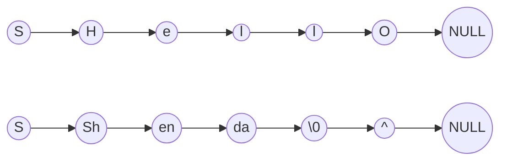
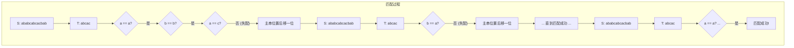
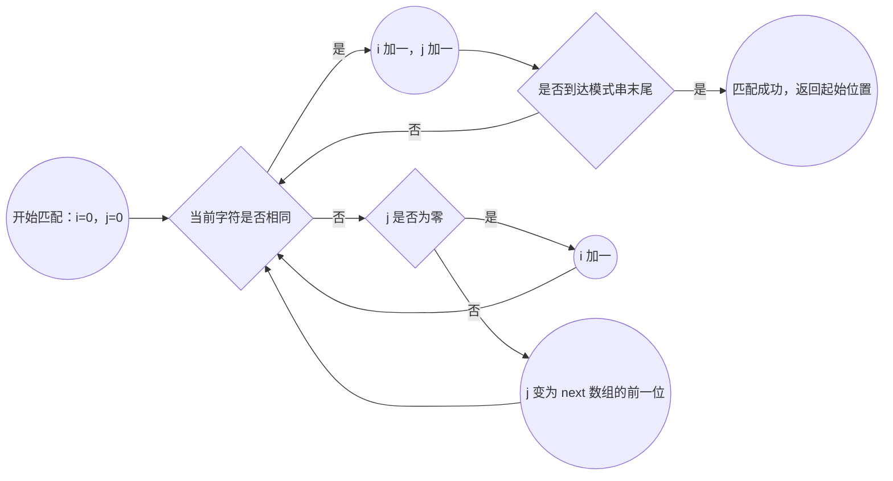
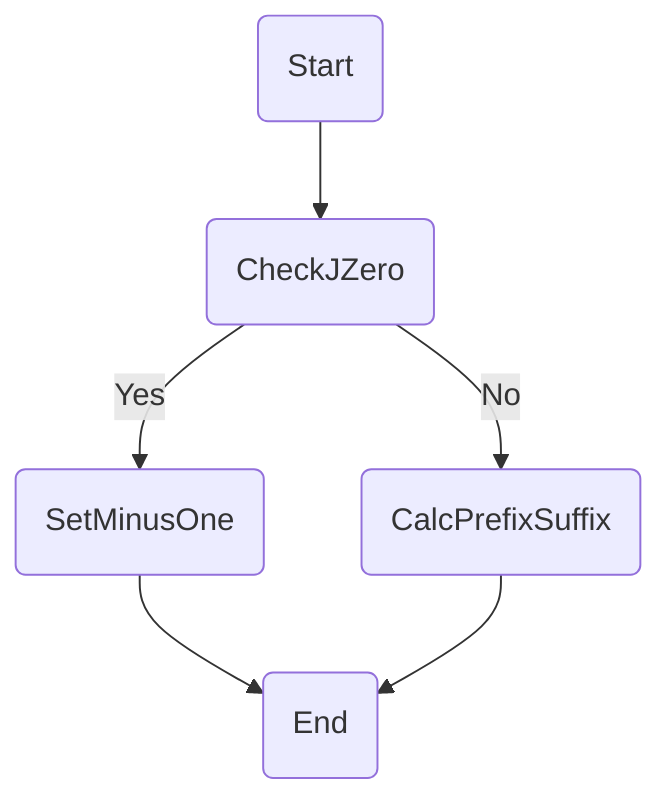
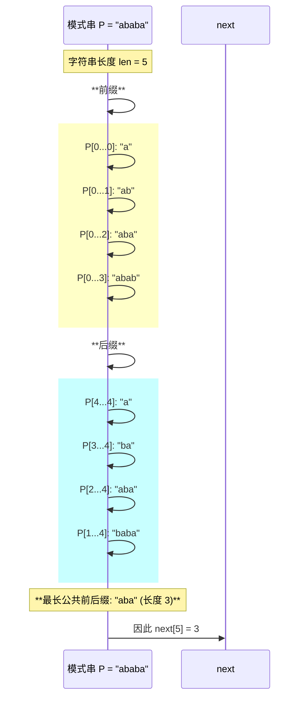

# 串

> 📝 **课程**: 数据结构：串
> 🎯 **学习目标**: 
> - 深入理解字符串的基本概念
> - 存储表示、常用操作及高效匹配算法
> - 特别是KMP算法及其next数组的计算与应用
> - 通过可视化图表与代码示例掌握其实现。

---

## 📋 目录结构

```mermaid
mindmap
  root((第四章 串))

    字符串基础
      定义
      术语
      与线性表对比
      基本操作

    存储方式
      顺序存储
        定长顺序
        串长表示
      链式存储
        节点结构
        示例图

    匹配算法
      BF算法
        思想
        举例
        实现
        复杂度
      KMP算法
        思想
        匹配示例
        启示

    KMP next数组
      next定义
      手算方法
      递推法
      nextval

    next应用
      最长前后缀
      循环节
      补齐循环串

    Java字符串
      常用方法

    总结
      关键要点

``````

**章节列表**:
*   1. 字符串基础
*   2. 字符串的存储表示与实现
*   3. 字符串匹配算法
*   4. KMP算法中的next值计算
*   5. next数组的应用
*   6. Java中的String类
*   7. 总结

---

## 🔍 1. 字符串基础

### 💡 1.1 核心定义

**字符串 (String)** 是由 `n (n ≥ 0)` 个字符组成的有限序列。它是数据结构中一种重要的线性结构。

> 💡 **关键**: 字符串强调的是**字符的有序序列**，其长度 `n` 表示字符的个数。

例如：`S = "Shenzhen University"`

其中：
*   `S` 是串的名字。
*   `"Shenzhen University"` 是串值。
*   每个字符 `aᵢ` 是串中的一个字符。
*   `n` 是串的长度。

### 💡 1.2 字符串术语

*   **空串 (Empty String)**: 不含任何字符的串，长度为 `0`。
*   **空格串 (Space String)**: 仅由一个或多个空格组成的串。
*   **子串 (Substring)**: 串中任意个**连续字符**组成的子序列。
*   **主串 (Main String)**: 包含子串的串。

>例如：
>如果`A = "Shenzhen University"`，`B = "University"`
>则`A`是主串，`B`是`A`的一个子串

*   **位置 (Position)**: 字符在主串中的序号。子串在主串中的位置以其第一个字符在主串中的位置来表示（通常从0或1开始计数）。
*   **串相等条件 (String Equality Condition)**: 两个串**长度相等**且**各对应位置的字符相等**。
*   **模式匹配 (Pattern Matching)**: 子串的定位操作，即确定子串在主串中首次出现的位置。

### 📊 1.3 与线性表的异同

字符串与线性表在逻辑结构上极为相似，两者都是线性结构。然而，它们之间也存在显著区别：

| 特性       | 字符串 (String)                      | 线性表 (Linear List)                    |
| :--------- | :----------------------------------- | :-------------------------------------- |
| **数据对象** | 约定为**字符集**                     | 可以是任意类型元素的集合                |
| **基本操作** | 通常以**“串的整体”**作为操作对象，如查找子串、插入子串等 | 通常以**“单个元素”**作为操作对象，如插入、删除某个元素 |

### 🛠️ 1.4 基本字符串操作

字符串通常提供以下基本操作：

*   **串赋值 (Assignment)**: 将一个串的值赋给另一个串。
*   **串比较 (Comparison)**: 比较两个串的大小（通常按字典序）。
*   **求串长 (Length)**: 获取串的长度。
*   **串联接 (Concatenation)**: 将两个串连接成一个新串。
*   **求子串 (Substring)**: 从主串中提取一个子串。
*   **串查找 (Search)**: 在主串中查找子串的位置。

其它复杂操作通常通过组合调用上述基本操作来完成。

---

## 🔍 2. 字符串的存储表示与实现

### 💡 2.1 顺序存储

#### 2.1.1 定长顺序存储

顺序存储是指将字符串的字符序列存储在一组地址连续的存储单元中。

*   **静态或动态分配**: 存储空间可以是静态分配（编译时确定大小），也可以是动态分配（运行时根据需要分配）。
*   **定长顺序存储**: 在C语言中，常用字符数组表示字符串，并以`\0`作为字符串的结束标志。

#### 代码示例 

```c
#define MAXSTRLEN 255 // 定义字符串的最大长度
char Str[MAXSTRLEN];   // 定义了长度为MAXSTRLEN的字符存储空间

// 注意: 实际字符串的长度可以小于MAXSTRLEN
// char sentence[] = "Hello"; // 实际长度为5，但会额外存储'\0'
```

### 💡 2.2 串长的两种表示

在顺序存储中，表示字符串长度有两种主要方式：隐式表示和显式表示。

#### 2.2.1 隐式表示

*   **特点**: 利用一个**不会出现在串中**的特殊字符（如C语言中的`\0`）作为串值的结束标志。
*   **优点**: 便于系统自动实现字符串的结束判断。
*   **缺点**: 不利于某些需要频繁获取长度的操作，每次获取长度可能需要遍历。

#### 2.2.2 显式表示

*   **特点**: 若不设终结符，则需要用一个**整数变量**来存储串的实际长度。
*   **优点**: 便于在算法中直接获取串长，用长度参数控制循环过程，效率高。
*   **缺点**: 需要额外的存储空间来保存长度信息。

#### 代码示例 

```cpp
#include <string>   // 包含C++标准字符串库
#include <vector>   // 可选，如果使用char数组，vector更灵活

// 概念上类似于某些数据结构库的实现
class SString {
public:
    std::string ch; // 存储字符序列，使用C++标准字符串
    int length;     // 存储串的实际长度

    // 构造函数
    SString(const std::string& s) {
        this->ch = s;
        this->length = s.length(); // 或 s.size()
    }

    // 获取串的长度
    int getLength() const {
        return this->length;
    }

    // ... 其他操作方法
};
```

### 💡 2.3 链式存储

#### 2.3.1 节点结构与存储密度

链式存储通过链表的方式存储字符串值。

*   **节点结构**: 每个结点可以存放一个字符，也可以存放多个字符。
*   **存储密度**: 链式存储的存储密度通常小于1（即实际存储数据元素所占空间 / 实际分配的总存储空间），因为每个节点还需要额外的指针空间。

#### 2.3.2 Mermaid 图 



---

## 🔍 3. 字符串匹配算法

字符串匹配是查找一个模式串 (`Pattern`) 在主串 (`Text`) 中首次出现位置的操作。

### 🛠️ 3.1 朴素算法 (Brute-Force, BF)

#### 3.1.1 核心思想与匹配过程

朴素算法是最直观的字符串匹配方法。

*   **核心思想**:
    1.  从主串的指定位置 `i` 开始，将主串中的字符与模式串的第一个字符进行比较。
    2.  若相等，则继续逐个比较后续字符。
    3.  若不等（失配），则从主串的**下一个字符** (`i+1`) 起重新和模式串的第一个字符比较。主串指针 `i` 回溯。

#### 3.1.2 朴素算法举例

主串 `S = "ababcabcacbab"`
模式串 `T = "abcac"`



#### 3.1.3 代码示例 

```cpp
int indexOf(const string &S, const string &T, int pos = 0) {
    if (T.empty() || pos < 0 || pos > S.length() - T.length())
        return -1;

    int i = pos; // 主串指针
    int j = 0;   // 模式串指针

    while (i < S.length() && j < T.lenght()) {
        if (S[i] == T[j]) // 匹配成功，继续比较
            i++, j++;
        else // 匹配失败，主串回溯，模式串归零
            i = i - j + 1, j = 0;
    }

    return (j == T.length()) ? (i - j) : -1;
}
```

#### 3.1.4 朴素算法时间复杂度与局限性

*   **最好情况**: 除比较成功的位置外，其余位置仅需比较一次（模式第一个字符），时间复杂度为 `O(n+m)`，其中 `n` 为主串长度，`m` 为模式串长度。
*   **最坏情况**: 如主串和模式串中存在大量部分匹配但最终失配的情况，例如主串为 `'000...0001'`，模式串为 `'000...001'`。每次失配都只后移一位，导致大量重复比较。时间复杂度为 `O(n * m)`。

> ⚠️ **注意事项**: 朴素算法在最坏情况下的效率较低，尤其是当主串和模式串有大量重复字符时。

### 💡 3.2 KMP算法

#### 3.2.1 核心思想与优势

KMP (Knuth-Morris-Pratt) 算法是对朴素算法的改进，其时间复杂度为 `O(n+m)`，避免了朴素算法中不必要的回溯。

*   **核心思想**:
    1.  当匹配过程中出现字符比较不等（失配）时，**主串指针 `i` 不需回溯**。
    2.  利用已匹配的模式串前缀信息，将模式串向右“滑动”尽可能远的一段距离，然后继续进行比较。这个“滑动”的距离由 `next` 数组（或 `nextval` 数组）决定。

#### Mermaid 图



#### 3.2.2 KMP算法匹配过程举例

主串 `S = "ababcabcacbab"`
模式串 `T = "abcac"`
假设已计算出模式串的 `next` 数组：

| j (索引) | 0 | 1 | 2 | 3 | 4 |
| :------- | :- | :- | :- | :- | :- |
| T[j] (字符) | a | b | c | a | c |
| next[j] | -1 | 0 | 0 | 0 | 1 |

以下是KMP匹配的简要过程：

**第一趟匹配**:
主串：`ababcabcacbab`
模式：`abcac`
*   `S[0]`('a') == `T[0]`('a') -> 匹配
*   `S[1]`('b') == `T[1]`('b') -> 匹配
*   `S[2]`('a') != `T[2]`('c') -> **失配**
    *   此时 `i=2, j=2`。根据 `next[j]`（即 `next[2]=0`），模式串滑动，`j` 变为 `next[2]=0`，`i` 不变。

**第二趟匹配**: (从主串 `S[2]` 开始，模式串从 `T[0]` 开始)
主串：`ababcabcacbab`
模式：`  abcac`
*   `S[2]`('a') == `T[0]`('a') -> 匹配
*   `S[3]`('b') == `T[1]`('b') -> 匹配
*   `S[4]`('c') == `T[2]`('c') -> 匹配
*   `S[5]`('a') == `T[3]`('a') -> 匹配
*   `S[6]`('c') != `T[4]`('c') -> **失配** 
    *   此时 `i=6, j=4`。根据 `next[j]`（即 `next[4]=1`），模式串滑动，`j` 变为 `next[4]=1`，`i` 不变。

**第三趟匹配**: (从主串 `S[6]` 开始，模式串从 `T[1]` 开始)
主串：`ababcabcacbab`
模式：`     abcac` 
... (继续匹配过程)
最终，在 `i=10, j=5` 时成功匹配。模式串在主串中的位置为 `i - T.length() + 1`，即 `10 - 5 + 1 = 6`。

#### 3.2.3 KMP算法思想及启示

*   **目标串始终往前，不走回头路**: KMP算法的核心在于避免主串指针的回溯，通过模式串自身的特性（`next`数组）来指导滑动。
*   **正确地面对困难，往前看**: 算法思想引申到人生哲理，强调面对挫折时不原地踏步，而是利用经验（`next`数组）寻找新的突破点。
*   **找对方法避免重复犯错**: `next`数组的计算正是对模式串已匹配部分信息的总结，避免了重复无效的比较。

---

## 🔍 4. KMP算法中的next值计算

`next` 数组是KMP算法的关键，它存储了模式串中每个前缀的最长公共前后缀的长度。

### 💡 4.1 next函数定义

#### 4.1.1 定义与约定

`next[j]` 定义为模式串 `P` 中前 `j` 个字符 `P[0...j-1]` 的最长相等前缀和后缀的长度。

*   **当 `j=0` 时**:
    *   `next[0] = -1` (约定，表示无任何匹配，需要将模式串整体右移)

*   **当 `j > 0` 时**:
    *   `next[j]` 等于模式串 `P[0...j-1]` 中，最长的相等的真前缀和真后缀的长度。

#### 4.1.2 Mermaid 图 



### 🛠️ 4.2 next值手动计算

手动计算 `next` 数组需要逐个分析模式串的每个前缀。

#### 最长公共前后缀图解示例

以模式串 `P = "ababa"` 为例，计算 `next[5]`：

-   **真前缀**: `"a"`, `"ab"`, `"aba"`, `"abab"`
-   **真后缀**: `"a"`, `"ba"`, `"aba"`, `"baba"`

观察发现，最长的相等真前缀和真后缀是 `"aba"`，其长度为 `3`。因此，`next[5] = 3`。



**示例模式串 `T = "abaabcac"`**

| j (索引) | 0   | 1   | 2   | 3   | 4   | 5   | 6   | 7   |
| :----- | :-- | :-- | :-- | :-- | :-- | :-- | :-- | :-- |
| T[j]   | a   | b   | a   | a   | b   | c   | a   | c   |

1.  `j=0`: `next[0] = -1`
2.  `j=1`: 模式串 `P[0]` (`"a"`)。最长前后缀长度为 `0`。
    > `next[1] = 0`
3.  `j=2`: 模式串 `P[0...1]` (`"ab"`)。真前缀 `{"a"}`，真后缀 `{"b"}`。无相等前后缀。
    > `next[2] = 0`
4.  `j=3`: 模式串 `P[0...2]` (`"aba"`)。真前缀 `{"a", "ab"}`，真后缀 `{"a", "ba"}`。最长相等前后缀为 `"a"`，长度为 `1`。
    > `next[3] = 1`
5.  `j=4`: 模式串 `P[0...3]` (`"abaa"`)。真前缀 `{"a", "ab", "aba"}`，真后缀 `{"a", "aa", "baa"}`。最长相等前后缀为 `"a"`，长度为 `1`。
    > `next[4] = 1`
6.  `j=5`: 模式串 `P[0...4]` (`"abaab"`)。真前缀 `{"a", "ab", "aba", "abaa"}`，真后缀 `{"b", "ab", "aab", "baab"}`。最长相等前后缀为 `"ab"`，长度为 `2`。
    > `next[5] = 2`
7.  `j=6`: 模式串 `P[0...5]` (`"abaabc"`)。无相等前后缀。
    > `next[6] = 0`
8.  `j=7`: 模式串 `P[0...6]` (`"abaabca"`)。最长相等前后缀为 `"a"`，长度为 `1`。
    > `next[7] = 1`

最终 `next` 数组: `{-1, 0, 0, 1, 1, 2, 0, 1}`

### 🛠️ 4.3 next值递推计算方法

递推计算 `next` 数组是KMP算法中生成 `next` 数组的常用方法，避免了每次都重新计算。

#### 4.3.1 算法描述 (基于 next[j]=k 的推导)

假设 `next[j] = k`，这意味着模式串 `P` 的前缀 `P[0...k-1]` 等于其后缀 `P[j-k...j-1]`。现在要计算 `next[j+1]`。

1.  **若 `P[j] == P[k]`**: 此时，`P[0...k]` 等于 `P[j-k...j]`，则 `next[j+1] = k+1`。 (终止递推条件)
2.  **若 `P[j] != P[k]`**:
    *   令 `k = next[k]`，回到步骤1继续比较。
    *   如果 `k` 变为 `-1` (即 `P[j]` 也与 `P[0]` 失配)，则 `next[j+1] = 0`。 (另一个终止递推条件)

#### 4.3.2 递推算法实现 

```cpp
#include <iostream>
#include <string>
#include <vector>

class KMPNext {
  public:
    // 计算模式串T的next数组
    void getNext(const string &T, vector<int> &next) {
        int n = T.length();
        next.resize();

        next[0] = -1; // 约定：next[0]=-1
        int j = 0;    // 当前正在计算next[j]
        int k = -1;   // T[j]已匹配的最长前缀

        // 当j指向倒数第二个字符时仍需处理，因为next[j+1]要赋值
        while (j < n - 1) {
            if (k == -1 || T[j] == T[k]) {
                // 如果k==-1：说明无需比较，直接推进
                // 或者字符相等：说明匹配扩大
                j++, k++, next[j] = k;
            } else {
                k = next[k];
            }
        }
    }
};
```

### 💡 4.4 nextval改进算法

#### 4.4.1 优化动机与核心思想

`nextval` 数组是对 `next` 数组的优化，旨在进一步减少KMP算法中不必要的比较。

*   **问题背景**: 如果 `T[j]` 与 `T[next[j]]` 相等，那么在匹配过程中当 `T[j]` 失配时，如果直接跳转到 `next[j]` 再次比较，仍然会因为 `T[next[j]]` 与主串字符失配而导致重复的比较。
*   **改进思路**: `nextval[j]` 表示当 `T[j]` 失配时，应跳回的下一个位置 `k'`。如果 `T[j] == T[k]` (即 `T[j]` 与其对应的最长公共前后缀的下一个字符相同)，那么就直接跳过 `k`，取 `nextval[k]` 作为新的 `k` 值。

#### 4.4.2 nextval计算方法

1.  首先，计算出模式串的 `next` 数组。
2.  对于 `nextval[j]` 的计算：
    *   若 `P[j] == P[next[j]]` (即当前字符与它对应的公共前后缀的下一个字符相同)，则 `nextval[j] = nextval[next[j]]`。
    *   否则，`nextval[j] = next[j]` (维持不变)。

#### 4.4.3 nextval计算举例

**模式串 `T = "abaabcac"`，next 数组: `{-1, 0, 0, 1, 1, 2, 0, 1}`**

| j       | 0   | 1   | 2   | 3   | 4   | 5   | 6   | 7   |
| :------ | :-- | :-- | :-- | :-- | :-- | :-- | :-- | :-- |
| T[j]    | a   | b   | a   | a   | b   | c   | a   | c   |
| next[j] | -1  | 0   | 0   | 1   | 1   | 2   | 0   | 1   |
| nextval[j] | ? | ? | ? | ? | ? | ? | ? | ? |

1.  `nextval[0] = -1` (约定)
2.  `j=1`: `T[1]`('b') != `T[next[1]]`(`T[0]`='a') -> `nextval[1] = next[1] = 0`
3.  `j=2`: `T[2]`('a') == `T[next[2]]`(`T[0]`='a') -> `nextval[2] = nextval[next[2]] = nextval[0] = -1`
4.  `j=3`: `T[3]`('a') != `T[next[3]]`(`T[1]`='b') -> `nextval[3] = next[3] = 1`
5.  `j=4`: `T[4]`('b') == `T[next[4]]`(`T[1]`='b') -> `nextval[4] = nextval[next[4]] = nextval[1] = 0`
6.  `j=5`: `T[5]`('c') != `T[next[5]]`(`T[2]`='a') -> `nextval[5] = next[5] = 2`
7.  `j=6`: `T[6]`('a') == `T[next[6]]`(`T[0]`='a') -> `nextval[6] = nextval[next[6]] = nextval[0] = -1`
8.  `j=7`: `T[7]`('c') != `T[next[7]]`(`T[1]`='b') -> `nextval[7] = next[7] = 1`

最终 `nextval` 数组: `{-1, 0, -1, 1, 0, 2, -1, 1}`

#### 4.4.4 nextval实现代码 

```cpp
#include <iostream>
#include <string>
#include <vector>

class KMPNextval {
  public:
    // 计算nextval数组
    void getNextval(const string &T, vector<int> &nextval) {
        int n = T.length();
        nextvlal.resize(n);

        nextval[0] = -1;
        int j = 0, k = -1;

        while (j < n - 1) {
            if (k == -1 || T[j] == T[k]) {
                j++, k++;
                // 优化点：避免重复字符导致的无效回溯
                if (T[j] == T[k])
                    nextval[j] = nextval[k];
                else
                    nextval[j] = k;
            } else {
                k = nextval[k];
            }
        }
    }
};
```

---

## 🔍 5. next数组的应用

`next` 数组除了用于KMP算法的模式匹配外，还有其他一些有趣的推论和应用。

### 💡 5.1 求串的最长前缀、后缀

*   **结论**: `next[len]` (其中 `len` 为模式串的长度) 的值即为模式串的最长相等前缀和后缀的长度。
*   **应用**: 计算模式串 `P` 的 `next` 值，若 `next[P.length()] == 0`，则最长前后缀为空串。否则，最长前后缀为 `P.substring(0, next[P.length()])`。

### 💡 5.2 求循环节

对于一个由某个循环节构成的字符串，`next` 数组可以帮助我们找出其最小循环节。

*   **判断条件**: 如果 `len % (len - next[len]) == 0` 且 `next[len] != 0`，则说明字符串是循环的。
*   **循环节长度**: `len - next[len]`
*   **循环次数**: `len / (len - next[len])`

**示例**: 字符串 `ababab`，长度 `len=6`。
计算 `next` 数组得到 `next[6] = 4` (对于0-based索引的`next[len-1]`或1-based索引的`next[len]`)。
`len - next[len] = 6 - 4 = 2`。
`6 % 2 == 0` 且 `next[6] != 0`。
所以 `ababab` 的最小循环节是长度为2的 `ab`，循环次数为 `6/2 = 3`。

### 💡 5.3 补齐循环串

给定一个字符串，计算在其末尾最少需要补充多少个字符才能使其成为一个完整的循环串。

*   **最小循环节长度**: `MinCirLen = len - next[len]` (同上)
*   **补字符个数**:
    *   如果 `len % MinCirLen == 0` 且 `next[len] != 0`，则不需要补充，为 `0` 个字符。
    *   否则，需要补充 `MinCirLen - (len % MinCirLen)` 个字符。

---

## 🔍 6. C++中的`std::string`类

C++ 标准库中的 `std::string` 类提供了强大且灵活的字符串操作功能，推荐在C++编程中优先使用。

### 🛠️ 6.1 常用方法

| 方法签名                               | 描述                                     | 示例                                  |
| :------------------------------------- | :--------------------------------------- | :------------------------------------ |
| `std::string substr(pos = 0, len = npos)` | 返回从指定位置 `pos` 开始，长度为 `len` 的子字符串。 | `"hello".substr(2)` -> `"llo"`    |
|                                        |                                          | `"hello".substr(1, 3)` -> `"ell"`   |
| `size_t find(const std::string& str, pos = 0)` | 返回指定子字符串第一次出现的位置。       | `"banana".find("an")` -> `1`        |
| `size_t find(char c, pos = 0)`         | 返回指定字符第一次出现的位置。           | `"banana".find('a', 2)` -> `3`       |
| `std::string& replace(pos, len, str)`  | 替换从 `pos` 开始，长度为 `len` 的子字符串为 `str`。 | `"hello".replace(1, 2, "ww")` -> `"hwwo"` |
| `bool starts_with(const std::string& prefix)` | C++20：测试此字符串是否以指定的前缀开始。 | `"apple".starts_with("ap")` -> `true` |
| `bool ends_with(const std::string& suffix)` | C++20：测试此字符串是否以指定的后缀结束。 | `"apple".ends_with("le")` -> `true`   |
| `size_t length()` / `size_t size()`    | 返回此字符串的长度。                     | `"cpp".length()` -> `3`               |
| `char& operator[](size_t index)`       | 返回指定索引处的字符引用。               | `"cpp"[0]` -> `'c'`                 |
| `char& at(size_t index)`               | 返回指定索引处的字符引用，带边界检查。   | `"cpp".at(0)` -> `'c'`                |
| `int compare(const std::string& str)`  | 比较两个字符串。返回0表示相等，<0表示小于，>0表示大于。 | `"abc".compare("abc")` -> `0`       |
| `bool empty()`                         | 检查字符串是否为空。                     | `" ".empty()` -> `false`              |
| `void push_back(char c)`               | 在字符串末尾添加一个字符。               | `s = "ab"; s.push_back('c')` -> `"abc"` |
| `std::string& operator+=(const std::string& str)` | 连接字符串。                           | `s = "a"; s += "b"` -> `"ab"`         |
| `const char* c_str()`                  | 返回指向C风格字符串的指针。              | `std::cout << s.c_str()`            |

---

## 🔍 7. 总结

### 📌 7.1 关键要点

*   **字符串定义与基本概念**: 理解字符串作为字符序列的特性、常用术语（空串、子串、主串、模式匹配）及其与线性表的异同。
*   **存储表示**: 掌握字符串的顺序存储（定长数组，`\0`结尾或显式长度）和链式存储方式。
*   **朴素模式匹配算法**: 理解其工作原理和在最坏情况下的效率瓶颈 (`O(n*m)`)。
*   **KMP算法核心**: 认识到KMP通过避免主串指针回溯来提高效率 (`O(n+m)`)，其核心在于 `next` 数组。
*   **`next` 数组的计算**: 掌握 `next` 数组的定义（最长相等真前缀和真后缀长度），以及其手动和递推计算方法。
*   **`nextval` 改进**: 理解 `nextval` 如何在 `next` 数组的基础上进一步优化，减少不必要的字符比较。
*   **`next` 数组的应用**: 了解 `next` 数组在求最长公共前后缀、查找循环节和补齐循环串等方面的实际应用。
*   **Java `String` 类**: 熟悉Java中 `String` 类的常用方法，并能在实际开发中灵活运用。

---

## 🔍 8. 算法对比与自测

### 📊 8.1 模式匹配算法对比总结

| 特性           | 朴素算法 (BF)            | KMP算法                    | KMP with Nextval               |
| :------------- | :----------------------- | :--------------------------- | :----------------------------- |
| **核心思想**   | 逐位比较，失配则主串回溯 | 利用next数组，主串不回溯     | nextval优化，减少重复比较      |
| **主串指针**   | 回溯                     | 不回溯                       | 不回溯                         |
| **模式串指针** | 归零                     | 根据next数组进行跳跃         | 根据nextval数组进行跳跃        |
| **时间复杂度** | 最坏 O(nm)               | 最好 O(n+m)，最坏 O(n+m)   | 最好 O(n+m)，最坏 O(n+m)     |
| **额外空间**   | O(1)                     | O(m) (存储next数组)          | O(m) (存储nextval数组)         |
| **适用场景**   | 简单、短字符串匹配       | 大量重复字符的模式匹配       | 进一步优化，极端重复字符模式 |

### 💡 8.2 知识自测

> **💡 快速自测：**
> 1.  字符串 "ababa" 的最长公共前后缀是什么？`next[5]` 值是多少？
> 2.  KMP算法中，主串指针 `i` 会回溯吗？为什么？
> 3.  `nextval` 数组是如何在 `next` 数组的基础上进行优化的？请举例说明。
> 4.  字符串 "abcababcab" 的最小循环节长度和循环次数分别是多少？

---
