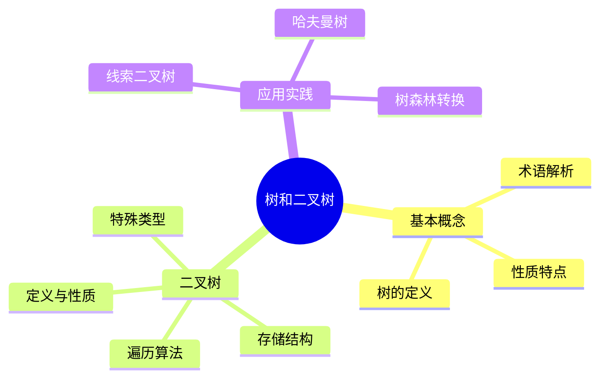

# 🌳 树和二叉树

## 📋 知识体系概览



---

## 🔍 6.1 树的基本概念和术语

### 🏷️ 树的定义

**树(Tree)**是n(n≥0)个结点的有限集。它满足以下条件：

1. 当n=0时，称为空树
2. 当n>0时，有且仅有一个特定的称为根(Root)的结点
3. 当n>1时，其余结点可分为m(m>0)个互不相交的有限集T₁,T₂,…,Tm，其中每个集合本身又是一棵树，并且称为根的子树(SubTree)

> 💡 **核心特点**：树是一种层次结构，体现了数据元素之间的分支关系

### 🏷️ 基本术语

| 术语 | 定义 | 说明 |
|------|------|------|
| 结点的度 | 结点拥有的子树数 | 度为0的结点称为叶子结点 |
| 树的度 | 树内各结点的度的最大值 | 反映树的分支特性 |
| 叶子(终端结点) | 度为0的结点 | 没有子结点的结点 |
| 非终端结点 | 度不为0的结点 | 有子结点的结点 |
| 孩子 | 结点的子树的根 | 直接后继结点 |
| 双亲(父结点) | 子结点的直接前驱 | 与孩子相对的概念 |
| 兄弟 | 同一双亲的孩子结点 | 同父结点的子结点 |
| 祖先 | 从根到该结点所经分支上的所有结点 | 路径上所有前驱结点 |
| 子孙 | 以某结点为根的子树中任一结点 | 路径上所有后继结点 |
| 结点层次 | 从根开始定义，根为第一层 | 层次从1开始计数 |
| 树的深度(高度) | 树内结点的最大层次数 | 反映树的纵向规模 |

### 🏷️ 树的性质

1. **树的结点数 = 所有结点的度数之和 + 1**
2. **度为m的树中，第i层上最多有 m^(i-1) 个结点 (i≥1)**
3. **深度为h的m叉树最多有 (m^h - 1)/(m - 1) 个结点**

---

## 🔍 6.2 二叉树的定义和性质

### 🏷️ 二叉树的定义

**二叉树(Binary Tree)**是另一种树形结构，它的特点是每个结点至多只有两棵子树(即二叉树中不存在度大于2的结点)，并且二叉树的子树有左右之分，次序不能任意颠倒。

### 🏷️ 特殊二叉树

| 二叉树类型 | 特点 | 性质 |
|------------|------|------|
| 满二叉树 | 深度为k且含有2^k-1个结点的二叉树 | 每层都达到最大结点数 |
| 完全二叉树 | 深度为k的具有n个结点的二叉树 | 当且仅当其每一个结点都与深度为k的满二叉树中编号从1至n的结点一一对应时 |
| 二叉排序树 | 左子树关键字 < 根结点关键字 < 右子树关键字 | 用于快速查找 |
| 平衡二叉树 | 左右子树高度差≤1 | 保持查找效率 |

### 🏷️ 二叉树的性质

1. **在二叉树的第i层上至多有2^(i-1)个结点(i≥1)**
2. **深度为k的二叉树至多有2^k-1个结点(k≥1)**
3. **对任何一棵二叉树T，如果其终端结点数为n₀，度为2的结点数为n₂，则 n₀ = n₂ + 1**
4. **具有n个结点的完全二叉树的深度为⌊log₂n⌋+1**
5. **对完全二叉树，如果对结点从上至下、从左到右编号，则结点i的特性为：**
   - i=1时，i是根，否则双亲是⌊i/2⌋
   - 2i>n时，i无左孩子，否则左孩子是2i
   - 2i+1>n时，i无右孩子，否则右孩子是2i+1

---

## 🔍 6.3 二叉树的存储结构

### 🏷️ 顺序存储结构

使用**一维数组**按层次顺序存储完全二叉树的结点，对于一般二叉树则将不存在的结点置空。

#### 存储特点

| 情况 | 存储效率 | 适用场景 |
|------|----------|----------|
| 完全二叉树 | 高，无空闲单元 | 完全二叉树 |
| 单支树 | 低，浪费严重 | 较少使用 |
| 一般二叉树 | 中等 | 平衡度较好的二叉树 |

```cpp
// 顺序存储二叉树
#include <iostream>
#include <queue>
#include <vector>
using namespace std;

template <typename T>
class ArrayBinaryTree {
  private:
    vector<T> tree;  // 顺序存储节点
    int maxSize;     // 树的最大容量
    int currentSize; // 当前节点个数

  public:
    ArrayBinaryTree(int size) : maxSize(size), currentSize(0) {
        tree.resize(size); // 默认填充默认值
    }

    // 获取左孩子位置
    int getLeftChild(int i) { return 2 * i + 1; }

    // 获取右孩子位置
    int getRightChild(int i) { return 2 * i + 2; }

    // 获取父节点位置
    int getParent(int i) {
        if (i == 0)
            return -1; // 根节点没有父节点
        return (i - 1) / 2;
    }
}
```

### 🏷️ 链式存储结构

使用**二叉链表**结构，每个结点包含数据域和两个指针域(左孩子指针和右孩子指针)。

#### 结点定义

```cpp
// 二叉树结点
template <typename T>
struct TreeNode {
    T data;
    TreeNode<T> *left;
    TreeNode<T> *right;

    TreeNode()
        : left(nullptr), right(nullptr) {}
    TreeNode(const T &value)
        : data(value), left(nullptr), right(nullptr) {}
    TreeNode(const T &value, TreeNode<T> *l, TreeNode<T> *r)
        : data(value), left(l), right(r) {}
};
```

#### 链式存储结构对比

| 结构类型 | 空间复杂度 | 优点 | 缺点 | 适用场景 |
|----------|------------|------|------|----------|
| 二叉链表 | O(n) | 结构简单，存储效率高 | 无法直接访问父节点 | 一般应用 |
| 三叉链表 | O(n) | 可访问父节点 | 存储开销大 | 需要父节点访问 |
| 线索链表 | O(n) | 便于遍历 | 实现复杂 | 频繁遍历操作 |

```cpp
// 二叉树类
template <typename T>
class BinaryTree {
  protected:
    TreeNode<T> *root;

  public:
    BinaryTree() : root(nullptr) {}
    BinaryTree(const T &value) { root = new TreeNode<T>(value); }

    // 以根植和左右子树构造
    BinaryTree(const T &value,
               BinaryTree<T> &leftTree, BinaryTree<T> &rightTree) {
        root = new TreeNode<T>(value);
        root->left = leftTree.root;
        root->right = rightTree.root;
        leftTree.root = nullptr;
        rightTree.root = nullptr;
    }

    // 析构
    ~BinaryTree() { destroy(root); }

    bool isEmpty() const { return root == nullptr; }

    T getRoot() const {
        if (root == nullptr)
            throw runtime_error();
        return root->data;
    }

    // 获取左子树（摘除）
    BinaryTree<T> getLeftChild() const {
        BinaryTree<T> leftTree;
        if (root != nullptr) {
            leftTree.root = root->left;
            root->left = nullptr;
        }
        return leftTree;
    }

    // 获取右子树（摘除）
    BinaryTree<T> getRightChild() const {
        BinaryTree<T> rightTree;
        if (root != nullptr) {
            rightTree.root = root->right;
            root->right = nullptr;
        }
        return rightTree;
    }

    // 遍历接口
    void preOrder() const {
        cout << "先序遍历：";
        preOrder(root);
        cout << endl;
    }
    void inOrder() const {
        cout << "中序遍历：";
        inOrder(root);
        cout << endl;
    }
    void postOrder() const {
        cout << "后序遍历：";
        postOrder(root);
        cout << endl;
    }
    void levelOrder() const {
        cout << "层序遍历：";
        levelOrder(root);
        cout << endl;
    }

    // 非递归遍历
    void preOrderIterative() const {
        cout << "非递归先序遍历：";
        preOrderIterative(root);
        cout << endl;
    }
    void inOrderIterative() const {
        cout << "非递归中序遍历：";
        inOrderIterative(root);
        cout << endl;
    }
    void postOrderIterative() const {
        cout << "非递归后序遍历：";
        postOrderIterative(root);
        cout << endl;
    }

    // 基本操作
    int getHeight() const { return getHeight(root); }
    int getNodeCount() const { return getNodeCount(root); }
    int getLeafCount() const { return getLeafCount(root); }

    // 前序输入构建
    void createTree() {
        root = createTreeHelper();
    }

  private:
    // 销毁树
    void destroy(TreeNode<T> *&node) {
        if (node) {
            destroy(node->left), destroy(node->right);
            delete node;
            node = nullptr;
        }
    }

    // 递归遍历
    void preOrder(TreeNode<T> *node) const {
        if (!root)
            return;
        cout << node->data << " ";
        preOrder(node->left);
        preOrder(node->right);
    }

    void inOrder(TreeNode<T> *node) const {
        if (!node)
            return;
        inOrder(node->left);
        cout << node->data << " ";
        inOrder(node->right);
    }

    void postOrder(TreeNode<T> *node) const {
        if (!node)
            return;
        postOrder(node->left);
        postOrder(node->right);
        cout << node->data << " ";
    }

    // 层序遍历
    void levelOrder(TreeNode<T> *node) const {
        if (!node)
            return;
        queue<TreeNode<T> *> q;
        q.push(node);

        while (!q.empty()) {
            TreeNode<T> *cur = q.front();
            q.pop();
            cout << cur->data << " ";

            if (cur->left)
                q.push(cur->left);
            if (cur->right)
                q.push(cur->right);
        }
    }

    // 非递归先序
    void preOrderIterative(TreeNode<T> *node) const {
        if (!node)
            return;
        stack<TreeNode<T> *> s;
        s.push(node);

        while (!s.empty()) {
            TreeNode<T> *cur = s.top();
            s.pop();
            cout << cur->data << " ";

            if (cur->right)
                s.push(cur->right);
            if (cur->left)
                s.push(cur->left);
        }
    }

    // 非递归中序
    void inOrderIterative(TreeNode<T> *node) const {
        stack<TreeNode<T> *> s;
        TreeNode<T> *cur = node;

        while (cur || !s.empty()) {
            while (cur) {
                s.push(cur);
                cur = cur->left;
            }
            cur = s.top(), s.pop();
            cout << cur->data << " ";
            cur = cur->right;
        }
    }

    // 非递归后序
    void postOrderIterative(TreeNode<T> *node) const {
        if (!node)
            return;
        stack<TreeNode<T> *> s;
        TreeNode<T> *cur = node;
        TreeNode<T> *last = nullptr;

        while (cur || !s.empty()) {
            if (cur)
                s.push(cur), cur = cur->left;
            else {
                TreeNode<T> *peek = s.top();
                if (peek->right && last != peek->right)
                    cur = peek->right;
                else {
                    cout << peek->data << " ";
                    last = peek, s.pop();
                }
            }
        }
    }

    // 高度
    int getHeight(TreeNode<T> *node) const {
        if (!node)
            return 0;
        return max(getHeight(node->left), getHeight(node->right)) + 1;
    }

    // 结点数
    int getNodeCount(TreeNode<T> *node) const {
        if (!node)
            return 0;
        return getNodeCount(node->left) + getNodeCount(node->right) + 1;
    }

    // 叶子树
    int getLeafCount(TreeNode<T> *node) const {
        if (!node)
            return 0;
        if (!node->left && !node->right)
            return 1;
        return getLeafCount(node->left) + getLeafCount(node->right);
    }

    // 构造树（前序，#为空）
    TreeNode<T> *createTreeHelper() {
        T data;
        cin >> data;
        if (data == T('#'))
            return nullptr;

        TreeNode<T> *node = new TreeNode<T>(data);
        node->left = createTreeHelper();
        node->right = createTreeHelper();
        return node;
    }
};

// 字符类型特化
template <>
TreeNode<char> *BinaryTree<char>::createTreeHelper() {
    char ch;
    cin >> ch;
    if (ch == '#')
        return nullptr;

    TreeNode<char> *node = new TreeNode<char>(ch);
    node->left = createTreeHelper();
    node->right = createTreeHelper();
    return node;
}
```

---

## 🔍 6.4 二叉树的遍历算法

### 🏷️ 遍历算法概述

遍历是按照某种次序访问树中所有结点，并且每个结点仅被访问一次的过程。对于二叉树，有三种主要的遍历方式：

- **先序遍历(PreOrder)**：根→左子树→右子树
- **中序遍历(InOrder)**：左子树→根→右子树  
- **后序遍历(PostOrder)**：左子树→右子树→根

### 🏷️ 递归遍历算法

```cpp
// 递归遍历算法实现
template <tpyename T>
void BinaryTree<T>::preOrder(TreeNode<T> *node) const {
    if (node != nullptr) {
        cout << node->data << " "; // 访问根结点
        preOrder(node->left);      // 遍历左子树
        preOrder(node->right);     // 遍历右子树
    }
}

template <typename T>
void BinaryTree<T>::inOrder(TreeNode<T> *node) const {
    if (node != nullptr) {
        inOrder(node->left);       // 遍历左子树
        cout << node->data << " "; // 访问根结点
        inOrder(node->right);      // 遍历右子树
    }
}

template <typename T>
void BinaryTree<T>::postOrder(TreeNode<T> *node) const {
    if (node != nullptr) {
        postOrder(node->left);     // 遍历左子树
        postOrder(node->right);    // 遍历右子树
        cout << node->data << " "; // 访问根结点
    }
}
```

### 🏷️ 非递归遍历算法

#### 先序遍历(非递归)

```cpp
template <typename T>
void BinaryTree<T>::preOrderIterative() const {
    if (root == nullptr)
        return;

    stack<TreeNode<T> *> s;
    s.push(root);

    while (!s.empty()) {
        TreeNode<T> *current = s.top();
        s.pop();

        cout << curret->data << " "; // 访问当前结点
        // 先压入右子树，再压入左子树（因为栈是后进先出）
        if (current->right != nullptr)
            s.push(current->right);
        if (current->left != nullptr)
            s.push(current->left);
    }
}
```

#### 中序遍历(非递归)

```cpp
template <typename T>
void BinaryTree<T>::inOrderIterative() const {
    if (root == nullptr)
        return;

    stack<TreeNode<T> *> s;
    TreeNode<T> *current = root;

    while (current != nullptr || !s.empty()) {
        // 一直向左走到最左边的结点
        while (current != nullptr) {
            s.push(current);
            current = current->left;
        }

        // 处理栈顶结点
        current = s.top(), s.pop();
        cout << current->data << " "; // 访问当前结点

        // 转向右子树
        current = current->right;
    }
}
```

#### 后序遍历(非递归)

```cpp
template <typename T>
void BinaryTree<T>::postOrderIterative() const {
    if (root == nullptr)
        return;

    stack<TreeNode<T> *> s;
    TreeNode<T> *current = root;
    TreeNode<T> *lastVisited = nullptr;

    while (current != nullptr || s.empty()) {
        if (current != nullptr) {
            s.push(current);
            current = current->left;
        } else {
            TreeNode<T> *peekNode = s.top();
            // 如果右子树存在且未被访问过
            if (peekNode->right != nullptr &&
                lastVisited != peekNode->right)
                current = peekNode->right;
            else {
                cout << peekNode->data << " "; // 访问当前结点
                lastVisited = s.top(), s.pop();
            }
        }
    }
}
```

### 🏷️ 遍历算法对比

| 遍历方式 | 递归实现 | 非递归实现 | 时间复杂度 | 空间复杂度 |
|----------|----------|------------|------------|------------|
| 先序 | 简单直观 | 使用栈 | O(n) | O(h) |
| 中序 | 简单直观 | 使用栈 | O(n) | O(h) |
| 后序 | 简单直观 | 实现较复杂 | O(n) | O(h) |

> ⚠️ **注意**：其中h为二叉树的高度，空间复杂度取决于栈的最大深度

---

## 🔍 6.5 线索二叉树

### 🏷️ 线索二叉树的概念

在二叉链表中，有n+1个空指针域，利用这些空指针域存放指向结点在某种遍历次序下的前驱和后继结点的指针，这些指针称为**线索**，加上线索的二叉链表称为**线索链表**，相应的二叉树称为**线索二叉树(Threaded Binary Tree)**。

### 🏷️ 线索二叉树的结构

```cpp
// 线索二叉树结点定义
template <typename T>
struct ThreadNode {
    T data;               // 数据域
    ThreadNode<T> *left;  // 左指针域
    ThreadNode<T> *right; // 右指针域
    int leftTag;          // 左标志：0指针，1线索
    int rightTag;         // 右标志：0指针，1线索

    ThreadNode()
        : left(nullptr), right(nullptr), leftTag(0), rightTag(0) {}
    ThreadNode(const T &value)
        : data(value), left(nullptr), right(nullptr), leftTag(0), rightTag(0) {}
};
```

### 🏷️ 中序线索化算法

```cpp
template <typename T>
class ThreadedBinaryTree {
  private:
    ThreadNode<T> *root;
    ThreadNode<T> *pre; // 指向当前访问节点的前驱

  public:
    ThreadedBinaryTree() : root(nullptr), pre(nullptr) {}

    // 中序线索化二叉树
    void inThread(ThreadNode<T> *node) {
        if (node != nullptr) {
            inThread(node->left); // 线索化左子树

            // 处理当前结点
            if (node->left == nullptr) { // 左子树为空，建立前驱线索
                node->leftTag = 1;
                node->left = pre;
            }
            // 前驱右子树为空，建立后继线索
            if (pre != nullptr && pre->right == nullptr) {
                pre->rightTag = 1;
                pre->right = node;
            }
            pre = node; // 更新前驱

            inThread(node->right); // 线索化右子树
        }
    }

    // 对整个二叉树进行中序线索化
    void inOrderThread() {
        pre = nullptr;
        if (root != nullptr) {
            inThread(root);
            // 处理最后一个结点
            if (pre->right == nullptr) {
                pre->rightTag = 1;
                pre->right = nullptr; // 最后一个结点的后继为空
            }
        }
    }

    // 中序遍历线索二叉树
    void inOrderTraverseThread() {
        ThreadNode<T> *p = root;
        // 找到最左边的结点
        while (p != nullptr && p->leftTag == 0)
            p = p->left;

        while (p != nullptr) {
            cout << p->data << " ";
            if (p->rightTag == 1) // 右指针为线索
                p = p->right;
            else { // 右指针为右孩子
                p = p->right;
                while (p != nullptr && p->leftTag == 0)
                    p = p->left;
            }
        }
    }
};
```

### 🏷️ 线索二叉树的优势

| 特性 | 传统二叉树 | 线索二叉树 |
|------|------------|------------|
| 遍历效率 | 需要递归或栈 | 直接通过线索遍历 |
| 空间利用 | 空指针浪费 | 充分利用空指针 |
| 存储开销 | n+1个空指针 | 增加标志域 |
| 实现复杂度 | 相对简单 | 较为复杂 |

---

## 🔍 6.6 树和森林

### 🏷️ 树的存储结构

#### 双亲表示法

```cpp
// 双亲表示法
// 双亲表示法
template <typename T>
struct PTNode {
    T data;     // 结点数据
    int parent; // 双亲位置域
};

template <typename T>
class PTree {
  private:
    vector<PTNode<T>> nodes; // 结点数组
    int root;                // 根的位置
    int n;                   // 结点数

  public:
    PTree() : root(-1), n(0) {}

    // 查找结点的双亲
    int findParent(int i) {
        return nodes[i].parent;
    }

    // 查找结点的孩子（需要遍历整个数组）
    vector<int> findChildren(int i) {
        vector<int> children;
        for (int j = 0; j < n; j++)
            if (nodes[j].parent == i)
                children.push_back(j);
        return children;
    }
};
```

#### 孩子表示法

```cpp
// 孩子结点定义
struct ChildNode {
    int child;       // 孩子结点在数组中的位置
    ChildNode *next; // 指向下一个孩子结点

    ChildNode(int c) : child(c), next(nullptr) {}
};

template <typename T>
struct CTNode {
    T data;                // 结点数据
    ChildNode *firstChild; // 指向第一个孩子结点
};

template <typename T>
class CTree {
    vector<CTNode<T>> nodes; // 结点数组
    int root;                // 根结点位置
    int n;                   // 结点数

  public:
    CTree() : root(-1), n(0) {}
};
```

#### 孩子兄弟表示法(二叉树表示法)

```cpp
// 节点定义
template <typename T>
struct TreeNode {
    T data;
    TreeNode<T> *firstChild;  // 第一个孩子
    TreeNode<T> *nextSibling; // 右兄弟

    TreeNode(const T &value)
        : data(value), firstChild(nullptr), nextSibling(nullptr) {}
};

// 树转二叉树
template <typename T>
TreeNode<T> *treeToBinaryTree(TreeNode<T> *root) {
    if (root == nullptr)
        return nullptr;

    TreeNode<T> *left = nullptr;
    TreeNode<T> *right = nullptr;

    if (root->firstChild) {
        // 左孩子指向第一个孩子
        left = treeToBinaryTree(root->firstChild);
    }

    if (root->nextSibling) {
        // 右孩子指向下一个兄弟
        right = treeToBinaryTree(root->nextSibling);
    }

    root->firstChild = left;
    root->nextSibling = right;

    return root;
}

// 二叉树转树
template <typename T>
TreeNode<T> *binaryTreeToTree(TreeNode<T> *root) {
    if (root-- nullptr)
        return nullptr;

    // 左子树是第一个孩子
    root->firstChild = binaryTreeToTree(root->firstChild);
    // 右子树是下一个兄弟
    root->nextSibling = binaryTreeToTree(root->nextSibling);

    return root;
}
```

### 🏷️ 森林与二叉树的转换

**森林转换为二叉树的规则**：

1. 将森林中的每棵树转换为二叉树
2. 将后一棵二叉树作为前一棵二叉树的右子树

**二叉树转换为森林的规则**：
1. 若某结点是其双亲的左孩子，则把该结点的右子树、右子树的右子树...都与该结点脱离，成为独立的树
2. 最后形成的多棵二叉树组成森林

---

## 🔍 6.7 哈夫曼树及应用

### 🏷️ 哈夫曼树的定义

**哈夫曼树(Huffman Tree)**，又称最优二叉树，是带权路径长度最短的树。

#### 基本概念

- **路径**：从一个结点到另一个结点之间的分支序列
- **路径长度**：路径上分支的数目
- **结点的权**：给结点赋予的意义的数值
- **带权路径长度(WPL)**：从树根到该结点之间的路径长度与该结点上权的乘积

### 🏷️ 哈夫曼树的构造算法

```cpp
#include <iostream>
#include <queue>
#include <string>
#include <vector>
using namespace std;

// 哈夫曼树结点
struct HuffmanNode {
    int weight;
    char data;
    HuffmanNode *left;
    HuffmanNode *right;

    HuffmanNode(int w, char d = 0)
        : weight(w), data(d), left(nullptr), right(nullptr) {}

    // 用于优先队列（最小堆）
    bool operator>(const HuffmanNode &other) const {
        return weight > other.weight;
    }
};

// 哈夫曼树类
class HuffmanTree {
  public:
    HuffmanNode *root;

    HuffmanTree() : root(nullptr) {}

    // 构造哈夫曼树
    void createHuffmanTree(const vector<int> &weights,
                           const vector<char> &chars = {}) {
        if (weights.empty())
            return;

        auto cmp = [](HuffmanNode *a,
                      HuffmanNode *b) { return a->weight > b->weight; };
        priority_queue<HuffmanNode *,
                       vector<HuffmanNode *>, decltype(cmp)>
            pq(cmp);

        // 叶子节点入队
        for (size_t i = 0; i < weights.size(); ++i) {
            char c = (i < chars.size()) ? chars[i] : 0;
            pq.push(new HuffmanNode(weights[i], c));
        }

        // 构建哈夫曼树
        while (pq.size() > 1) {
            HuffmanNode *left = pq.top();
            pq.pop();
            HuffmanNode *right = pq.top();
            pq.pop();

            HuffmanNode *parent = new HuffmanNode(
                left->weight + right->weight);
            parent->left = left;
            parent->right = right;

            pq.push(parent);
        }

        root = pq.top();
    }

    // 计算带权路径长度WPL
    int calculateWPL() {
        return calculateWPL(root, 0);
    }

    int calculateWPL(HuffmanNode *node, int depth) {
        if (!node)
            return 0;
        if (!node->left && !node->right)
            return node->weight * depth;
        return calculateWPL(node->left, depth + 1) +
               calculateWPL(node->right, depth + 1);
    }

    // 生成哈夫曼编码
    void generateHuffmanCodes(HuffmanNode *node, const string &code,
                              vector<pair<char, string>> &codes) {
        if (!node)
            return;
        if (!node->left && !node->right && node->data != 0) {
            codes.push_back({node->data, code});
            return;
        }

        generateHuffmanCodes(node->left, code + "0", codes);
        generateHuffmanCodes(node->right, code + "1", codes);
    }

    void printHuffmanCodes() {
        vector<pair<char, string>> codes;
        generateHuffmanCodes(root, "", codes);
        for (auto &p : codes)
            cout << p.first << ":" << p.second << endl;
    }

    ~HuffmanTree() {
        destroy(root);
    }

  private:
    void destroy(HuffmanNode *node) {
        if (!node)
            return;
        destroy(node->left);
        destroy(node->right);
        delete node;
    }
};
```

### 🏷️ 哈夫曼编码

**哈夫曼编码**是一种广泛应用于数据压缩的编码方法：

1. **定长编码**：每个字符用相同长度的二进制码表示
2. **变长编码**：根据字符出现频率分配不同长度的编码
3. **前缀编码**：任意字符的编码都不是另一个字符编码的前缀

### 🏷️ 哈夫曼树应用示例

```cpp
// 完整的哈夫曼树应用示例
int main() {
    cout << "=== 哈夫曼树构造与编码示例 ===" << endl;

    vector<int> weights = {5, 29, 7, 8, 14, 23, 3, 11};
    vector<char> chars = {'A', 'B', 'C', 'D', 'E', 'F', 'G', 'H'};

    HuffmanTree ht;
    ht.createHuffmanTree(weights, chars);

    cout << "\nWPL = " << ht.calculateWPL() << endl;
    cout << "\n哈夫曼编码：" << endl;
    ht.printHuffmanCodes();

    return 0;
}
```

### 🏷️ 哈夫曼树性质总结

| 性质 | 说明 |
|------|------|
| 结点总数 | n₀ + n₂ = 2n₀ - 1 (n₀为叶子结点数) |
| WPL最小性 | 在所有二叉树中WPL最小 |
| 频率关联 | 频率高的字符编码短，频率低的字符编码长 |
| 前缀特性 | 任意字符编码都不是其他字符编码的前缀 |

---

## 🏆 核心知识点总结

### 📊 二叉树遍历算法对比

| 遍历方式 | 访问顺序 | 递归实现难易 | 非递归实现难易 | 典型应用 |
|----------|----------|--------------|----------------|----------|
| 先序遍历 | 根左右 | 简单 | 简单 | 复制树、计算表达式 |
| 中序遍历 | 左根右 | 简单 | 中等 | 二叉排序树输出有序序列 |
| 后序遍历 | 左右根 | 简单 | 困难 | 计算树的深度、删除树 |
| 层序遍历 | 从上到下 | 非递归 | 中等 | 按层打印树 |

### 📊 存储结构对比表

| 存储方法 | 空间复杂度 | 插入删除 | 访问效率 | 操作便利性 | 适用场景 |
|----------|------------|----------|----------|------------|----------|
| 顺序存储 | O(n) | 困难 | 快 | 访问父子关系 | 完全二叉树 |
| 二叉链表 | O(n) | 容易 | 慢 | 一般 | 一般二叉树 |
| 三叉链表 | O(n) | 容易 | 慢 | 便于访问父节点 | 需要父节点访问 |
| 线索链表 | O(n) | 中等 | 快遍历 | 遍历操作 | 频繁遍历 |

### 📊 特殊二叉树对比

| 二叉树类型 | 特点 | 时间复杂度 | 应用场景 |
|------------|------|------------|----------|
| 满二叉树 | 每层都满 | O(log n) | 理想情况分析 |
| 完全二叉树 | 按层编号连续 | O(log n) | 堆结构 |
| 二叉排序树 | 左<根<右 | 平均O(log n) | 查找操作 |
| 平衡二叉树 | | O(log n) | 动态查找 |
| 哈夫曼树 | 带权路径最短 | O(n) | 数据压缩 |

---

## 📊 全面对比总结表

### 🏷️ 树结构类型对比

| 树类型 | 定义特征 | 存储方式 | 遍历方法 | 应用场景 |
|--------|----------|----------|----------|----------|
| 普通树 | 结点度数不限 | 双亲、孩子、孩子兄弟表示法 | 无固定顺序 | 表示层次关系 |
| 二叉树 | 每个结点度数≤2 | 链式、顺序存储 | 先序、中序、后序、层序 | 数据结构基础 |
| 满二叉树 | 每层结点数达到最大 | 顺序存储效率高 | 各种遍历 | 理想模型分析 |
| 完全二叉树 | 按层编号连续 | 顺序存储 | 各种遍历 | 堆结构 |
| 二叉排序树 | 左<根<右 | 链式存储 | 中序遍历为有序序列 | 查找表 |
| 平衡二叉树 | 左右子树高度差≤1 | 链式存储 | 各种遍历 | 动态查找 |
| 哈夫曼树 | 带权路径长度最短 | 链式存储 | 各种遍历 | 数据压缩 |

### 🏷️ 存储结构性能对比

| 存储方式 | 空间复杂度 | 访问父节点 | 访问孩子节点 | 查找兄弟节点 | 适用场景 |
|----------|------------|------------|--------------|--------------|----------|
| 双亲表示法 | O(n) | O(1) | O(n) | O(n) | 频繁访问父节点 |
| 孩子表示法 | O(n) | O(n) | O(1) | O(1) | 频繁访问孩子节点 |
| 孩子兄弟表示法 | O(n) | O(n) | O(1) | O(1) | 森林转换为二叉树 |
| 二叉链表 | O(n) | O(n) | O(1) | O(n) | 一般二叉树 |
| 三叉链表 | O(n) | O(1) | O(1) | O(n) | 需要访问父节点 |
| 顺序存储 | O(n) | O(1) | O(1) | O(1) | 完全二叉树 |

### 🏷️ 遍历算法复杂度对比

| 遍历方式 | 时间复杂度 | 空间复杂度 | 递归实现 | 非递归实现 | 特殊优势 |
|----------|------------|------------|----------|------------|----------|
| 先序遍历 | O(n) | O(h) | 简单直观 | 使用栈 | 复制树结构 |
| 中序遍历 | O(n) | O(h) | 简单直观 | 使用栈 | 二叉搜索树有序输出 |
| 后序遍历 | O(n) | O(h) | 简单直观 | 实现复杂 | 计算表达式树 |
| 层序遍历 | O(n) | O(w) | 不常用 | 使用队列 | 按层处理 |
| 线索遍历 | O(n) | O(1) | 不适用 | 直接访问 | 遍历效率最高 |

> 💡 **注**：h为树的高度，w为树的最大宽度

### 🏷️ 特殊树的应用场景

| 树类型 | 特性 | 时间复杂度 | 主要应用 |
|--------|------|------------|----------|
| 二叉搜索树 | 左<根<右 | 查找平均O(log n) | 动态查找表 |
| AVL树 | 平衡二叉搜索树 | 查找O(log n) | 频繁查找 |
| 红黑树 | 近似平衡 | 查找O(log n) | 关联数组 |
| B树 | 多路平衡搜索树 | 查找O(log n) | 文件系统 |
| B+树 | B树变种 | 范围查询O(log n + k) | 数据库索引 |
| Trie树 | 字符串存储 | 查找O(m) | 字典、自动补全 |
| 线段树 | 区间查询 | 构建O(n)，查询O(log n) | 区间统计 |
| 哈夫曼树 | 最优带权路径 | 构建O(n log n) | 数据压缩 |

---

## 📚 学习建议与技巧

### 🎯 掌握要点

1. **理解递归本质**：二叉树的许多操作都可以用递归思想解决
2. **熟悉遍历应用**：掌握三种遍历在不同场景下的应用
3. **灵活运用存储结构**：根据应用场景选择合适的存储方式
4. **实践编码实现**：通过编程实现加深理解

### 🚀 进阶学习方向

- **平衡二叉树**：AVL树、红黑树
- **B树和B+树**：数据库索引结构
- **字典树(Trie)**：字符串处理
- **线段树**：区间查询更新
