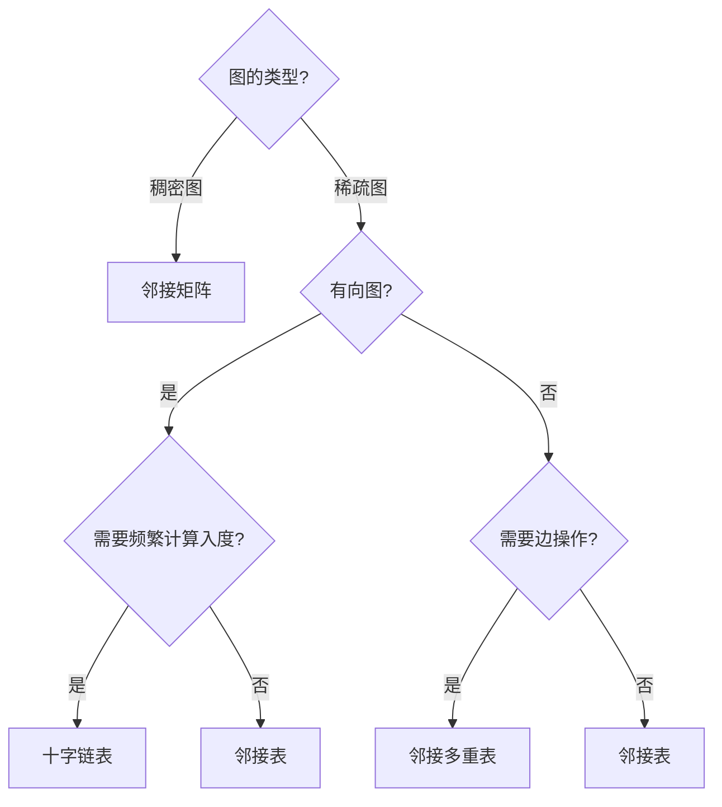
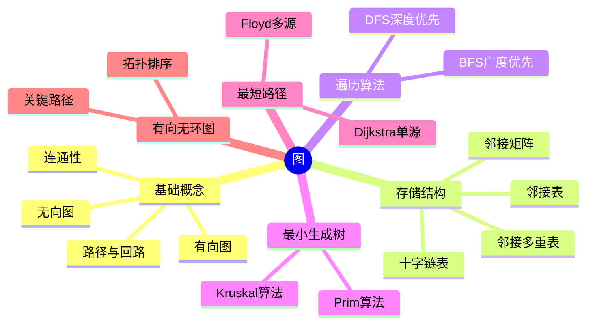

# 数据结构 - 第七章：图论完整知识文档

> 📝 **课程**：数据结构 - 图论
> 
> 🎯 **学习目标**：
> - 掌握图的基本概念和术语
> - 掌握图的存储结构（邻接矩阵、邻接表、十字链表、邻接多重表）
> - 掌握图的遍历算法（DFS、BFS）
> - 掌握最小生成树算法（Prim、Kruskal）
> - 掌握最短路径算法（Dijkstra、Floyd）
> - 掌握拓扑排序和关键路径算法
> - 灵活应用图论算法解决实际问题

---

## 🔍 7.1 图的定义与术语

### 🏷️ 图的基本定义

**图(Graph)**是由顶点集合及顶点间的关系集合组成的一种数据结构：

```
Graph = (V, E)
```

其中：
- **V**：顶点(Vertex)的有穷非空集合
- **E**：顶点之间关系的有穷集合

E的两种形式：
- **E₁ = {(x, y) | x, y ∈ V}**：边(Edge)的集合
- **E₂ = {<x, y> | x, y ∈ V}**：弧(Arc)的集合

> 💡 **应用场景**：图结点的邻接关系体现了事物的普遍联系性。5G技术开启万物互联时代，实现"随时随地万物接入"，解决人与物、物与物之间的通信。

---

### 🏷️ 无向图(Undigraph)

用**无序对(x,y)**表示两个顶点x,y之间的一条边。

**示例**：
```
V = {0, 1, 2, 3, 4, 5}
E = {(0,1), (0,4), (0,5), (1,2), (1,3), (1,5), (2,3), (3,4), (3,5), (4,5)}
```

#### 基本术语

| 术语 | 定义 | 说明 |
|------|------|------|
| 邻接点 | (x,y)∈E，则x,y互为邻接点 | x,y相邻接 |
| 依附 | 边(x,y)依附于顶点x,y | 边与顶点相关联 |
| 顶点的度 | 与顶点相关联的边的数目 | 记为TD(x) |
| 无向完全图 | 有n(n-1)/2条边的无向图 | 任意两点都有边 |

> 📌 **握手定理**：无向图顶点度之和为边数的两倍

**代码实现示例**：
```cpp
class UndirectedGraph {
    vector<int> vertices = {0, 1, 2, 3, 4, 5};
    vector<pair<int,int>> edges = {
        {0,1}, {0,4}, {0,5}, {1,2}, 
        {1,3}, {1,5}, {2,3}, {3,4}, 
        {3,5}, {4,5}
    };
    
    int getDegree(int v) {
        int degree = 0;
        for (auto &e : edges) {
            if (e.first == v || e.second == v)
                degree++;
        }
        return degree;
    }
};
```

---

### 🏷️ 有向图(Digraph)

用**有序对<x,y>**表示从x到y的一条弧，x为弧尾，y为弧头。

**示例**：
```
V = {0, 1, 2, 3, 4}
E = {<0,1>, <0,3>, <0,4>, <1,2>, <2,4>, <3,2>}
```

#### 基本术语

| 术语 | 定义 | 计算方式 |
|------|------|----------|
| 入度 | 以顶点为头的弧的数目 | 记为ID(x) |
| 出度 | 以顶点为尾的弧的数目 | 记为OD(x) |
| 度 | 入度与出度之和 | TD(x) = ID(x) + OD(x) |
| 有向完全图 | 有n(n-1)条弧的有向图 | 任意有序点对都有弧 |

> 📌 **性质**：有向图中，顶点入度和 = 顶点出度和 = 边数

**代码实现示例**：
```cpp
class DirectedGraph {
    vector<int> vertices = {0, 1, 2, 3, 4};
    vector<pair<int,int>> arcs = {
        {0,1}, {0,3}, {0,4}, {1,2}, {2,4}, {3,2}
    };
    
    int getInDegree(int v) {
        int inDegree = 0;
        for (auto &arc : arcs) {
            if (arc.second == v)
                inDegree++;
        }
        return inDegree;
    }
    
    int getOutDegree(int v) {
        int outDegree = 0;
        for (auto &arc : arcs) {
            if (arc.first == v)
                outDegree++;
        }
        return outDegree;
    }
};
```

---

### 🏷️ 路径与回路

#### 路径(Path)

从顶点x到y的顶点序列(x, v₁, v₂, …, vₙ, y)，其中相邻顶点间都有边或弧。

**分类**：

| 类型 | 定义 | 特点 |
|------|------|------|
| 简单路径 | 路径中顶点不重复出现 | 无重复顶点 |
| 回路/环 | 起点与终点相同的路径 | x = y |
| 简单回路 | 除起点和终点外无重复顶点的回路 | 最小环 |

**路径示例**：
```
简单路径: (1, 0, 4, 3)        // 从1到3，无重复顶点
回路: (1, 0, 4, 3, 1)        // 从1回到1
非简单路径: (1, 0, 5, 4, 3, 5, 1)  // 顶点5重复
```

---

### 🏷️ 连通性

| 概念 | 定义 | 适用范围 |
|------|------|----------|
| 连通 | 顶点x到y有路径 | 顶点对 |
| 连通图 | 图中任意两顶点都连通 | 无向图 |
| 强连通图 | 图中任意两顶点都连通 | 有向图 |
| 弱连通图 | 忽略边的方向后连通 | 有向图 |
| 连通分量 | 极大连通子图 | 非连通图 |

---

### 🏷️ 子图与生成树

**子图**：设G=(V,E)和G'=(V',E')，若V'⊆V且E'⊆E，则G'是G的子图。

**生成树**：一个连通图的极小连通子图，包含全部n个顶点和n-1条边。

> 💡 **特点**：生成树不唯一

---

## 🔍 7.2 图的存储结构

### 🏷️ 邻接矩阵(Adjacency Matrix)

记录图中各顶点之间关系的**二维数组**。

#### 定义

对于不带权的图：
```
A[i][j] = 1   如果(i,j)∈E 或 <i,j>∈E
A[i][j] = 0   其它
```

对于带权的网：
```
A[i][j] = wᵢⱼ   如果(i,j)∈E 或 <i,j>∈E
A[i][j] = ∞     其它
```

#### 性质对比

| 图类型 | 矩阵特性 | 度的计算 | 边数计算 |
|--------|----------|----------|----------|
| 无向图 | 对称矩阵 | 第i行1的个数 = TD(i) | 1的个数 / 2 |
| 有向图 | 可能不对称 | 第i行1的个数 = OD(i)<br>第j列1的个数 = ID(j) | 1的个数 |
| 无向网 | 对称矩阵 | 第i行非∞的个数 = TD(i) | 非∞的个数 / 2 |
| 有向网 | 可能不对称 | 第i行非∞的个数 = OD(i)<br>第j列非∞的个数 = ID(j) | 非∞的个数 |

**代码实现示例**：
```cpp
const int N = 100;
const int INF = 0x3f3f3f3f;

class MGraph {
    int vexnum;      // 顶点数
    int arcnum;      // 边数
    string vexs[N];  // 顶点集
    int edges[N][N]; // 邻接矩阵

  public:
    MGraph(int n) {
        vexnum = n, arcnum = 0;
        memset(edges, 0x3f, sizeof(edges));
        for (int i = 0; i < vexnum; i++)
            edges[i][i] = 0;
    }

    void insertEdge(int i, int j, int w) {
        edges[i][j] = w;
        edges[j][i] = w; // 无向图对称
    }

    int getDegree(int v) {
        int degree = 0;
        for (int i = 0; i < vexnum; i++)
            if (edges[v][i] != INF && edges[v][i] != 0)
                degree++;
        return degree;
    }
};
```

---

### 🏷️ 邻接表(Adjacency List)

图的一种**链式存储结构**，每个顶点设置一个单链表，表中每个结点都是依附于该顶点的边。

#### 结构定义

**弧结点**：
```cpp
struct ArcNode {
    int adjvex;    // 邻接顶点位置
    ArcNode *next; // 下一条弧
    int weight;    // 权值

    ArcNode(int v, ArcNode *n = nullptr, int w = 1)
        : adjvex(v), next(n), weight(w) {}
};
```

**顶点结点**：
```cpp
struct VNode {
    string data;       // 顶点数据
    ArcNode *firstarc; // 第一条弧

    VNode() : data(""), firstarc(nullptr) {}
};
```

**图类定义**：
```cpp
const int N = 100;

class ALGraph {
    int vexnum;    // 当前图中顶点数量
    int arcnum;    // 当前图中边数量
    VNode vexs[N]; // 顶点数组（每个元素存一个链表头指针）

  public:
    // 构造函数：初始化图，设置顶点数并清空所有邻接链表
    ALGraph(int n) {
        vexnum = n, arcnum = 0;
        for (int i = 0; i < vexnum; i++)
            vexs[i].firstarc = nullptr; // 初始每个顶点都没有边
    }

    // 插入一条从i->j的有向边（头插法），w为权重
    void insertArc(int i, int j, int w = 1) {
        ArcNode *newNode = new ArcNode(j, vexs[i].firstarc, w);
        vexs[i].firstarc = newNode; // 新边插入到链表头部
        arcnum++;                   // 记录边数量+1
    }

    // 计算顶点v的度（有向图中为“出度”）
    int getDegree(int v) {
        int degree = 0;
        ArcNode *p = vexs[v].firstarc; // 拿到邻接链表头
        while (p != nullptr)
            degree++, p = p->next; // 每遍历一个节点，度+1
        return degree;
    }
};
```

#### 性质对比

| 图类型 | 结点个数 | 度的计算 | 总结点数 |
|--------|----------|----------|----------|
| 无向图 | 邻接表结点数 = 顶点的度 | 遍历链表 | 2×边数 |
| 有向图 | 邻接表结点数 = 顶点的出度 | 遍历链表 | 边数 |

> ⚠️ **注意**：
> - 邻接表不方便计算入度，需要遍历整个邻接表或使用逆邻接表
> - 判定两顶点是否有边，需要搜索邻接表，不如邻接矩阵方便

---

### 🏷️ 十字链表(Orthogonal List)

有向图的另一种存储结构，将**邻接表**和**逆邻接表**结合起来。

**代码实现示例**：

```cpp
const int N = 100;

// 弧节点
struct OLArcNode {
    int tailvex;      // 弧尾顶点
    int headvex;      // 弧头顶点
    OLArcNode *hlink; // 指向弧头相同的下一条弧
    OLArcNode *tlink; // 指向弧尾相同的下一条弧
    int weight;       // 权值

    OLArcNode(int tail, int head, int w = 1)
        : tailvex(tail), headvex(head), weight(w),
          hlink(nullptr), tlink(nullptr) {}
};

// 顶点节点
struct OLVNode {
    string data;
    OLArcNode *firstin;  // 第一条入弧
    OLArcNode *firstout; // 第一条出弧

    OLVNode() : data(""), firstin(nullptr), firstout(nullptr) {}
};

// 图类
class OLGraph {
    int vexnum, arcnum;
    OLVNode vexs[N];

  public:
    void insertArc(int i, int j, int w) {
        OLArcNode *arc = new OLArcNode(i, j, w);

        // 插入到i的出弧链表
        arc->tlink = vexs[i].firstout;
        vexs[i].firstout = arc;

        // 插入到j的入弧链表
        arc->hlink = vexs[j].firstin;
        vexs[i].firstin = arc;

        arcnum++;
    }

    int getOutDegree(int v) {
        int outDegree = 0;
        OLArcNode *p = vexs[v].firstout;
        while (p != nullptr)
            outDegree++, p = p->tlink;
        return outDegree;
    }
};
```

> 💡 **优点**：方便同时计算入度和出度，时间复杂度都是O(度)

---

### 🏷️ 邻接多重表(Adjacency Multilist)

无向图的另一种存储结构，**一条边只用一个结点**表示（而不是像邻接表用2个）。

**代码实现**：
```cpp
const int N = 100;

// 边结点
struct AMLEdgeNode {
    bool mark;          // 标记域
    int ivex, jvex;     // 边的两个顶点
    AMLEdgeNode *ilink; // 依附ivex的下一条边
    AMLEdgeNode *jlink; // 依附jvex的下一条边
    int weight;         // 权值

    AMLEdgeNode(int i, int j, int w = 1)
        : mark(false), ivex(i), jvex(j), weight(w),
          ilink(nullptr), jlink(nullptr) {}
};

// 顶点节点
struct AMLVNode {
    string data;
    AMLEdgeNode *firstedge;

    AMLVNode() : data(""), firstedge(nullptr) {}
};

class AMLGraph {
    int vexnum, arcnum;
    AMLVNode vexs[N];

  public:
    void insertEdge(int i, int j, int w) {
        AMLEdgeNode *edge = new AMLEdgeNode(i, j, w);

        // 插入到i的边链表
        edge->ilink = vexs[i].firstedge;
        vexs[i].firstedge = edge;

        // 插入到j的边链表
        edge->jlink = vexs[j].firstedge;
        vexs[j].firstedge = edge;

        arcnum++;
    }

    int getDegree(int v) {
        int degree = 0;
        AMLEdgeNode *p = vexs[v].firstedge;

        while (p != nullptr) {
            degree++;
            if (p->ivex == v)
                p = p->ilink;
            else
                p = p->jlink;
        }
        return degree;
    }
};
```

> 💡 **优点**：边结点数等于边数（比邻接表减少一半），方便对边操作

---

### 🏷️ 四种存储结构总结

| 存储结构 | 空间复杂度 | 查找边 | 遍历邻接点 | 计算度 | 适用场景 |
|----------|------------|--------|------------|--------|----------|
| 邻接矩阵 | O(n²) | O(1) | O(n) | O(n) | 稠密图、频繁查边 |
| 邻接表 | O(n+e) | O(度) | O(度) | 出度O(度)<br>入度O(n+e) | 稀疏图、遍历 |
| 十字链表 | O(n+e) | O(度) | O(度) | 入度O(度)<br>出度O(度) | 有向图、频繁计算度 |
| 邻接多重表 | O(n+e) | O(度) | O(度) | O(度) | 无向图、边操作 |

#### 选择建议



> 🌟 **推荐**：
> - 一般情况优先使用**邻接矩阵**（实现简单）或**邻接表**（节省空间）
> - 有向图需要频繁计算入度用**十字链表**
> - 无向图需要边操作用**邻接多重表**

---

## 🔍 7.3 图的遍历

### 🏷️ 遍历概述

从图的某一顶点开始，访遍图中其余顶点，且使每一个顶点**仅被访问一次**。

**两种遍历方式**：

| 方式 | 英文 | 特点 | 数据结构 |
|------|------|------|----------|
| 深度优先搜索 | DFS (Depth First Search) | 纵深方向，类似树的先根遍历 | 栈/递归 |
| 广度优先搜索 | BFS (Breadth First Search) | 广度方向，类似树的层次遍历 | 队列 |

> ⚠️ **注意**：图中可能存在回路，需要设置辅助数组`visited[]`避免重复访问

---

### 🏷️ 深度优先搜索(DFS)

#### 算法思想

深度优先搜索沿着树的深度遍历尽可能深的每个分支，然后回溯到最近的节点继续未探索的路径。

#### 算法步骤

1. 所有顶点访问标志`visited[]`设置为FALSE
2. 从某顶点v₀开始，设v=v₀
3. 如果`visited[v]=FALSE`，访问该顶点，设`visited[v]=TRUE`
4. 找到当前顶点的一个未访问的邻接点w，设v=w，重复步骤3
5. 否则，如果当前顶点是v₀则退出；否则返回上一级顶点，重复步骤4

> 💡 **说明**：一次DFS只能遍历一个连通分量

**代码实现示例**：
```cpp
class ALGraph {
    // ... 之前的定义 ...
    
    // 从顶点v出发DFS（递归实现）
    void dfsRecursive(int v, bool visited[]) {
        cout << vexs[v].data << " ";
        visited[v] = true;
        
        // 遍历所有邻接点
        ArcNode *p = vexs[v].firstarc;
        while (p != nullptr) {
            if (!visited[p->adjvex])
                dfsRecursive(p->adjvex, visited);
            p = p->next;
        }
    }
    
    // 非递归DFS实现（使用栈）
    void dfsNonRecursive(int v, bool visited[]) {
        stack<int> s;
        s.push(v);
        visited[v] = true;
        cout << vexs[v].data << " ";
        
        while (!s.empty()) {
            int top = s.top();
            bool found = false;
            
            // 寻找未访问的邻接点
            ArcNode *p = vexs[top].firstarc;
            while (p != nullptr) {
                if (!visited[p->adjvex]) {
                    s.push(p->adjvex);
                    visited[p->adjvex] = true;
                    cout << vexs[p->adjvex].data << " ";
                    found = true;
                    break;
                }
                p = p->next;
            }
            
            if (!found)
                s.pop();
        }
    }
    
    // 深度优先遍历整个图
    void dfsTraverse() {
        bool visited[vexnum];
        for (int i = 0; i < vexnum; i++)
            visited[i] = false;
        
        for (int v = 0; v < vexnum; v++) {
            if (!visited[v]) {
                cout << "连通分量: ";
                dfsRecursive(v, visited);
                cout << endl;
            }
        }
    }
};
```

---

### 🏷️ 广度优先搜索(BFS)

#### 算法思想

广度优先搜索按照层次顺序逐层遍历，先访问距离起点最近的节点，再访问距离稍远的节点。

#### 算法步骤

1. 所有顶点访问标志`visited[]`设置为FALSE
2. 从某顶点v₀开始，访问v₀，`visited[v₀]=TRUE`，将v₀入队列Q
3. 若队列Q空，结束；否则取队头顶点v
4. 依次找到v的所有邻接点v'，若`visited[v']=FALSE`，访问v'，设`visited[v']=TRUE`，将v'入队列Q
5. 重复步骤3-4

> 💡 **特点**：BFS每向前走一步可能访问一批顶点，不存在往回退的情况，不是递归过程

**代码实现示例**：
```cpp
class ALGraph {
    // ... 之前的定义 ...
    
    // 从顶点v出发BFS
    void bfs(int v, bool visited[]) {
        queue<int> q;
        cout << vexs[v].data << " ";
        visited[v] = true;
        q.push(v);
        
        while (!q.empty()) {
            int front = q.front();
            q.pop();
            
            // 遍历邻接点
            ArcNode *p = vexs[front].firstarc;
            while (p != nullptr) {
                int adj = p->adjvex;
                if (!visited[adj]) {
                    cout << vexs[adj].data << " ";
                    visited[adj] = true;
                    q.push(adj);
                }
                p = p->next;
            }
        }
    }
    
    // 广度优先遍历整个图
    void bfsTraverse() {
        bool visited[vexnum];
        for (int i = 0; i < vexnum; i++)
            visited[i] = false;
        
        for (int v = 0; v < vexnum; v++) {
            if (!visited[v]) {
                cout << "连通分量: ";
                bfs(v, visited);
                cout << endl;
            }
        }
    }
};
```

---

### 🏷️ 遍历算法对比

| 特性 | DFS | BFS |
|------|-----|-----|
| 数据结构 | 栈（递归） | 队列 |
| 访问顺序 | 纵深优先 | 层次优先 |
| 实现方式 | 递归/循环 | 循环 |
| 空间复杂度 | O(n) | O(n) |

#### 时间复杂度

| 存储结构 | 时间复杂度 | 说明 |
|----------|------------|------|
| 邻接矩阵 | O(n²) | 需遍历整行查找邻接点 |
| 邻接表 | O(n+e) | 只遍历实际存在的边 |

> 💡 **本质**：两种遍历都是透过边或弧找邻接点的过程，只是访问顺序不同

---

## 🔍 7.4 最小生成树(MST)

### 🏷️ 基本概念

**最小生成树**：连通网中代价最小的生成树（边的权值和最小）。

#### 构造准则

1. 必须使用且仅使用连通网中的**n-1条边**来联结n个顶点
2. 不能使用产生**回路**的边
3. 各边权值总和达到**最小**

> 💡 **应用**：道路建设、网络线路铺设、车辆路径优化、电力系统等

---

### 🏷️ Prim算法

#### 算法思想

在生成树的构造过程中，图中n个顶点分属两个集合：
- **U**：已加入生成树的顶点集
- **V-U**：尚未加入生成树的顶点集

#### 算法步骤

1. `U={u₀}`（u₀∈V），`TE={}`
2. 在所有u∈U, v∈V-U的边(u,v)∈E中找一条代价最小的边(u,v₀)并入TE，同时v₀并入U
3. 重复步骤2，直到U=V

**代码实现示例**：
```cpp
#include <climits>
#include <iostream>
#include <queue>
#include <vector>
using namespace std;

class MGraph {
  public:
    int vexnum;
    // 邻接表：adj[u]里存放所有与u相连的边(v,w)
    vector<vector<pair<int, int>>> adj;

    MGraph(int num) : vexnum(num) {
        adj.resize(vexnum);
    }

    // 添加无向边u-v，权重为w
    void addEdge(int u, int v, int w) {
        adj[u].push_back({v, w});
        adj[v].push_back({u, w});
    }

    // 使用Prim算法求最小生成树，从start顶点开始
    void Prim(int start) {
        vector<bool> visited(vexnum, false); // 记录是否已加入MST
        vector<int> dist(vexnum, INT_MAX);   // dist[v]：当前能连接v的最短边
        vector<int> parent(vexnum, -1);      // parent[v]：v在MST中的父节点

        // 小根堆，按边权从小到大排序
        priority_queue<pair<int, int>, vector<pair<int, int>>,
                       greater<pair<int, int>>>
            pq;

        dist[start] = 0;     // 起点权重设为0，确保首个被选中
        pq.push({0, start}); // 堆中存储(边权,顶点)

        while (!pq.empty()) {
            // 取出当前最小的边权
            auto [d, u] = pq.top();
            pq.pop();

            // 如果u已经加入MST，则跳过
            if (visited[u])
                continue;

            visited[u] = true; // 将u加入MST

            // 打印加入MST的这条边（起点没有父节点）
            if (parent[u] != -1)
                cout << parent[u] << "->" << u << ":" << d << endl;

            // 遍历u的所有邻接边
            for (auto &edge : adj[u]) {
                int v = edge.first, w = edge.second; // 相邻顶点 边权
                // 若v未加入MST，并且从u到v的边更优，则更新之
                if (!visited[v] && w < dist[v]) {
                    dist[v] = w, parent[v] = u;
                    pq.push({w, v}); // 推入堆中以便之后选择
                }
            }
        }
    }
};
```

---

### 🏷️ Kruskal算法

#### 算法思想

按权值从小到大选择边，并且不构成环。

#### 算法步骤

1. 非连通图`T={V,{}}`，图中每个顶点自成一个连通分量
2. 在E中找一条代价最小，且其两个顶点分别依附不同连通分量的边，将其加入T中
3. 重复步骤2，直到T中所有顶点都在同一连通分量上

**代码实现示例**：
```cpp
// 并查集，带路径压缩+按规模合并
class DSU {
    vector<int> parent; // parent[x]表示x的父节点
    vector<int> size;   // size[x]表示以x为根的集合大小

  public:
    // 初始化n个独立节点
    DSU(int n) : parent(n), size(n, 1) {
        for (int i = 0; i < n; i++)
            parent[i] = i; // 每个点的父节点初始是自己
    }

    // 查找x的根节点，并进行路径压缩
    int find(int x) {
        if (parent[x] == x)
            return x;
        return parent[x] = find(parent[x]); // 压缩路径，降低树高度
    }

    // 合并x和y所在的集合，如果已经在同一集合，返回false
    bool unite(int x, int y) {
        x = find(x), y = find(y);
        if (x == y)
            return false; // 已在同一集合，不需要合并

        // 按集合大小合并，小树挂大树，提高效率
        if (size[x] < size[y])
            swap(x, y);
        parent[y] = x, size[x] += size[y]; // y挂到x
        return true;
    }
};

class MGraph {
  public:
    int vexnum;                // 顶点个数
    vector<vector<int>> edges; // 邻接矩阵存图

    // ...之前的定义...

    // 边结构体，用于Kruskal存边
    struct Edge {
        int u, v, w; // u到v的边，权重w
    };

    // Kruskal最小生成树算法
    void Kruskal() {
        vector<Edge> edgeList;
        edgeList.reserve(vexnum * vexnum / 2); // 预留空间，减少扩容开销

        // 将邻接矩阵中的边转换成边集（只遍历上三角避免重复）
        for (int i = 0; i < vexnum; i++)
            for (int j = i + 1; j < vexnum; j++)
                if (edges[i][j] != INF) // 有边
                    edgeList.push_back({i, j, edges[i][j]});

        // 按权重升序排序
        sort(edgeList.begin(), edgeList.end(),
             [](const Edge &a, const Edge &b) {
                 return a.w < b.w;
             });

        // 初始化并查集
        DSU dsu(vexnum);

        // 按边权从小到大尝试加入MST
        for (const auto &e : edgeList)
            // 如果u和v不在同一集合，则加入MST
            if (dsu.unite(e.u, e.v))
                cout << e.u << "->" << e.v << ":" << e.w << endl;
    }
};
```

---

### 🏷️ 两种算法对比

| 特性 | Prim算法 | Kruskal算法 |
|------|----------|-------------|
| 策略 | 加点策略 | 加边策略 |
| 适用 | 稠密图 | 稀疏图 |
| 时间复杂度 | O(n²) | O(e log e) |
| 数据结构 | 优先队列 | 并查集+排序 |
| 实现难度 | 中等 | 较难 |

> ⚠️ **注意**：
> - 权值最小的边**不一定**出现在最小生成树中
> - 最小生成树的代价唯一，但树**不唯一**

---

## 🔍 7.5 最短路径

### 🏷️ 基本概念

| 概念 | 定义 |
|------|------|
| 路径长度 | 路径上所经过的边的数目 |
| 带权路径长度 | 路径上所经过边的权值之和 |
| 最短路径 | 带权路径长度最小的路径 |
| 最短距离 | 最短路径的长度 |

#### 问题分类

1. **单源最短路径**：从某一顶点到其余各顶点的最短路径
2. **多源最短路径**：任意两顶点之间的最短路径

> 💡 **应用**：导航软件中的费用最少、时间最短、中转次数最少

---

### 🏷️ Dijkstra算法

#### 算法思想

按路径长度递增的次序产生最短路径。

设置两个顶点集合：
- **U**：已找到最短路径的顶点
- **T=V-U**：当前还未找到最短路径的顶点

#### 算法步骤

1. 初始，集合U中只包含源点v₀
2. 从集合T中选择到源点v₀路径长度最短的顶点u加入U
3. 每加入一个新顶点u，都要修改源点v₀到集合T中剩余顶点的当前最短路径长度：
   ```
   D[v] = min(原长度值, 从源点过顶点u到达的路径长度)
   D[v] = min{D[v], D[u] + wᵤᵥ}
   ```
4. 重复步骤2-3，直到T中顶点全部加入U

**代码实现示例**：
```cpp
#include <bits/stdc++.h>
using namespace std;

// 表示一条边：目标节点与边的非负权重
struct Edge {
    int to;     // 边指向的节点编号
    int weight; // 边的权值（必须是非负）
};

// 使用Dijkstra算法计算从start出发到所有节点的最短距离
//  graph为邻接表：graph[u]存储从u出发的所有边
vector<int> dijkstra(const vector<vector<Edge>> &graph, int start) {
    const int INF = INT_MAX;  // 表示“无限大”的距离
    int n = graph.size();     // 节点总数
    vector<int> dist(n, INF); // dist[i]存储起点到i的当前最短距离
    dist[start] = 0;          // 起点到自身距离为0

    // 最小堆：存储(距离,节点)
    // 使得距离最小的元素位于堆顶
    priority_queue<pair<int, int>,
                   vector<pair<int, int>, greater<pair<int, int>>>>
        pq;

    pq.push({0, start}); // 将起点加入优先队列

    while (!pq.empty()) {
        auto [currentDist, u] = pq.top(); // 取出距离最小的节点
        pq.pop();
        // 如果这是一个已经被更新过的旧方案，则跳过
        if (currentDist > dist[u])
            continue;

        // 尝试利用dist[u]去更新所有邻居节点的最短距离
        for (const auto &edge : graph[u]) {
            int v = edge.to, w = edge.weight; // 邻居节点 边权
            // “松弛”操作：如果经过u再到v更短，则更新
            if (dist[u] + w < dist[v])
                dist[v] = dist[u] + w, pq.push({dist[v], v});
        }
    }
    return dist; // 返回所有节点的最短距离
}
```

---

### 🏷️ Floyd算法

#### 算法思想

求**所有顶点对**之间的最短路径。

#### 算法原理

```
D⁻¹[i][j] = AdjMatrix[i][j]  // 初始为邻接矩阵

Dᵏ[i][j] = min{Dᵏ⁻¹[i][j], Dᵏ⁻¹[i][k] + Dᵏ⁻¹[k][j]}
```

**含义**：通过顶点k，比较直接路径和经过k的路径哪个更短。

**代码实现示例**：
```cpp
class MGraph {
    //...之前的定义...

    void Floyd() {
        int D[N][N]; // D[i][j]：表示从顶点i到顶点j的当前最短路径长度

        // 初始化：把图的邻接矩阵复制到D中
        // 若i到没有边，通常为INF
        for (int i = 0; i < vexnum; i++)
            for (int j = 0; j < vexnum; j++)
                D[i][j] = edges[i][j];

        // Floyd-Warshall核心动态规划思想：
        // 枚举每一个k，尝试使用k作为中间节点，判断是否能让i->k->更短
        for (int k = 0; k < vexnum; k++)
            for (int i = 0; i < vexnum; i++)
                for (int j = 0; j < vexnum; j++)
                    if (D[i][j] > D[i][k] + D[k][j])
                        D[i][j] = D[i][k] + D[k][j];

        // 输出最终的最短路径矩阵
        for (int i = 0; i < vexnum; i++) {
            for (int j = 0; j < vexnum; j++) {
                if (D[i][j] == INF)
                    cout << "∞ ";
                else
                    cout << D[i][j] << " ";
            }
            cout << endl;
        }
    }
};
```

> ⚠️ **注意**：三层循环的顺序不能改变，k必须在最外层

---

### 🏷️ Dijkstra vs Floyd对比

| 算法 | Dijkstra | Floyd |
|------|----------|-------|
| 问题类型 | 单源最短路径 | 多源最短路径 |
| 时间复杂度 | O(n²) | O(n³) |
| 实现难度 | 中等 | 简单 |
| 适用场景 | 一次计算一个起点 | 需要全距离矩阵 |

---

## 🔍 7.6 有向无环图及其应用

### 🏷️ 基本概念

**DAG (Directed Acyclic Graph)**：图中无环的有向图。

**AOV网(Activity On Vertex Network)**：用顶点表示活动，用弧表示活动间的优先关系的有向图。

**AOE网(Activity On Edge)**：用顶点表示事件，用弧表示活动的有向图。

---

### 🏷️ 拓扑排序

#### 定义

将有向图G中所有顶点排成一个线性序列，使顶点满足前驱后继关系。

即：对图中任意一对顶点u和v，若边<u,v>∈E，则u在线性序列中出现在v之前。

#### 算法步骤

1. 在有向图中选一个没有前驱（入度为0）的顶点并输出
2. 从图中删除该顶点和所有以它为尾的弧
3. 重复步骤1-2，直到所有顶点输出为止

**代码实现**：
```cpp
#include <bits/stdc++.h>
using namespace std;

class ALGraph {
    // ...之前的定义...

    // 计算每个顶点的入度并返回入度数组
    vector<int> FindInDegree() {
        vector<int> indegree(vexnum, 0); // 初始化入度数组，全为0

        // 遍历所有顶点的邻接表
        for (int i = 0; i < vexnum; i++) {
            ArcNode *p = vexs[i].firstarc; // 当前顶点的边表头指针
            while (p != nullptr) {
                indegree[p->adjvex]++; // 指向的顶点入度+1
                p = p->next;           // 继续遍历下一条边
            }
        }
        return indegree; // 返回最终的入度数组
    }

    // 拓扑排序（基于入度法，使用栈结构）
    bool TopologicalSort() {
        vector<int> InDegree = FindInDegree(); // 初始化每个顶点的入度
        stack<int> s;                          // 栈中放入度为0的顶点

        // 所有入度为0的顶点先入栈
        for (int i = 0; i < vexnum; i++)
            if (InDegree[i] == 0)
                s.push(i);

        int count = 0; // 已输出的顶点计数
        // 处理栈中元素
        while (!s.empty()) {
            int i = s.top(); // 取出栈顶顶点
            s.pop();
            cout << vexs[i].data << " "; // 输出顶点值
            count++;                     // 已输出顶点数+1

            // 遍历以i为起点的所有边，降低相邻顶点的入度
            ArcNode *p = vexs[i].firstarc;
            while (p != nullptr) {
                int adj = p->adjvex; // 邻接点编号
                InDegree[adj]++;     // 其入度-1

                // 若某个邻接点入度变成0，则入栈
                if (InDegree[adj] == 0)
                    s.push(adj);

                p = p->next; // 下一个邻接点
            }
        }
        cout << endl;

        // 若输出点数等于图的顶点数，则图无环，拓扑排序成功
        return count >= vexnum;
    }
};
```

> 💡 **应用**：拓扑排序可检测AOV网是否存在环。如果能排入所有顶点，则无环；否则有环

---

### 🏷️ 关键路径

#### 基本概念

**关键路径**：从工程开始顶点到结束顶点路径长度最长的路径

**关键活动**：关键路径上的所有活动

#### 时间参数

**事件时间**：

| 参数 | 含义 | 计算公式 |
|------|------|----------|
| ve(j) | 事件vⱼ最早开始时间 | ve(j) = max{ve(i) + dut(<i,j>)} |
| vl(j) | 事件vⱼ最迟开始时间 | vl(i) = min{vl(j) - dut(<i,j>)} |

**活动时间（活动aᵢ=<j,k>）**：

| 参数 | 含义 | 计算公式 |
|------|------|----------|
| e(i) | 活动最早开始时间 | e(i) = ve(j) |
| l(i) | 活动最迟开始时间 | l(i) = vl(k) - dut(<j,k>) |
| l(i)-e(i) | 活动开始时间余量 | 时间宽裕度 |

> 🌟 **关键活动判定**：如果 l(i) = e(i)，则活动aᵢ为关键活动

**代码实现示例**：
```cpp
#include <bits/stdc++.h>
using namespace std;

const int INF = 1e9;

class AOE {
    // ve[i]：事件i的最早发生时间；vl[i]：事件i的最迟发生时间
    vector<int> ve, vl;
    // 邻接矩阵：edges[u][v]为活动u->v的持续时间，不存在则为INF
    vector<vector<int>> edges;

  public:
    // 构造AOE网，包含n个事件
    AOE(int n) {
        ve.assign(n, 0);                      // 最早时间初始为0
        vl.assign(n, 0);                      // 最迟时间将在之后求出
        edges.assign(n, vector<int>(n, INF)); // 邻接矩阵初始化为无限大（无边）
    }

    // 添加一条活动u->v，并指定持续时间w
    void addEdge(int u, int v, int w) {
        edges[u][v] = w;
    }

    // 进行拓扑排序，计算每个时间的最早发生时间ve
    void topological_order(vector<int> &order) {
        int n = ve.size();
        vector<int> indegree(n, 0); // 入度数组：事件被多少活动指向
        queue<int> q;               // 拓扑排序使用队列

        // 统计每个事件的入度
        for (int i = 0; i < n; i++)
            for (int j = 0; j < n; j++)
                if (edges[i][j] != INF)
                    indegree[j]++;

        // 入度为0的事件入队
        for (int i = 0; i < n; i++)
            if (indegree[i] == 0)
                q.push(i);

        // 拓扑排序并计算ve
        while (!q.empty()) {
            int u = q.front();
            q.pop();
            order.push_back(u); // 记录拓扑序

            // 更新所有从u出发的活动终点v的最早时间ve[v]
            for (int v = 0; v < n; v++)
                if (edges[u][v] != INF) {
                    ve[v] = max(ve[v], ve[u] + edges[u][v]);

                    indegree[v]--;        // 去掉u->v活动对v的依赖
                    if (indegree[v] == 0) // 入度变为0，则可入队
                        q.push(v);
                }
        }
    }

    // 计算每个事件的最迟发生时间vl
    void reverse_topological_order() {
        vector<int> order;
        topological_order(order); // 获得拓扑序，保证是从前往后加工ve

        int n = ve.size();
        // 项目结束事件是拓扑序中的最后一个，ve[T]即项目工期
        int T = order.back();

        // 最迟时间初始全部设为项目总工期
        for (int i = 0; i < n; i++)
            vl[i] = ve[T];

        // 按逆拓扑序更新vl
        for (int i = order.size() - 1; i >= 0; i--) {
            int u = order[i];

            // 尝试用u->v活动更新vl[u]
            for (int v = 0; v < n; v++)
                if (edges[u][v] != INF)
                    vl[u] = min(vl[u], vl[v] - edges[u][v]);
        }
    }

    // 输出关键活动：所有Slack=0的活动
    void printCriticalPath() {
        reverse_topological_order(); // 完整计算ve与vl

        int n = ve.size();
        for (int u = 0; u < n; u++)
            for (int v = 0; v < n; v++)
                if (edges[u][v] != INF) {
                    int earliest = ve[u];             // 最早开始时间
                    int latest = vl[v] - edges[u][v]; // 最迟开始时间

                    // 若最早开始时间与最迟开始时间相同，则Slack=0
                    if (earliest == latest)
                        cout << "活动<" << u << "->" << v
                             << ">，持续：" << edges[u][v] << endl;
                }
        cout << "关键路径长度（项目工期）：" << ve[T_index()] << endl;
    }

  private:
    // 终点事件：没有任何出边的事件
    int T_index() {
        int n = ve.size();
        for (int i = 0; i < n; i++) {
            bool hasOut = false;
            for (int j = 0; j < n; j++)
                if (edges[i][j] != INF)
                    hasOut = true;

            if (!hasOut)
                return i; // 无出边，则是终点事件
        }
        return 0; // 理论上不发生
    }
};
```

---

## 🏆 本章总结

### 🗂️ 知识体系



---

### 📊 算法复杂度总览

| 算法 | 存储结构 | 时间复杂度 | 空间复杂度 |
|------|----------|------------|------------|
| DFS/BFS | 邻接矩阵 | O(n²) | O(n) |
| DFS/BFS | 邻接表 | O(n+e) | O(n) |
| Prim | 邻接矩阵 | O(n²) | O(n) |
| Kruskal | 边集数组 | O(e log e) | O(n) |
| Dijkstra | 邻接矩阵 | O(n²) | O(n) |
| Floyd | 邻接矩阵 | O(n³) | O(n²) |
| 拓扑排序 | 邻接表 | O(n+e) | O(n) |
| 关键路径 | 邻接矩阵 | O(n²) | O(n²) |

---

### 📚 核心算法应用场景

| 算法 | 应用场景 | 解决问题 |
|------|----------|----------|
| DFS | 路径搜索、环检测 | 遍历、连通性判断 |
| BFS | 最少顶点路径 | 层次遍历、最短跳数 |
| Prim | 稠密图 | 网络铺设、最小代价 |
| Kruskal | 稀疏图 | 道路建设、最小代价 |
| Dijkstra | 单源路径规划 | 导航、路径优化 |
| Floyd | 多源路径 | 全局最短距离矩阵 |
| 拓扑排序 | 任务调度 | 先修关系、依赖检测 |
| 关键路径 | 工程管理 | 工期优化、瓶颈分析 |

---

#### 易错点提醒

> ⚠️ **常见错误**：
> 1. 权值最小的边**不一定**在最小生成树中
> 2. 最小生成树代价唯一，但树**不唯一**
> 3. DFS和BFS的遍历结果**不唯一**，取决于存储结构
> 4. Dijkstra不能处理**负权边**
> 5. 拓扑排序结果**不唯一**

---

**祝学习顺利！** 🎉

